The **[Framework for Benchmarking Clustering Algorithms](https://clustering-benchmarks.gagolewski.com)
is authored/edited/maintained by [Marek Gagolewski](https://www.gagolewski.com)**

[Benchmark suite](https://github.com/gagolews/clustering-data-v1) version 1.1.0

--------------------------------------------------------------------------------

**Datasets**

* [fcps/atom](#atom)
* [fcps/chainlink](#chainlink)
* [fcps/engytime](#engytime)
* [fcps/hepta](#hepta)
* [fcps/lsun](#lsun)
* [fcps/target](#target)
* [fcps/tetra](#tetra)
* [fcps/twodiamonds](#twodiamonds)
* [fcps/wingnut](#wingnut)

*(results are sorted wrt the normalised clustering accuracy score – comparison against the reference labels; see the Framework's [homepage](https://clustering-benchmarks.gagolewski.com) for more details)*

--------------------------------------------------------------------------------

## fcps/atom (n=800, d=3) 

#### Genie_G0.1 (NCA=1.00)

#### mst_divisive_GDunn_d1_D1 (NCA=1.00)

#### mst_divisive_GDunn_d1_D2 (NCA=1.00)

#### mst_divisive_GDunn_d1_D3 (NCA=1.00)

#### mst_divisive_WCNN_25 (NCA=1.00)

#### mst_divisive_DuNN_25_Min_Max (NCA=1.00)

#### mst_divisive_DuNN_25_Mean_Mean (NCA=1.00)

#### Genie_G0.3 (NCA=1.00)

#### mst_divisive_DuNN_25_Max_Min (NCA=1.00)

#### sklearn_spectral_Alaplacian_G5 (NCA=1.00)

#### WCNN_25 (NCA=1.00)

#### DuNN_25_Max_Min (NCA=1.00)

#### DuNN_25_Mean_Mean (NCA=1.00)

#### DuNN_25_Min_Max (NCA=1.00)

#### ITM (NCA=1.00)

#### FCPS_MinEnergy (NCA=1.00)

#### FCPS_HDBSCAN_4 (NCA=1.00)

#### FCPS_HDBSCAN_2 (NCA=1.00)

#### FCPS_HDBSCAN_8 (NCA=1.00)

#### FCPS_Fanny (NCA=1.00)

#### GIc (NCA=1.00)

#### GDunn_d1_D3 (NCA=1.00)

#### GDunn_d1_D2 (NCA=1.00)

#### GDunn_d1_D1 (NCA=1.00)

#### Genie_G0.7 (NCA=1.00)

#### Genie_G1.0 (NCA=1.00)

#### Genie_G0.5 (NCA=1.00)

#### IcA (NCA=0.99)

#### HEMST (NCA=0.86)

#### fastcluster_weighted (NCA=0.46)

#### mst_divisive_GDunn_d2_D1 (NCA=0.45)

#### CalinskiHarabasz (NCA=0.44)

#### CTCEHC (NCA=0.44)

#### FCPS_Softcl (NCA=0.43)

#### sklearn_kmeans (NCA=0.43)

#### FCPS_Hardcl (NCA=0.43)

#### FCPS_Diana (NCA=0.41)

#### Silhouette (NCA=0.38)

#### mst_divisive_Silhouette (NCA=0.34)

#### mst_divisive_CalinskiHarabasz (NCA=0.34)

#### FCPS_Clara (NCA=0.33)

#### fastcluster_ward (NCA=0.31)

#### sklearn_birch_T0.01_BF50 (NCA=0.31)

#### fastcluster_average (NCA=0.31)

#### mst_divisive_GDunn_d3_D1 (NCA=0.30)

#### FCPS_PAM (NCA=0.30)

#### GDunn_d3_D2 (NCA=0.30)

#### GDunn_d3_D1 (NCA=0.30)

#### GDunn_d2_D2 (NCA=0.30)

#### mst_divisive_GDunn_d4_D2 (NCA=0.29)

#### fastcluster_complete (NCA=0.29)

#### mst_divisive_GDunn_d3_D2 (NCA=0.29)

#### mst_divisive_GDunn_d5_D2 (NCA=0.28)

#### mst_divisive_GDunn_d2_D2 (NCA=0.28)

#### GDunn_d2_D3 (NCA=0.28)

#### GDunn_d4_D2 (NCA=0.28)

#### GDunn_d3_D3 (NCA=0.28)

#### FCPS_AdaptiveDensityPeak (NCA=0.23)

#### mst_divisive_GDunn_d2_D3 (NCA=0.22)

#### mst_divisive_GDunn_d3_D3 (NCA=0.22)

#### GDunn_d4_D3 (NCA=0.18)

#### fastcluster_median (NCA=0.17)

#### sklearn_gm (NCA=0.17)

#### FCPS_Minimax (NCA=0.14)

#### BallHall (NCA=0.05)

#### fastcluster_centroid (NCA=0.05)

#### GDunn_d5_D1 (NCA=0.03)

#### GDunn_d2_D1 (NCA=0.03)

#### GDunn_d5_D2 (NCA=0.02)

#### mst_divisive_BallHall (NCA=0.01)

#### mst_divisive_GDunn_d4_D3 (NCA=0.00)

#### GDunn_d5_D3 (NCA=0.00)

#### SilhouetteW (NCA=0.00)

#### mst_divisive_GDunn_d4_D1 (NCA=0.00)

#### mst_divisive_DaviesBouldin (NCA=0.00)

#### mst_divisive_SilhouetteW (NCA=0.00)

#### DaviesBouldin (NCA=0.00)

#### mst_divisive_GDunn_d5_D3 (NCA=0.00)

#### GDunn_d4_D1 (NCA=0.00)

#### mst_divisive_GDunn_d5_D1 (NCA=0.00)

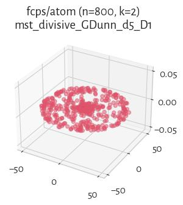

## fcps/chainlink (n=1000, d=3) 

#### Genie_G0.1 (NCA=1.00)

#### WCNN_25 (NCA=1.00)

#### mst_divisive_GDunn_d1_D1 (NCA=1.00)

#### mst_divisive_GDunn_d1_D2 (NCA=1.00)

#### mst_divisive_GDunn_d1_D3 (NCA=1.00)

#### mst_divisive_GDunn_d5_D1 (NCA=1.00)

#### mst_divisive_GDunn_d5_D2 (NCA=1.00)

#### mst_divisive_GDunn_d5_D3 (NCA=1.00)

#### mst_divisive_WCNN_25 (NCA=1.00)

#### mst_divisive_DuNN_25_Min_Max (NCA=1.00)

#### mst_divisive_DuNN_25_Mean_Mean (NCA=1.00)

#### Genie_G0.3 (NCA=1.00)

#### mst_divisive_DuNN_25_Max_Min (NCA=1.00)

#### GDunn_d5_D2 (NCA=1.00)

#### sklearn_spectral_Alaplacian_G5 (NCA=1.00)

#### DuNN_25_Max_Min (NCA=1.00)

#### DuNN_25_Mean_Mean (NCA=1.00)

#### Genie_G0.7 (NCA=1.00)

#### FCPS_HDBSCAN_4 (NCA=1.00)

#### FCPS_HDBSCAN_2 (NCA=1.00)

#### FCPS_HDBSCAN_8 (NCA=1.00)

#### ITM (NCA=1.00)

#### GIc (NCA=1.00)

#### Genie_G1.0 (NCA=1.00)

#### DuNN_25_Min_Max (NCA=1.00)

#### GDunn_d1_D1 (NCA=1.00)

#### GDunn_d1_D2 (NCA=1.00)

#### GDunn_d1_D3 (NCA=1.00)

#### Genie_G0.5 (NCA=1.00)

#### IcA (NCA=0.99)

#### mst_divisive_GDunn_d2_D1 (NCA=0.97)

#### sklearn_gm (NCA=0.95)

#### CTCEHC (NCA=0.92)

#### mst_divisive_GDunn_d2_D2 (NCA=0.82)

#### GDunn_d5_D1 (NCA=0.78)

#### mst_divisive_GDunn_d3_D3 (NCA=0.76)

#### mst_divisive_GDunn_d3_D2 (NCA=0.76)

#### mst_divisive_GDunn_d2_D3 (NCA=0.76)

#### mst_divisive_GDunn_d3_D1 (NCA=0.75)

#### mst_divisive_GDunn_d4_D1 (NCA=0.75)

#### mst_divisive_CalinskiHarabasz (NCA=0.71)

#### fastcluster_centroid (NCA=0.64)

#### fastcluster_weighted (NCA=0.63)

#### FCPS_MinEnergy (NCA=0.63)

#### fastcluster_median (NCA=0.61)

#### fastcluster_complete (NCA=0.56)

#### HEMST (NCA=0.55)

#### sklearn_birch_T0.01_BF50 (NCA=0.53)

#### fastcluster_ward (NCA=0.53)

#### fastcluster_average (NCA=0.52)

#### GDunn_d4_D1 (NCA=0.49)

#### GDunn_d3_D1 (NCA=0.48)

#### FCPS_Minimax (NCA=0.46)

#### GDunn_d5_D3 (NCA=0.36)

#### Silhouette (NCA=0.33)

#### FCPS_Fanny (NCA=0.33)

#### FCPS_Hardcl (NCA=0.32)

#### FCPS_Diana (NCA=0.31)

#### FCPS_Softcl (NCA=0.31)

#### sklearn_kmeans (NCA=0.31)

#### CalinskiHarabasz (NCA=0.31)

#### GDunn_d3_D2 (NCA=0.30)

#### GDunn_d2_D2 (NCA=0.30)

#### mst_divisive_Silhouette (NCA=0.30)

#### FCPS_Clara (NCA=0.30)

#### FCPS_PAM (NCA=0.30)

#### GDunn_d3_D3 (NCA=0.30)

#### GDunn_d4_D2 (NCA=0.29)

#### GDunn_d4_D3 (NCA=0.28)

#### GDunn_d2_D3 (NCA=0.28)

#### GDunn_d2_D1 (NCA=0.25)

#### mst_divisive_GDunn_d4_D3 (NCA=0.22)

#### mst_divisive_GDunn_d4_D2 (NCA=0.22)

#### mst_divisive_BallHall (NCA=0.11)

#### BallHall (NCA=0.11)

#### FCPS_AdaptiveDensityPeak (NCA=0.11)

#### DaviesBouldin (NCA=0.00)

#### mst_divisive_SilhouetteW (NCA=0.00)

#### mst_divisive_DaviesBouldin (NCA=0.00)

#### SilhouetteW (NCA=0.00)

## fcps/engytime (n=4096, d=2) 

#### sklearn_gm (NCA=0.99)

#### sklearn_spectral_Alaplacian_G5 (NCA=0.96)

#### sklearn_birch_T0.01_BF50 (NCA=0.95)

#### FCPS_Diana (NCA=0.95)

#### FCPS_Softcl (NCA=0.93)

#### FCPS_AdaptiveDensityPeak (NCA=0.93)

#### FCPS_Fanny (NCA=0.93)

#### FCPS_PAM (NCA=0.92)

#### FCPS_Hardcl (NCA=0.92)

#### sklearn_kmeans (NCA=0.92)

#### CalinskiHarabasz (NCA=0.92)

#### FCPS_Clara (NCA=0.92)

#### Genie_G0.3 (NCA=0.92)

#### Genie_G0.1 (NCA=0.92)

#### GIc (NCA=0.92)

#### Genie_G0.5 (NCA=0.92)

#### ITM (NCA=0.91)

#### mst_divisive_CalinskiHarabasz (NCA=0.89)

#### FCPS_MinEnergy (NCA=0.88)

#### GDunn_d5_D3 (NCA=0.87)

#### fastcluster_ward (NCA=0.86)

#### GDunn_d2_D3 (NCA=0.86)

#### GDunn_d2_D2 (NCA=0.86)

#### CTCEHC (NCA=0.81)

#### IcA (NCA=0.80)

#### DuNN_25_Max_Min (NCA=0.66)

#### mst_divisive_GDunn_d2_D2 (NCA=0.58)

#### mst_divisive_GDunn_d2_D3 (NCA=0.58)

#### fastcluster_average (NCA=0.23)

#### fastcluster_complete (NCA=0.21)

#### fastcluster_weighted (NCA=0.18)

#### fastcluster_centroid (NCA=0.17)

#### FCPS_Minimax (NCA=0.13)

#### mst_divisive_GDunn_d2_D1 (NCA=0.12)

#### Genie_G0.7 (NCA=0.07)

#### GDunn_d5_D1 (NCA=0.07)

#### GDunn_d2_D1 (NCA=0.05)

#### fastcluster_median (NCA=0.04)

#### mst_divisive_DuNN_25_Min_Max (NCA=0.04)

#### mst_divisive_WCNN_25 (NCA=0.03)

#### GDunn_d5_D2 (NCA=0.02)

#### HEMST (NCA=0.02)

#### mst_divisive_GDunn_d5_D1 (NCA=0.02)

#### mst_divisive_DuNN_25_Mean_Mean (NCA=0.02)

#### mst_divisive_DuNN_25_Max_Min (NCA=0.01)

#### WCNN_25 (NCA=0.01)

#### DuNN_25_Min_Max (NCA=0.01)

#### BallHall (NCA=0.01)

#### DuNN_25_Mean_Mean (NCA=0.00)

#### mst_divisive_BallHall (NCA=0.00)

#### mst_divisive_SilhouetteW (NCA=0.00)

#### FCPS_HDBSCAN_2 (NCA=0.00)

#### GDunn_d1_D2 (NCA=0.00)

#### GDunn_d1_D1 (NCA=0.00)

#### mst_divisive_GDunn_d1_D1 (NCA=0.00)

#### mst_divisive_GDunn_d1_D2 (NCA=0.00)

#### Genie_G1.0 (NCA=0.00)

#### mst_divisive_GDunn_d1_D3 (NCA=0.00)

#### GDunn_d1_D3 (NCA=0.00)

#### DaviesBouldin (NCA=0.00)

#### mst_divisive_DaviesBouldin (NCA=0.00)

#### SilhouetteW (NCA=0.00)

#### FCPS_HDBSCAN_4 (NCA=0.00)

#### FCPS_HDBSCAN_8 (NCA=0.00)

#### GDunn_d3_D1 (NCA=0.00)

#### GDunn_d3_D2 (NCA=0.00)

#### mst_divisive_GDunn_d3_D3 (NCA=0.00)

#### mst_divisive_GDunn_d3_D2 (NCA=0.00)

#### mst_divisive_GDunn_d3_D1 (NCA=0.00)

#### mst_divisive_GDunn_d4_D3 (NCA=0.00)

#### mst_divisive_GDunn_d5_D2 (NCA=0.00)

#### mst_divisive_GDunn_d5_D3 (NCA=0.00)

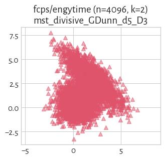

#### mst_divisive_GDunn_d4_D1 (NCA=0.00)

#### mst_divisive_Silhouette (NCA=0.00)

#### GDunn_d4_D1 (NCA=0.00)

#### GDunn_d3_D3 (NCA=0.00)

#### Silhouette (NCA=0.00)

#### GDunn_d4_D3 (NCA=0.00)

#### GDunn_d4_D2 (NCA=0.00)

#### mst_divisive_GDunn_d4_D2 (NCA=0.00)

## fcps/hepta (n=212, d=3) 

#### Genie_G0.1 (NCA=1.00)

#### mst_divisive_GDunn_d1_D2 (NCA=1.00)

#### sklearn_gm (NCA=1.00)

#### mst_divisive_WCNN_25 (NCA=1.00)

#### mst_divisive_GDunn_d1_D3 (NCA=1.00)

#### mst_divisive_GDunn_d1_D1 (NCA=1.00)

#### GDunn_d1_D2 (NCA=1.00)

#### sklearn_kmeans (NCA=1.00)

#### GDunn_d3_D1 (NCA=1.00)

#### GDunn_d4_D1 (NCA=1.00)

#### Silhouette (NCA=1.00)

#### WCNN_25 (NCA=1.00)

#### Genie_G0.3 (NCA=1.00)

#### mst_divisive_DuNN_25_Min_Max (NCA=1.00)

#### mst_divisive_DuNN_25_Mean_Mean (NCA=1.00)

#### mst_divisive_DuNN_25_Max_Min (NCA=1.00)

#### GDunn_d1_D3 (NCA=1.00)

#### GDunn_d2_D1 (NCA=1.00)

#### GDunn_d1_D1 (NCA=1.00)

#### FCPS_MinEnergy (NCA=1.00)

#### fastcluster_centroid (NCA=1.00)

#### fastcluster_complete (NCA=1.00)

#### fastcluster_median (NCA=1.00)

#### fastcluster_ward (NCA=1.00)

#### fastcluster_weighted (NCA=1.00)

#### FCPS_AdaptiveDensityPeak (NCA=1.00)

#### FCPS_Minimax (NCA=1.00)

#### FCPS_HDBSCAN_4 (NCA=1.00)

#### FCPS_HDBSCAN_2 (NCA=1.00)

#### FCPS_HDBSCAN_8 (NCA=1.00)

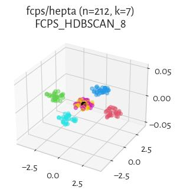

#### sklearn_spectral_Alaplacian_G5 (NCA=1.00)

#### FCPS_Fanny (NCA=1.00)

#### FCPS_Softcl (NCA=1.00)

#### FCPS_Clara (NCA=1.00)

#### fastcluster_average (NCA=1.00)

#### HEMST (NCA=1.00)

#### Genie_G0.5 (NCA=1.00)

#### Genie_G0.7 (NCA=1.00)

#### Genie_G1.0 (NCA=1.00)

#### GIc (NCA=1.00)

#### FCPS_PAM (NCA=1.00)

#### CTCEHC (NCA=1.00)

#### DuNN_25_Min_Max (NCA=1.00)

#### BallHall (NCA=1.00)

#### DuNN_25_Mean_Mean (NCA=1.00)

#### DuNN_25_Max_Min (NCA=1.00)

#### CalinskiHarabasz (NCA=1.00)

#### DaviesBouldin (NCA=1.00)

#### sklearn_birch_T0.01_BF50 (NCA=1.00)

#### GDunn_d3_D2 (NCA=0.97)

#### GDunn_d2_D2 (NCA=0.96)

#### GDunn_d4_D2 (NCA=0.96)

#### mst_divisive_BallHall (NCA=0.95)

#### GDunn_d2_D3 (NCA=0.95)

#### mst_divisive_CalinskiHarabasz (NCA=0.94)

#### ITM (NCA=0.94)

#### mst_divisive_Silhouette (NCA=0.94)

#### IcA (NCA=0.94)

#### GDunn_d4_D3 (NCA=0.93)

#### GDunn_d3_D3 (NCA=0.93)

#### mst_divisive_GDunn_d3_D1 (NCA=0.89)

#### mst_divisive_GDunn_d3_D2 (NCA=0.88)

#### mst_divisive_GDunn_d3_D3 (NCA=0.87)

#### mst_divisive_GDunn_d5_D2 (NCA=0.84)

#### mst_divisive_GDunn_d5_D3 (NCA=0.84)

#### mst_divisive_GDunn_d5_D1 (NCA=0.83)

#### FCPS_Diana (NCA=0.83)

#### mst_divisive_GDunn_d2_D3 (NCA=0.81)

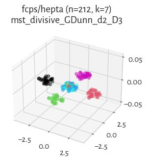

#### mst_divisive_GDunn_d2_D1 (NCA=0.79)

#### mst_divisive_GDunn_d2_D2 (NCA=0.79)

#### FCPS_Hardcl (NCA=0.78)

#### GDunn_d5_D2 (NCA=0.41)

#### SilhouetteW (NCA=0.22)

#### GDunn_d5_D1 (NCA=0.16)

#### mst_divisive_GDunn_d4_D1 (NCA=0.12)

#### mst_divisive_GDunn_d4_D2 (NCA=0.11)

#### mst_divisive_GDunn_d4_D3 (NCA=0.11)

#### GDunn_d5_D3 (NCA=0.09)

#### mst_divisive_SilhouetteW (NCA=0.07)

#### mst_divisive_DaviesBouldin (NCA=0.04)

## fcps/lsun (n=400, d=2) 

#### Genie_G0.1 (NCA=1.00)

#### Genie_G0.3 (NCA=1.00)

#### mst_divisive_DuNN_25_Min_Max (NCA=1.00)

#### mst_divisive_WCNN_25 (NCA=1.00)

#### mst_divisive_GDunn_d1_D3 (NCA=1.00)

#### mst_divisive_GDunn_d1_D2 (NCA=1.00)

#### mst_divisive_GDunn_d1_D1 (NCA=1.00)

#### WCNN_25 (NCA=1.00)

#### GDunn_d1_D3 (NCA=1.00)

#### GDunn_d1_D2 (NCA=1.00)

#### GDunn_d1_D1 (NCA=1.00)

#### sklearn_gm (NCA=1.00)

#### mst_divisive_DuNN_25_Mean_Mean (NCA=1.00)

#### Genie_G0.5 (NCA=1.00)

#### GIc (NCA=1.00)

#### FCPS_HDBSCAN_2 (NCA=1.00)

#### ITM (NCA=1.00)

#### Genie_G1.0 (NCA=1.00)

#### Genie_G0.7 (NCA=1.00)

#### DuNN_25_Min_Max (NCA=1.00)

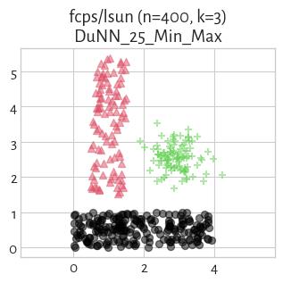

#### DuNN_25_Mean_Mean (NCA=1.00)

#### mst_divisive_GDunn_d2_D1 (NCA=0.96)

#### mst_divisive_CalinskiHarabasz (NCA=0.89)

#### mst_divisive_Silhouette (NCA=0.89)

#### FCPS_Diana (NCA=0.89)

#### DaviesBouldin (NCA=0.86)

#### sklearn_spectral_Alaplacian_G5 (NCA=0.85)

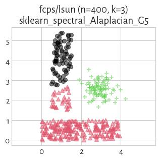

#### GDunn_d4_D3 (NCA=0.84)

#### mst_divisive_GDunn_d2_D3 (NCA=0.84)

#### mst_divisive_GDunn_d2_D2 (NCA=0.83)

#### GDunn_d3_D3 (NCA=0.83)

#### GDunn_d2_D3 (NCA=0.83)

#### GDunn_d3_D2 (NCA=0.82)

#### GDunn_d4_D2 (NCA=0.82)

#### GDunn_d2_D2 (NCA=0.81)

#### FCPS_PAM (NCA=0.80)

#### FCPS_Clara (NCA=0.80)

#### BallHall (NCA=0.79)

#### mst_divisive_BallHall (NCA=0.76)

#### FCPS_Fanny (NCA=0.75)

#### CTCEHC (NCA=0.75)

#### mst_divisive_GDunn_d3_D3 (NCA=0.75)

#### mst_divisive_GDunn_d3_D2 (NCA=0.75)

#### mst_divisive_GDunn_d4_D3 (NCA=0.75)

#### mst_divisive_GDunn_d4_D2 (NCA=0.75)

#### mst_divisive_GDunn_d4_D1 (NCA=0.74)

#### mst_divisive_GDunn_d3_D1 (NCA=0.74)

#### FCPS_AdaptiveDensityPeak (NCA=0.73)

#### sklearn_kmeans (NCA=0.71)

#### CalinskiHarabasz (NCA=0.70)

#### Silhouette (NCA=0.70)

#### FCPS_Softcl (NCA=0.69)

#### fastcluster_complete (NCA=0.67)

#### sklearn_birch_T0.01_BF50 (NCA=0.67)

#### GDunn_d3_D1 (NCA=0.67)

#### GDunn_d2_D1 (NCA=0.65)

#### fastcluster_ward (NCA=0.64)

#### GDunn_d4_D1 (NCA=0.64)

#### FCPS_MinEnergy (NCA=0.64)

#### fastcluster_average (NCA=0.61)

#### fastcluster_centroid (NCA=0.61)

#### FCPS_Minimax (NCA=0.61)

#### fastcluster_median (NCA=0.56)

#### fastcluster_weighted (NCA=0.55)

#### mst_divisive_GDunn_d5_D3 (NCA=0.50)

#### mst_divisive_GDunn_d5_D1 (NCA=0.50)

#### FCPS_HDBSCAN_8 (NCA=0.49)

#### HEMST (NCA=0.49)

#### FCPS_HDBSCAN_4 (NCA=0.49)

#### mst_divisive_GDunn_d5_D2 (NCA=0.49)

#### FCPS_Hardcl (NCA=0.39)

#### mst_divisive_DuNN_25_Max_Min (NCA=0.32)

#### GDunn_d5_D2 (NCA=0.29)

#### GDunn_d5_D1 (NCA=0.29)

#### IcA (NCA=0.25)

#### DuNN_25_Max_Min (NCA=0.03)

#### SilhouetteW (NCA=0.02)

#### GDunn_d5_D3 (NCA=0.02)

#### mst_divisive_DaviesBouldin (NCA=0.01)

#### mst_divisive_SilhouetteW (NCA=0.01)

## fcps/target (n=770, d=2) 

#### Genie_G0.1 (NCA=1.00)

#### WCNN_25 (NCA=1.00)

#### mst_divisive_GDunn_d1_D1 (NCA=1.00)

#### mst_divisive_GDunn_d1_D2 (NCA=1.00)

#### mst_divisive_GDunn_d1_D3 (NCA=1.00)

#### mst_divisive_WCNN_25 (NCA=1.00)

#### mst_divisive_DuNN_25_Min_Max (NCA=1.00)

#### mst_divisive_DuNN_25_Mean_Mean (NCA=1.00)

#### Genie_G0.3 (NCA=1.00)

#### mst_divisive_DuNN_25_Max_Min (NCA=1.00)

#### GDunn_d1_D2 (NCA=1.00)

#### sklearn_spectral_Alaplacian_G5 (NCA=1.00)

#### GDunn_d1_D3 (NCA=1.00)

#### GDunn_d1_D1 (NCA=1.00)

#### DuNN_25_Min_Max (NCA=1.00)

#### DuNN_25_Mean_Mean (NCA=1.00)

#### DuNN_25_Max_Min (NCA=1.00)

#### HEMST (NCA=1.00)

#### Genie_G0.5 (NCA=1.00)

#### Genie_G0.7 (NCA=1.00)

#### FCPS_HDBSCAN_2 (NCA=1.00)

#### ITM (NCA=1.00)

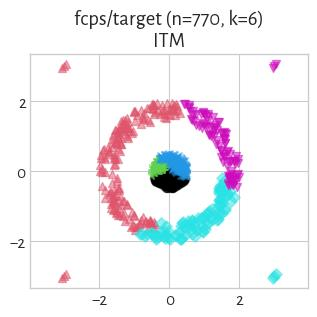

#### GIc (NCA=1.00)

#### Genie_G1.0 (NCA=1.00)

#### IcA (NCA=0.99)

#### FCPS_Fanny (NCA=0.94)

#### fastcluster_weighted (NCA=0.90)

#### FCPS_Diana (NCA=0.88)

#### fastcluster_complete (NCA=0.88)

#### fastcluster_median (NCA=0.87)

#### GDunn_d4_D1 (NCA=0.86)

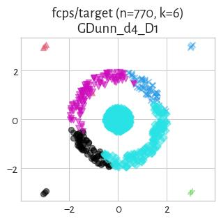

#### GDunn_d3_D1 (NCA=0.86)

#### fastcluster_average (NCA=0.86)

#### FCPS_Hardcl (NCA=0.86)

#### mst_divisive_GDunn_d5_D1 (NCA=0.85)

#### sklearn_gm (NCA=0.84)

#### sklearn_kmeans (NCA=0.84)

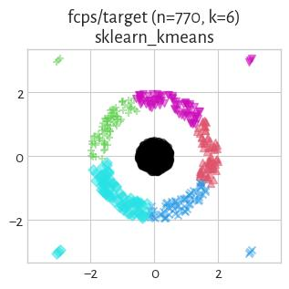

#### sklearn_birch_T0.01_BF50 (NCA=0.84)

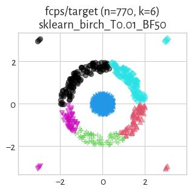

#### CalinskiHarabasz (NCA=0.84)

#### FCPS_Minimax (NCA=0.84)

#### FCPS_PAM (NCA=0.84)

#### FCPS_Clara (NCA=0.84)

#### FCPS_AdaptiveDensityPeak (NCA=0.84)

#### fastcluster_centroid (NCA=0.83)

#### CTCEHC (NCA=0.83)

#### mst_divisive_CalinskiHarabasz (NCA=0.83)

#### mst_divisive_GDunn_d2_D1 (NCA=0.83)

#### fastcluster_ward (NCA=0.83)

#### FCPS_MinEnergy (NCA=0.83)

#### BallHall (NCA=0.81)

#### mst_divisive_BallHall (NCA=0.80)

#### DaviesBouldin (NCA=0.80)

#### GDunn_d5_D1 (NCA=0.80)

#### GDunn_d2_D1 (NCA=0.79)

#### Silhouette (NCA=0.77)

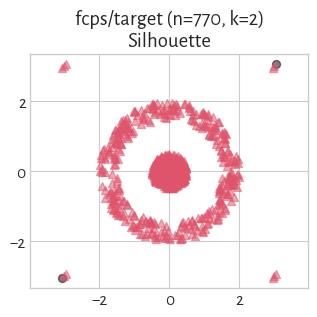

#### GDunn_d4_D3 (NCA=0.77)

#### FCPS_Softcl (NCA=0.70)

#### mst_divisive_GDunn_d3_D2 (NCA=0.67)

#### mst_divisive_GDunn_d4_D2 (NCA=0.67)

#### mst_divisive_GDunn_d4_D3 (NCA=0.67)

#### mst_divisive_GDunn_d5_D2 (NCA=0.67)

#### mst_divisive_GDunn_d3_D1 (NCA=0.67)

#### mst_divisive_GDunn_d4_D1 (NCA=0.67)

#### mst_divisive_GDunn_d5_D3 (NCA=0.66)

#### mst_divisive_GDunn_d2_D3 (NCA=0.65)

#### mst_divisive_DaviesBouldin (NCA=0.60)

#### mst_divisive_GDunn_d3_D3 (NCA=0.60)

#### mst_divisive_GDunn_d2_D2 (NCA=0.58)

#### GDunn_d4_D2 (NCA=0.57)

#### SilhouetteW (NCA=0.53)

#### mst_divisive_SilhouetteW (NCA=0.53)

#### GDunn_d3_D3 (NCA=0.50)

#### GDunn_d2_D2 (NCA=0.37)

#### GDunn_d2_D3 (NCA=0.37)

#### GDunn_d5_D2 (NCA=0.29)

#### mst_divisive_Silhouette (NCA=0.20)

#### FCPS_HDBSCAN_4 (NCA=0.20)

#### FCPS_HDBSCAN_8 (NCA=0.20)

#### GDunn_d3_D2 (NCA=0.11)

#### GDunn_d5_D3 (NCA=0.02)

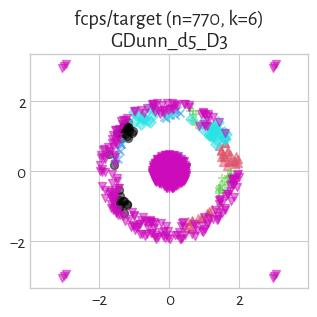

## fcps/tetra (n=400, d=3) 

#### Genie_G0.1 (NCA=1.00)

#### Genie_G0.3 (NCA=1.00)

#### mst_divisive_DuNN_25_Mean_Mean (NCA=1.00)

#### mst_divisive_Silhouette (NCA=1.00)

#### GDunn_d4_D2 (NCA=1.00)

#### GDunn_d4_D3 (NCA=1.00)

#### GDunn_d5_D3 (NCA=1.00)

#### Silhouette (NCA=1.00)

#### WCNN_25 (NCA=1.00)

#### mst_divisive_CalinskiHarabasz (NCA=1.00)

#### mst_divisive_GDunn_d1_D2 (NCA=1.00)

#### mst_divisive_GDunn_d1_D3 (NCA=1.00)

#### mst_divisive_GDunn_d3_D2 (NCA=1.00)

#### mst_divisive_GDunn_d3_D3 (NCA=1.00)

#### mst_divisive_WCNN_25 (NCA=1.00)

#### mst_divisive_DuNN_25_Min_Max (NCA=1.00)

#### GDunn_d3_D3 (NCA=1.00)

#### sklearn_kmeans (NCA=1.00)

#### sklearn_spectral_Alaplacian_G5 (NCA=1.00)

#### sklearn_gm (NCA=1.00)

#### GDunn_d4_D1 (NCA=1.00)

#### GDunn_d3_D2 (NCA=1.00)

#### FCPS_AdaptiveDensityPeak (NCA=1.00)

#### DaviesBouldin (NCA=1.00)

#### CalinskiHarabasz (NCA=1.00)

#### BallHall (NCA=1.00)

#### GDunn_d3_D1 (NCA=1.00)

#### FCPS_Clara (NCA=1.00)

#### FCPS_Softcl (NCA=1.00)

#### FCPS_Hardcl (NCA=1.00)

#### FCPS_MinEnergy (NCA=1.00)

#### fastcluster_weighted (NCA=1.00)

#### fastcluster_median (NCA=1.00)

#### fastcluster_centroid (NCA=1.00)

#### ITM (NCA=1.00)

#### GIc (NCA=1.00)

#### Genie_G0.5 (NCA=1.00)

#### FCPS_PAM (NCA=1.00)

#### GDunn_d2_D3 (NCA=1.00)

#### GDunn_d2_D2 (NCA=1.00)

#### GDunn_d1_D2 (NCA=1.00)

#### GDunn_d2_D1 (NCA=1.00)

#### GDunn_d1_D3 (NCA=1.00)

#### GDunn_d1_D1 (NCA=1.00)

#### fastcluster_average (NCA=1.00)

#### FCPS_Minimax (NCA=1.00)

#### DuNN_25_Min_Max (NCA=1.00)

#### fastcluster_complete (NCA=0.99)

#### fastcluster_ward (NCA=0.98)

#### sklearn_birch_T0.01_BF50 (NCA=0.98)

#### CTCEHC (NCA=0.98)

#### FCPS_Diana (NCA=0.93)

#### IcA (NCA=0.85)

#### mst_divisive_DuNN_25_Max_Min (NCA=0.84)

#### mst_divisive_GDunn_d5_D2 (NCA=0.63)

#### mst_divisive_GDunn_d5_D3 (NCA=0.57)

#### mst_divisive_GDunn_d5_D1 (NCA=0.57)

#### FCPS_Fanny (NCA=0.52)

#### mst_divisive_GDunn_d2_D2 (NCA=0.50)

#### mst_divisive_GDunn_d2_D3 (NCA=0.50)

#### HEMST (NCA=0.44)

#### mst_divisive_GDunn_d2_D1 (NCA=0.36)

#### Genie_G0.7 (NCA=0.33)

#### DuNN_25_Max_Min (NCA=0.33)

#### GDunn_d5_D2 (NCA=0.28)

#### GDunn_d5_D1 (NCA=0.14)

#### DuNN_25_Mean_Mean (NCA=0.03)

#### mst_divisive_SilhouetteW (NCA=0.02)

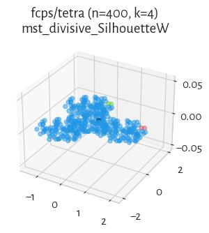

#### SilhouetteW (NCA=0.02)

#### mst_divisive_DaviesBouldin (NCA=0.02)

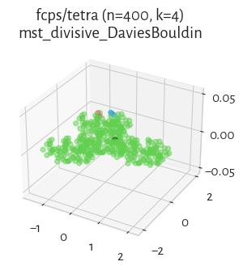

#### mst_divisive_GDunn_d4_D3 (NCA=0.01)

#### Genie_G1.0 (NCA=0.01)

#### mst_divisive_GDunn_d4_D2 (NCA=0.01)

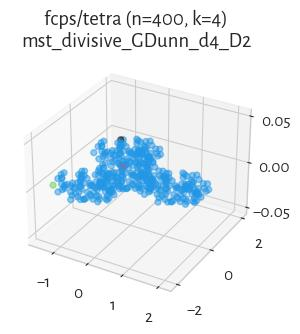

#### mst_divisive_GDunn_d3_D1 (NCA=0.01)

#### mst_divisive_GDunn_d1_D1 (NCA=0.01)

#### FCPS_HDBSCAN_8 (NCA=0.01)

#### mst_divisive_GDunn_d4_D1 (NCA=0.01)

#### FCPS_HDBSCAN_4 (NCA=0.01)

#### mst_divisive_BallHall (NCA=0.01)

#### FCPS_HDBSCAN_2 (NCA=0.01)

## fcps/twodiamonds (n=800, d=2) 

#### mst_divisive_GDunn_d4_D1 (NCA=1.00)

#### mst_divisive_WCNN_25 (NCA=1.00)

#### mst_divisive_DaviesBouldin (NCA=1.00)

#### DaviesBouldin (NCA=1.00)

#### CalinskiHarabasz (NCA=1.00)

#### BallHall (NCA=1.00)

#### mst_divisive_GDunn_d4_D2 (NCA=1.00)

#### mst_divisive_GDunn_d3_D2 (NCA=1.00)

#### FCPS_PAM (NCA=1.00)

#### GDunn_d2_D1 (NCA=1.00)

#### mst_divisive_BallHall (NCA=1.00)

#### WCNN_25 (NCA=1.00)

#### mst_divisive_Silhouette (NCA=1.00)

#### SilhouetteW (NCA=1.00)

#### Silhouette (NCA=1.00)

#### mst_divisive_SilhouetteW (NCA=1.00)

#### mst_divisive_GDunn_d2_D1 (NCA=1.00)

#### mst_divisive_GDunn_d2_D2 (NCA=1.00)

#### GDunn_d4_D2 (NCA=1.00)

#### GDunn_d4_D1 (NCA=1.00)

#### GDunn_d3_D2 (NCA=1.00)

#### GDunn_d3_D1 (NCA=1.00)

#### mst_divisive_GDunn_d3_D1 (NCA=1.00)

#### GDunn_d2_D2 (NCA=1.00)

#### mst_divisive_CalinskiHarabasz (NCA=1.00)

#### FCPS_Clara (NCA=1.00)

#### sklearn_spectral_Alaplacian_G5 (NCA=1.00)

#### FCPS_Softcl (NCA=1.00)

#### FCPS_MinEnergy (NCA=1.00)

#### FCPS_Hardcl (NCA=1.00)

#### FCPS_Fanny (NCA=1.00)

#### FCPS_Diana (NCA=1.00)

#### sklearn_gm (NCA=1.00)

#### sklearn_kmeans (NCA=1.00)

#### FCPS_AdaptiveDensityPeak (NCA=1.00)

#### fastcluster_ward (NCA=1.00)

#### mst_divisive_GDunn_d2_D3 (NCA=1.00)

#### mst_divisive_GDunn_d3_D3 (NCA=1.00)

#### mst_divisive_DuNN_25_Mean_Mean (NCA=1.00)

#### mst_divisive_GDunn_d4_D3 (NCA=1.00)

#### mst_divisive_GDunn_d5_D3 (NCA=1.00)

#### GDunn_d3_D3 (NCA=1.00)

#### fastcluster_average (NCA=1.00)

#### fastcluster_centroid (NCA=1.00)

#### fastcluster_weighted (NCA=1.00)

#### sklearn_birch_T0.01_BF50 (NCA=1.00)

#### GDunn_d2_D3 (NCA=1.00)

#### GDunn_d4_D3 (NCA=1.00)

#### DuNN_25_Mean_Mean (NCA=1.00)

#### GDunn_d1_D1 (NCA=0.99)

#### CTCEHC (NCA=0.99)

#### FCPS_Minimax (NCA=0.99)

#### mst_divisive_GDunn_d1_D3 (NCA=0.99)

#### fastcluster_median (NCA=0.99)

#### mst_divisive_DuNN_25_Min_Max (NCA=0.99)

#### mst_divisive_GDunn_d1_D1 (NCA=0.99)

#### mst_divisive_GDunn_d1_D2 (NCA=0.99)

#### DuNN_25_Min_Max (NCA=0.99)

#### ITM (NCA=0.99)

#### fastcluster_complete (NCA=0.99)

#### GDunn_d1_D2 (NCA=0.99)

#### GDunn_d1_D3 (NCA=0.99)

#### Genie_G0.1 (NCA=0.99)

#### Genie_G0.3 (NCA=0.99)

#### Genie_G0.7 (NCA=0.99)

#### Genie_G0.5 (NCA=0.99)

#### GIc (NCA=0.99)

#### HEMST (NCA=0.86)

#### IcA (NCA=0.73)

#### GDunn_d5_D1 (NCA=0.11)

#### mst_divisive_DuNN_25_Max_Min (NCA=0.07)

#### DuNN_25_Max_Min (NCA=0.06)

#### GDunn_d5_D2 (NCA=0.03)

#### mst_divisive_GDunn_d5_D1 (NCA=0.03)

#### GDunn_d5_D3 (NCA=0.02)

#### mst_divisive_GDunn_d5_D2 (NCA=0.00)

#### FCPS_HDBSCAN_4 (NCA=0.00)

#### Genie_G1.0 (NCA=0.00)

#### FCPS_HDBSCAN_2 (NCA=0.00)

#### FCPS_HDBSCAN_8 (NCA=0.00)

## fcps/wingnut (n=1016, d=2) 

#### Genie_G0.1 (NCA=1.00)

#### mst_divisive_DuNN_25_Min_Max (NCA=1.00)

#### Genie_G0.3 (NCA=1.00)

#### mst_divisive_WCNN_25 (NCA=1.00)

#### mst_divisive_GDunn_d5_D3 (NCA=1.00)

#### mst_divisive_GDunn_d1_D1 (NCA=1.00)

#### GDunn_d1_D1 (NCA=1.00)

#### GDunn_d1_D2 (NCA=1.00)

#### GDunn_d1_D3 (NCA=1.00)

#### WCNN_25 (NCA=1.00)

#### mst_divisive_GDunn_d1_D2 (NCA=1.00)

#### mst_divisive_GDunn_d4_D3 (NCA=1.00)

#### mst_divisive_GDunn_d1_D3 (NCA=1.00)

#### mst_divisive_GDunn_d2_D2 (NCA=1.00)

#### mst_divisive_GDunn_d2_D3 (NCA=1.00)

#### mst_divisive_GDunn_d3_D2 (NCA=1.00)

#### mst_divisive_GDunn_d3_D3 (NCA=1.00)

#### mst_divisive_GDunn_d4_D2 (NCA=1.00)

#### sklearn_birch_T0.01_BF50 (NCA=1.00)

#### DuNN_25_Min_Max (NCA=1.00)

#### fastcluster_complete (NCA=1.00)

#### fastcluster_centroid (NCA=1.00)

#### fastcluster_average (NCA=1.00)

#### FCPS_Minimax (NCA=1.00)

#### FCPS_MinEnergy (NCA=1.00)

#### Genie_G0.5 (NCA=1.00)

#### Genie_G0.7 (NCA=1.00)

#### Genie_G1.0 (NCA=1.00)

#### FCPS_HDBSCAN_2 (NCA=1.00)

#### FCPS_HDBSCAN_4 (NCA=1.00)

#### GIc (NCA=1.00)

#### ITM (NCA=1.00)

#### mst_divisive_GDunn_d3_D1 (NCA=1.00)

#### mst_divisive_GDunn_d4_D1 (NCA=1.00)

#### IcA (NCA=1.00)

#### HEMST (NCA=1.00)

#### mst_divisive_GDunn_d2_D1 (NCA=0.99)

#### mst_divisive_Silhouette (NCA=0.97)

#### mst_divisive_BallHall (NCA=0.97)

#### mst_divisive_CalinskiHarabasz (NCA=0.97)

#### CTCEHC (NCA=0.97)

#### GDunn_d3_D1 (NCA=0.96)

#### GDunn_d4_D1 (NCA=0.96)

#### mst_divisive_GDunn_d5_D1 (NCA=0.94)

#### sklearn_gm (NCA=0.93)

#### CalinskiHarabasz (NCA=0.93)

#### BallHall (NCA=0.93)

#### sklearn_kmeans (NCA=0.93)

#### FCPS_Softcl (NCA=0.93)

#### FCPS_Hardcl (NCA=0.93)

#### GDunn_d4_D2 (NCA=0.93)

#### GDunn_d3_D2 (NCA=0.93)

#### GDunn_d2_D2 (NCA=0.93)

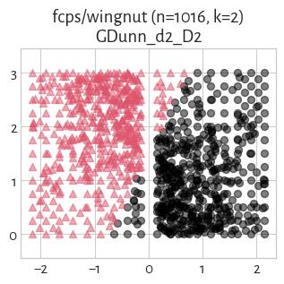

#### Silhouette (NCA=0.93)

#### FCPS_Diana (NCA=0.92)

#### GDunn_d4_D3 (NCA=0.89)

#### sklearn_spectral_Alaplacian_G5 (NCA=0.89)

#### GDunn_d3_D3 (NCA=0.88)

#### FCPS_PAM (NCA=0.87)

#### FCPS_Clara (NCA=0.87)

#### FCPS_Fanny (NCA=0.86)

#### GDunn_d2_D3 (NCA=0.86)

#### GDunn_d5_D3 (NCA=0.82)

#### FCPS_AdaptiveDensityPeak (NCA=0.82)

#### fastcluster_ward (NCA=0.78)

#### fastcluster_weighted (NCA=0.77)

#### GDunn_d2_D1 (NCA=0.64)

#### fastcluster_median (NCA=0.27)

#### GDunn_d5_D2 (NCA=0.06)

#### mst_divisive_DuNN_25_Mean_Mean (NCA=0.05)

#### mst_divisive_DuNN_25_Max_Min (NCA=0.05)

#### GDunn_d5_D1 (NCA=0.02)

#### DuNN_25_Max_Min (NCA=0.01)

#### mst_divisive_SilhouetteW (NCA=0.01)

#### mst_divisive_DaviesBouldin (NCA=0.00)

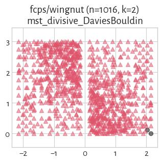

#### SilhouetteW (NCA=0.00)

#### DaviesBouldin (NCA=0.00)

#### mst_divisive_GDunn_d5_D2 (NCA=0.00)

#### FCPS_HDBSCAN_8 (NCA=0.00)

#### DuNN_25_Mean_Mean (NCA=0.00)

