The **[Framework for Benchmarking Clustering Algorithms](https://clustering-benchmarks.gagolewski.com)
is authored/edited/maintained by [Marek Gagolewski](https://www.gagolewski.com)**

[Benchmark suite](https://github.com/gagolews/clustering-data-v1) version 1.1.0

--------------------------------------------------------------------------------

**Datasets**

* [graves/dense](#dense)
* [graves/fuzzyx](#fuzzyx)
* [graves/line](#line)
* [graves/parabolic](#parabolic)
* [graves/ring](#ring)
* [graves/ring_noisy](#ring_noisy)
* [graves/ring_outliers](#ring_outliers)
* [graves/zigzag](#zigzag)
* [graves/zigzag_noisy](#zigzag_noisy)
* [graves/zigzag_outliers](#zigzag_outliers)

*(results are sorted wrt the normalised clustering accuracy score – comparison against the reference labels; see the Framework's [homepage](https://clustering-benchmarks.gagolewski.com) for more details)*

--------------------------------------------------------------------------------

## graves/dense (n=200, d=2) 

#### sklearn_gm (NCA=1.00)

#### ITM (NCA=1.00)

#### FCPS_MinEnergy (NCA=1.00)

#### Genie_G0.1 (NCA=0.98)

#### mst_divisive_DaviesBouldin (NCA=0.98)

#### Genie_G0.3 (NCA=0.98)

#### mst_divisive_DuNN_25_Min_Max (NCA=0.98)

#### mst_divisive_WCNN_25 (NCA=0.98)

#### IcA (NCA=0.98)

#### GIc (NCA=0.98)

#### CTCEHC (NCA=0.98)

#### Genie_G0.7 (NCA=0.98)

#### Genie_G0.5 (NCA=0.98)

#### mst_divisive_BallHall (NCA=0.97)

#### mst_divisive_CalinskiHarabasz (NCA=0.97)

#### mst_divisive_Silhouette (NCA=0.97)

#### WCNN_25 (NCA=0.97)

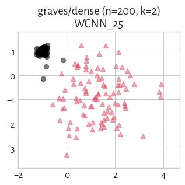

#### fastcluster_centroid (NCA=0.96)

#### fastcluster_average (NCA=0.96)

#### sklearn_spectral_Alaplacian_G5 (NCA=0.96)

#### sklearn_birch_T0.01_BF50 (NCA=0.96)

#### fastcluster_ward (NCA=0.96)

#### BallHall (NCA=0.95)

#### FCPS_Fanny (NCA=0.94)

#### DuNN_25_Min_Max (NCA=0.94)

#### Silhouette (NCA=0.94)

#### DuNN_25_Mean_Mean (NCA=0.93)

#### FCPS_PAM (NCA=0.92)

#### FCPS_Clara (NCA=0.92)

#### sklearn_kmeans (NCA=0.90)

#### CalinskiHarabasz (NCA=0.90)

#### FCPS_Hardcl (NCA=0.90)

#### FCPS_Softcl (NCA=0.90)

#### FCPS_AdaptiveDensityPeak (NCA=0.89)

#### FCPS_Diana (NCA=0.84)

#### mst_divisive_DuNN_25_Mean_Mean (NCA=0.82)

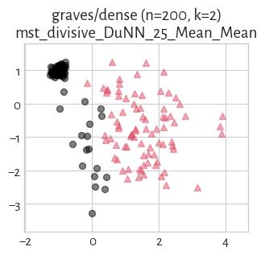

#### mst_divisive_GDunn_d4_D3 (NCA=0.82)

#### mst_divisive_GDunn_d3_D3 (NCA=0.82)

#### mst_divisive_GDunn_d2_D3 (NCA=0.82)

#### mst_divisive_GDunn_d2_D2 (NCA=0.82)

#### GDunn_d2_D1 (NCA=0.80)

#### fastcluster_median (NCA=0.71)

#### mst_divisive_GDunn_d2_D1 (NCA=0.70)

#### GDunn_d2_D3 (NCA=0.66)

#### GDunn_d2_D2 (NCA=0.62)

#### FCPS_Minimax (NCA=0.60)

#### GDunn_d3_D3 (NCA=0.59)

#### GDunn_d4_D3 (NCA=0.59)

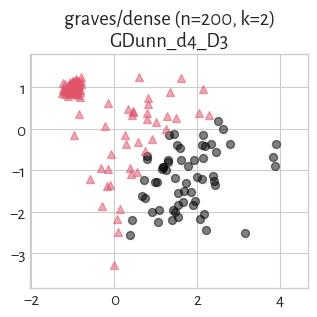

#### GDunn_d4_D2 (NCA=0.54)

#### GDunn_d3_D2 (NCA=0.54)

#### fastcluster_complete (NCA=0.51)

#### GDunn_d5_D2 (NCA=0.46)

#### mst_divisive_DuNN_25_Max_Min (NCA=0.41)

#### GDunn_d5_D1 (NCA=0.20)

#### HEMST (NCA=0.17)

#### fastcluster_weighted (NCA=0.07)

#### GDunn_d4_D1 (NCA=0.04)

#### GDunn_d3_D1 (NCA=0.04)

#### mst_divisive_GDunn_d1_D1 (NCA=0.03)

#### mst_divisive_GDunn_d1_D2 (NCA=0.03)

#### DuNN_25_Max_Min (NCA=0.03)

#### Genie_G1.0 (NCA=0.03)

#### FCPS_HDBSCAN_2 (NCA=0.03)

#### mst_divisive_GDunn_d1_D3 (NCA=0.03)

#### mst_divisive_SilhouetteW (NCA=0.03)

#### GDunn_d1_D1 (NCA=0.03)

#### GDunn_d1_D2 (NCA=0.03)

#### GDunn_d1_D3 (NCA=0.03)

#### mst_divisive_GDunn_d3_D2 (NCA=0.03)

#### SilhouetteW (NCA=0.02)

#### GDunn_d5_D3 (NCA=0.02)

#### DaviesBouldin (NCA=0.02)

#### mst_divisive_GDunn_d4_D1 (NCA=0.01)

#### FCPS_HDBSCAN_8 (NCA=0.01)

#### mst_divisive_GDunn_d5_D3 (NCA=0.01)

#### FCPS_HDBSCAN_4 (NCA=0.01)

#### mst_divisive_GDunn_d3_D1 (NCA=0.01)

#### mst_divisive_GDunn_d4_D2 (NCA=0.01)

#### mst_divisive_GDunn_d5_D2 (NCA=0.01)

#### mst_divisive_GDunn_d5_D1 (NCA=0.01)

## graves/fuzzyx (n=1000, d=2) 

#### FCPS_Softcl (NCA=1.00)

#### GDunn_d4_D2 (NCA=1.00)

#### CalinskiHarabasz (NCA=1.00)

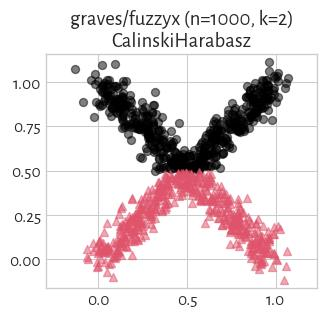

#### sklearn_kmeans (NCA=1.00)

#### sklearn_gm (NCA=1.00)

#### GDunn_d2_D3 (NCA=1.00)

#### GDunn_d2_D2 (NCA=1.00)

#### FCPS_Diana (NCA=1.00)

#### GDunn_d3_D3 (NCA=0.99)

#### GDunn_d4_D3 (NCA=0.99)

#### GDunn_d3_D2 (NCA=0.99)

#### sklearn_birch_T0.01_BF50 (NCA=0.98)

#### mst_divisive_GDunn_d2_D3 (NCA=0.97)

#### mst_divisive_GDunn_d2_D2 (NCA=0.97)

#### ITM (NCA=0.97)

#### FCPS_Fanny (NCA=0.97)

#### fastcluster_complete (NCA=0.97)

#### mst_divisive_GDunn_d5_D2 (NCA=0.96)

#### IcA (NCA=0.96)

#### mst_divisive_GDunn_d5_D1 (NCA=0.96)

#### mst_divisive_GDunn_d2_D1 (NCA=0.96)

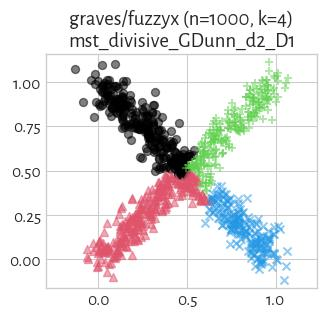

#### mst_divisive_CalinskiHarabasz (NCA=0.96)

#### fastcluster_weighted (NCA=0.94)

#### GDunn_d2_D1 (NCA=0.93)

#### FCPS_Minimax (NCA=0.91)

#### Silhouette (NCA=0.89)

#### fastcluster_ward (NCA=0.88)

#### FCPS_Clara (NCA=0.86)

#### fastcluster_average (NCA=0.86)

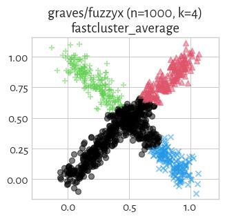

#### FCPS_MinEnergy (NCA=0.85)

#### Genie_G0.1 (NCA=0.84)

#### GIc (NCA=0.84)

#### GDunn_d3_D1 (NCA=0.84)

#### FCPS_PAM (NCA=0.83)

#### fastcluster_centroid (NCA=0.83)

#### GDunn_d4_D1 (NCA=0.82)

#### FCPS_AdaptiveDensityPeak (NCA=0.80)

#### FCPS_Hardcl (NCA=0.80)

#### CTCEHC (NCA=0.79)

#### sklearn_spectral_Alaplacian_G5 (NCA=0.77)

#### mst_divisive_GDunn_d5_D3 (NCA=0.74)

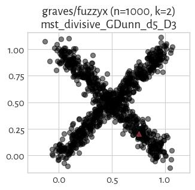

#### Genie_G0.3 (NCA=0.72)

#### WCNN_25 (NCA=0.71)

#### DaviesBouldin (NCA=0.67)

#### fastcluster_median (NCA=0.63)

#### Genie_G0.5 (NCA=0.63)

#### BallHall (NCA=0.63)

#### HEMST (NCA=0.62)

#### DuNN_25_Min_Max (NCA=0.56)

#### mst_divisive_BallHall (NCA=0.53)

#### mst_divisive_DuNN_25_Max_Min (NCA=0.49)

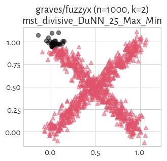

#### GDunn_d5_D2 (NCA=0.44)

#### Genie_G0.7 (NCA=0.43)

#### mst_divisive_DuNN_25_Min_Max (NCA=0.43)

#### DuNN_25_Mean_Mean (NCA=0.41)

#### DuNN_25_Max_Min (NCA=0.36)

#### mst_divisive_GDunn_d3_D1 (NCA=0.34)

#### GDunn_d5_D3 (NCA=0.34)

#### mst_divisive_WCNN_25 (NCA=0.31)

#### mst_divisive_DuNN_25_Mean_Mean (NCA=0.26)

#### GDunn_d5_D1 (NCA=0.12)

#### SilhouetteW (NCA=0.01)

#### mst_divisive_DaviesBouldin (NCA=0.01)

#### mst_divisive_GDunn_d3_D2 (NCA=0.00)

#### mst_divisive_GDunn_d4_D3 (NCA=0.00)

#### mst_divisive_GDunn_d4_D2 (NCA=0.00)

#### mst_divisive_GDunn_d4_D1 (NCA=0.00)

#### mst_divisive_GDunn_d3_D3 (NCA=0.00)

#### mst_divisive_SilhouetteW (NCA=0.00)

#### mst_divisive_GDunn_d1_D1 (NCA=0.00)

#### GDunn_d1_D2 (NCA=0.00)

#### GDunn_d1_D1 (NCA=0.00)

#### Genie_G1.0 (NCA=0.00)

#### GDunn_d1_D3 (NCA=0.00)

#### mst_divisive_GDunn_d1_D3 (NCA=0.00)

#### mst_divisive_GDunn_d1_D2 (NCA=0.00)

#### FCPS_HDBSCAN_4 (NCA=0.00)

#### FCPS_HDBSCAN_2 (NCA=0.00)

#### FCPS_HDBSCAN_8 (NCA=0.00)

#### mst_divisive_Silhouette (NCA=0.00)

## graves/line (n=250, d=2) 

#### mst_divisive_GDunn_d1_D3 (NCA=1.00)

#### mst_divisive_GDunn_d1_D2 (NCA=1.00)

#### mst_divisive_GDunn_d1_D1 (NCA=1.00)

#### WCNN_25 (NCA=1.00)

#### mst_divisive_WCNN_25 (NCA=1.00)

#### GDunn_d1_D3 (NCA=1.00)

#### GDunn_d1_D2 (NCA=1.00)

#### GDunn_d1_D1 (NCA=1.00)

#### mst_divisive_DuNN_25_Max_Min (NCA=1.00)

#### Genie_G0.3 (NCA=1.00)

#### mst_divisive_DuNN_25_Mean_Mean (NCA=1.00)

#### mst_divisive_DuNN_25_Min_Max (NCA=1.00)

#### FCPS_HDBSCAN_8 (NCA=1.00)

#### FCPS_HDBSCAN_2 (NCA=1.00)

#### FCPS_HDBSCAN_4 (NCA=1.00)

#### sklearn_gm (NCA=1.00)

#### sklearn_spectral_Alaplacian_G5 (NCA=1.00)

#### GIc (NCA=1.00)

#### Genie_G1.0 (NCA=1.00)

#### Genie_G0.7 (NCA=1.00)

#### Genie_G0.5 (NCA=1.00)

#### DuNN_25_Max_Min (NCA=1.00)

#### DuNN_25_Mean_Mean (NCA=1.00)

#### DuNN_25_Min_Max (NCA=1.00)

#### ITM (NCA=0.59)

#### mst_divisive_GDunn_d5_D2 (NCA=0.59)

#### mst_divisive_GDunn_d2_D2 (NCA=0.59)

#### CTCEHC (NCA=0.58)

#### GDunn_d2_D2 (NCA=0.56)

#### mst_divisive_GDunn_d2_D3 (NCA=0.56)

#### GDunn_d5_D2 (NCA=0.54)

#### FCPS_AdaptiveDensityPeak (NCA=0.54)

#### GDunn_d3_D2 (NCA=0.54)

#### mst_divisive_GDunn_d3_D2 (NCA=0.53)

#### GDunn_d2_D3 (NCA=0.52)

#### Genie_G0.1 (NCA=0.50)

#### GDunn_d3_D1 (NCA=0.49)

#### GDunn_d4_D1 (NCA=0.49)

#### GDunn_d4_D2 (NCA=0.49)

#### FCPS_Fanny (NCA=0.49)

#### FCPS_Diana (NCA=0.49)

#### mst_divisive_GDunn_d2_D1 (NCA=0.49)

#### mst_divisive_GDunn_d3_D1 (NCA=0.49)

#### mst_divisive_GDunn_d4_D1 (NCA=0.49)

#### GDunn_d2_D1 (NCA=0.49)

#### mst_divisive_GDunn_d4_D2 (NCA=0.49)

#### mst_divisive_GDunn_d5_D1 (NCA=0.49)

#### GDunn_d3_D3 (NCA=0.48)

#### mst_divisive_CalinskiHarabasz (NCA=0.46)

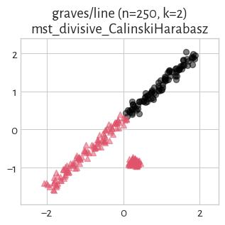

#### FCPS_Softcl (NCA=0.46)

#### sklearn_kmeans (NCA=0.46)

#### CalinskiHarabasz (NCA=0.46)

#### mst_divisive_GDunn_d3_D3 (NCA=0.46)

#### FCPS_Hardcl (NCA=0.46)

#### FCPS_Clara (NCA=0.46)

#### FCPS_PAM (NCA=0.46)

#### GDunn_d4_D3 (NCA=0.46)

#### fastcluster_centroid (NCA=0.46)

#### mst_divisive_GDunn_d4_D3 (NCA=0.46)

#### fastcluster_median (NCA=0.45)

#### fastcluster_weighted (NCA=0.45)

#### mst_divisive_Silhouette (NCA=0.45)

#### Silhouette (NCA=0.45)

#### IcA (NCA=0.45)

#### FCPS_MinEnergy (NCA=0.38)

#### BallHall (NCA=0.37)

#### sklearn_birch_T0.01_BF50 (NCA=0.37)

#### fastcluster_average (NCA=0.37)

#### mst_divisive_BallHall (NCA=0.37)

#### FCPS_Minimax (NCA=0.37)

#### GDunn_d5_D1 (NCA=0.36)

#### fastcluster_complete (NCA=0.36)

#### GDunn_d5_D3 (NCA=0.32)

#### fastcluster_ward (NCA=0.25)

#### HEMST (NCA=0.25)

#### mst_divisive_DaviesBouldin (NCA=0.03)

#### mst_divisive_SilhouetteW (NCA=0.03)

#### DaviesBouldin (NCA=0.03)

#### SilhouetteW (NCA=0.03)

#### mst_divisive_GDunn_d5_D3 (NCA=0.02)

## graves/parabolic (n=1000, d=2) 

#### CTCEHC (NCA=0.90)

#### IcA (NCA=0.90)

#### Genie_G0.1 (NCA=0.90)

#### Genie_G0.3 (NCA=0.90)

#### GIc (NCA=0.90)

#### Genie_G0.5 (NCA=0.90)

#### mst_divisive_GDunn_d2_D2 (NCA=0.85)

#### mst_divisive_GDunn_d2_D3 (NCA=0.85)

#### fastcluster_median (NCA=0.82)

#### fastcluster_centroid (NCA=0.81)

#### mst_divisive_GDunn_d3_D3 (NCA=0.81)

#### mst_divisive_GDunn_d3_D2 (NCA=0.81)

#### mst_divisive_GDunn_d4_D2 (NCA=0.81)

#### mst_divisive_GDunn_d4_D3 (NCA=0.81)

#### sklearn_spectral_Alaplacian_G5 (NCA=0.80)

#### ITM (NCA=0.80)

#### FCPS_Minimax (NCA=0.80)

#### mst_divisive_CalinskiHarabasz (NCA=0.79)

#### mst_divisive_Silhouette (NCA=0.79)

#### fastcluster_ward (NCA=0.79)

#### mst_divisive_BallHall (NCA=0.78)

#### mst_divisive_GDunn_d3_D1 (NCA=0.78)

#### mst_divisive_GDunn_d4_D1 (NCA=0.78)

#### GDunn_d3_D3 (NCA=0.78)

#### fastcluster_weighted (NCA=0.78)

#### GDunn_d4_D3 (NCA=0.78)

#### FCPS_Fanny (NCA=0.78)

#### FCPS_Diana (NCA=0.78)

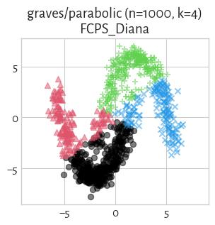

#### GDunn_d2_D3 (NCA=0.77)

#### GDunn_d2_D2 (NCA=0.77)

#### GDunn_d4_D2 (NCA=0.77)

#### GDunn_d3_D2 (NCA=0.77)

#### fastcluster_average (NCA=0.77)

#### GDunn_d4_D1 (NCA=0.77)

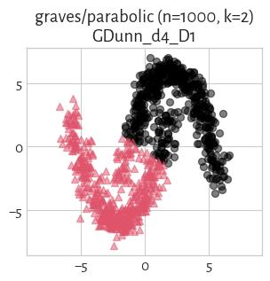

#### GDunn_d3_D1 (NCA=0.77)

#### Silhouette (NCA=0.77)

#### sklearn_birch_T0.01_BF50 (NCA=0.77)

#### FCPS_Clara (NCA=0.77)

#### fastcluster_complete (NCA=0.77)

#### CalinskiHarabasz (NCA=0.77)

#### FCPS_Hardcl (NCA=0.77)

#### BallHall (NCA=0.77)

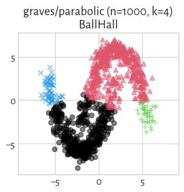

#### sklearn_kmeans (NCA=0.77)

#### FCPS_Softcl (NCA=0.77)

#### FCPS_PAM (NCA=0.77)

#### FCPS_AdaptiveDensityPeak (NCA=0.76)

#### mst_divisive_GDunn_d2_D1 (NCA=0.74)

#### sklearn_gm (NCA=0.73)

#### GDunn_d2_D1 (NCA=0.66)

#### mst_divisive_GDunn_d5_D1 (NCA=0.64)

#### FCPS_MinEnergy (NCA=0.62)

#### DuNN_25_Min_Max (NCA=0.50)

#### mst_divisive_GDunn_d5_D2 (NCA=0.50)

#### mst_divisive_GDunn_d5_D3 (NCA=0.49)

#### mst_divisive_DuNN_25_Min_Max (NCA=0.44)

#### WCNN_25 (NCA=0.36)

#### DaviesBouldin (NCA=0.35)

#### Genie_G0.7 (NCA=0.35)

#### mst_divisive_DuNN_25_Max_Min (NCA=0.33)

#### GDunn_d5_D1 (NCA=0.33)

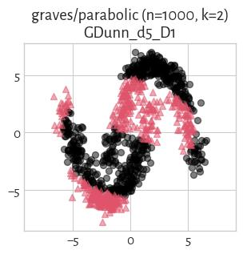

#### HEMST (NCA=0.32)

#### DuNN_25_Max_Min (NCA=0.22)

#### mst_divisive_DuNN_25_Mean_Mean (NCA=0.21)

#### GDunn_d5_D2 (NCA=0.19)

#### DuNN_25_Mean_Mean (NCA=0.19)

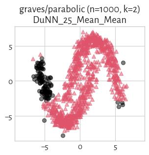

#### SilhouetteW (NCA=0.14)

#### mst_divisive_WCNN_25 (NCA=0.09)

#### GDunn_d5_D3 (NCA=0.04)

#### mst_divisive_DaviesBouldin (NCA=0.01)

#### mst_divisive_SilhouetteW (NCA=0.01)

#### GDunn_d1_D1 (NCA=0.00)

#### GDunn_d1_D2 (NCA=0.00)

#### GDunn_d1_D3 (NCA=0.00)

#### mst_divisive_GDunn_d1_D1 (NCA=0.00)

#### mst_divisive_GDunn_d1_D2 (NCA=0.00)

#### mst_divisive_GDunn_d1_D3 (NCA=0.00)

#### FCPS_HDBSCAN_2 (NCA=0.00)

#### Genie_G1.0 (NCA=0.00)

#### FCPS_HDBSCAN_8 (NCA=0.00)

#### FCPS_HDBSCAN_4 (NCA=0.00)

## graves/ring (n=1000, d=2) 

#### Genie_G0.1 (NCA=1.00)

#### mst_divisive_GDunn_d1_D1 (NCA=1.00)

#### mst_divisive_GDunn_d1_D2 (NCA=1.00)

#### mst_divisive_GDunn_d1_D3 (NCA=1.00)

#### mst_divisive_WCNN_25 (NCA=1.00)

#### mst_divisive_DuNN_25_Min_Max (NCA=1.00)

#### mst_divisive_DuNN_25_Mean_Mean (NCA=1.00)

#### Genie_G0.3 (NCA=1.00)

#### mst_divisive_DuNN_25_Max_Min (NCA=1.00)

#### sklearn_spectral_Alaplacian_G5 (NCA=1.00)

#### WCNN_25 (NCA=1.00)

#### DuNN_25_Max_Min (NCA=1.00)

#### DuNN_25_Mean_Mean (NCA=1.00)

#### DuNN_25_Min_Max (NCA=1.00)

#### FCPS_HDBSCAN_4 (NCA=1.00)

#### FCPS_HDBSCAN_2 (NCA=1.00)

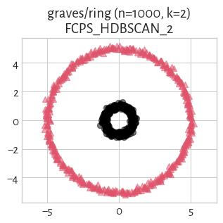

#### FCPS_HDBSCAN_8 (NCA=1.00)

#### Genie_G0.5 (NCA=1.00)

#### Genie_G1.0 (NCA=1.00)

#### GIc (NCA=1.00)

#### ITM (NCA=1.00)

#### GDunn_d1_D3 (NCA=1.00)

#### GDunn_d1_D2 (NCA=1.00)

#### GDunn_d1_D1 (NCA=1.00)

#### Genie_G0.7 (NCA=1.00)

#### mst_divisive_GDunn_d2_D1 (NCA=0.50)

#### IcA (NCA=0.48)

#### fastcluster_complete (NCA=0.46)

#### mst_divisive_Silhouette (NCA=0.43)

#### Silhouette (NCA=0.42)

#### fastcluster_median (NCA=0.42)

#### FCPS_Diana (NCA=0.42)

#### mst_divisive_CalinskiHarabasz (NCA=0.42)

#### FCPS_Hardcl (NCA=0.41)

#### fastcluster_weighted (NCA=0.40)

#### FCPS_MinEnergy (NCA=0.39)

#### mst_divisive_GDunn_d3_D2 (NCA=0.38)

#### GDunn_d2_D2 (NCA=0.38)

#### mst_divisive_GDunn_d2_D2 (NCA=0.38)

#### mst_divisive_GDunn_d5_D2 (NCA=0.38)

#### GDunn_d3_D2 (NCA=0.38)

#### mst_divisive_GDunn_d3_D1 (NCA=0.38)

#### GDunn_d4_D2 (NCA=0.37)

#### mst_divisive_GDunn_d4_D2 (NCA=0.37)

#### FCPS_PAM (NCA=0.37)

#### FCPS_Clara (NCA=0.36)

#### GDunn_d3_D1 (NCA=0.36)

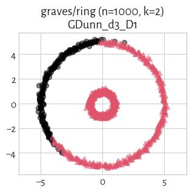

#### FCPS_AdaptiveDensityPeak (NCA=0.36)

#### CTCEHC (NCA=0.36)

#### sklearn_birch_T0.01_BF50 (NCA=0.34)

#### fastcluster_ward (NCA=0.34)

#### GDunn_d2_D3 (NCA=0.34)

#### GDunn_d3_D3 (NCA=0.34)

#### mst_divisive_GDunn_d2_D3 (NCA=0.34)

#### mst_divisive_GDunn_d3_D3 (NCA=0.34)

#### fastcluster_average (NCA=0.34)

#### mst_divisive_GDunn_d5_D3 (NCA=0.34)

#### GDunn_d5_D3 (NCA=0.34)

#### GDunn_d2_D1 (NCA=0.34)

#### GDunn_d4_D3 (NCA=0.31)

#### mst_divisive_GDunn_d4_D3 (NCA=0.31)

#### FCPS_Minimax (NCA=0.30)

#### fastcluster_centroid (NCA=0.22)

#### sklearn_gm (NCA=0.17)

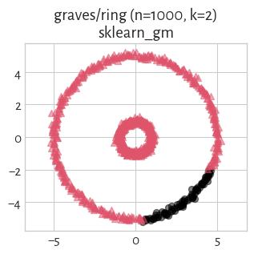

#### GDunn_d5_D1 (NCA=0.15)

#### BallHall (NCA=0.04)

#### mst_divisive_BallHall (NCA=0.04)

#### FCPS_Fanny (NCA=0.03)

#### HEMST (NCA=0.03)

#### sklearn_kmeans (NCA=0.01)

#### FCPS_Softcl (NCA=0.01)

#### SilhouetteW (NCA=0.00)

#### mst_divisive_DaviesBouldin (NCA=0.00)

#### mst_divisive_SilhouetteW (NCA=0.00)

#### DaviesBouldin (NCA=0.00)

#### CalinskiHarabasz (NCA=0.00)

#### GDunn_d5_D2 (NCA=0.00)

#### mst_divisive_GDunn_d5_D1 (NCA=0.00)

#### GDunn_d4_D1 (NCA=0.00)

#### mst_divisive_GDunn_d4_D1 (NCA=0.00)

## graves/ring_noisy (n=1050, d=2) 

#### Genie_G0.1 (NCA=1.00)

#### Genie_G0.3 (NCA=1.00)

#### mst_divisive_DuNN_25_Mean_Mean (NCA=1.00)

#### mst_divisive_DuNN_25_Min_Max (NCA=1.00)

#### mst_divisive_WCNN_25 (NCA=1.00)

#### WCNN_25 (NCA=1.00)

#### DuNN_25_Min_Max (NCA=1.00)

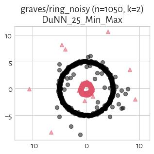

#### DuNN_25_Mean_Mean (NCA=1.00)

#### sklearn_spectral_Alaplacian_G5 (NCA=1.00)

#### Genie_G0.7 (NCA=1.00)

#### Genie_G0.5 (NCA=1.00)

#### GIc (NCA=1.00)

#### ITM (NCA=1.00)

#### IcA (NCA=0.99)

#### CTCEHC (NCA=0.79)

#### fastcluster_weighted (NCA=0.60)

#### fastcluster_complete (NCA=0.52)

#### FCPS_Diana (NCA=0.42)

#### FCPS_MinEnergy (NCA=0.42)

#### FCPS_Hardcl (NCA=0.41)

#### sklearn_kmeans (NCA=0.41)

#### mst_divisive_CalinskiHarabasz (NCA=0.40)

#### mst_divisive_GDunn_d2_D1 (NCA=0.39)

#### fastcluster_ward (NCA=0.39)

#### FCPS_Minimax (NCA=0.38)

#### mst_divisive_GDunn_d5_D2 (NCA=0.37)

#### mst_divisive_GDunn_d2_D2 (NCA=0.37)

#### FCPS_AdaptiveDensityPeak (NCA=0.37)

#### FCPS_PAM (NCA=0.37)

#### GDunn_d2_D2 (NCA=0.37)

#### FCPS_Clara (NCA=0.36)

#### mst_divisive_GDunn_d2_D3 (NCA=0.35)

#### mst_divisive_GDunn_d5_D3 (NCA=0.35)

#### sklearn_birch_T0.01_BF50 (NCA=0.34)

#### GDunn_d2_D3 (NCA=0.34)

#### fastcluster_median (NCA=0.28)

#### FCPS_Fanny (NCA=0.26)

#### GDunn_d5_D1 (NCA=0.18)

#### sklearn_gm (NCA=0.16)

#### GDunn_d2_D1 (NCA=0.12)

#### mst_divisive_DuNN_25_Max_Min (NCA=0.08)

#### GDunn_d5_D2 (NCA=0.04)

#### BallHall (NCA=0.04)

#### FCPS_Softcl (NCA=0.03)

#### CalinskiHarabasz (NCA=0.02)

#### DuNN_25_Max_Min (NCA=0.01)

#### GDunn_d5_D3 (NCA=0.01)

#### Genie_G1.0 (NCA=0.00)

#### GDunn_d4_D2 (NCA=0.00)

#### mst_divisive_GDunn_d1_D3 (NCA=0.00)

#### mst_divisive_GDunn_d1_D2 (NCA=0.00)

#### mst_divisive_GDunn_d1_D1 (NCA=0.00)

#### mst_divisive_SilhouetteW (NCA=0.00)

#### mst_divisive_Silhouette (NCA=0.00)

#### mst_divisive_DaviesBouldin (NCA=0.00)

#### mst_divisive_BallHall (NCA=0.00)

#### SilhouetteW (NCA=0.00)

#### Silhouette (NCA=0.00)

#### GDunn_d4_D3 (NCA=0.00)

#### GDunn_d4_D1 (NCA=0.00)

#### mst_divisive_GDunn_d3_D2 (NCA=0.00)

#### GDunn_d3_D3 (NCA=0.00)

#### GDunn_d3_D2 (NCA=0.00)

#### GDunn_d3_D1 (NCA=0.00)

#### GDunn_d1_D3 (NCA=0.00)

#### GDunn_d1_D2 (NCA=0.00)

#### GDunn_d1_D1 (NCA=0.00)

#### DaviesBouldin (NCA=0.00)

#### mst_divisive_GDunn_d3_D1 (NCA=0.00)

#### mst_divisive_GDunn_d3_D3 (NCA=0.00)

#### fastcluster_average (NCA=0.00)

#### fastcluster_centroid (NCA=0.00)

#### mst_divisive_GDunn_d4_D1 (NCA=0.00)

#### FCPS_HDBSCAN_4 (NCA=0.00)

#### FCPS_HDBSCAN_2 (NCA=0.00)

#### FCPS_HDBSCAN_8 (NCA=0.00)

#### HEMST (NCA=0.00)

#### mst_divisive_GDunn_d5_D1 (NCA=0.00)

#### mst_divisive_GDunn_d4_D3 (NCA=0.00)

#### mst_divisive_GDunn_d4_D2 (NCA=0.00)

## graves/ring_outliers (n=1030, d=2) 

#### Genie_G0.1 (NCA=1.00)

#### GDunn_d1_D3 (NCA=1.00)

#### WCNN_25 (NCA=1.00)

#### mst_divisive_GDunn_d1_D1 (NCA=1.00)

#### mst_divisive_GDunn_d1_D2 (NCA=1.00)

#### mst_divisive_GDunn_d1_D3 (NCA=1.00)

#### mst_divisive_WCNN_25 (NCA=1.00)

#### mst_divisive_DuNN_25_Min_Max (NCA=1.00)

#### mst_divisive_DuNN_25_Mean_Mean (NCA=1.00)

#### Genie_G0.3 (NCA=1.00)

#### mst_divisive_DuNN_25_Max_Min (NCA=1.00)

#### sklearn_spectral_Alaplacian_G5 (NCA=1.00)

#### DuNN_25_Max_Min (NCA=1.00)

#### DuNN_25_Mean_Mean (NCA=1.00)

#### DuNN_25_Min_Max (NCA=1.00)

#### FCPS_HDBSCAN_4 (NCA=1.00)

#### FCPS_HDBSCAN_2 (NCA=1.00)

#### FCPS_HDBSCAN_8 (NCA=1.00)

#### ITM (NCA=1.00)

#### GIc (NCA=1.00)

#### GDunn_d1_D2 (NCA=1.00)

#### GDunn_d1_D1 (NCA=1.00)

#### Genie_G0.5 (NCA=1.00)

#### Genie_G0.7 (NCA=1.00)

#### Genie_G1.0 (NCA=1.00)

#### mst_divisive_GDunn_d4_D1 (NCA=0.85)

#### mst_divisive_BallHall (NCA=0.76)

#### mst_divisive_GDunn_d5_D1 (NCA=0.74)

#### mst_divisive_GDunn_d2_D1 (NCA=0.69)

#### HEMST (NCA=0.66)

#### FCPS_Fanny (NCA=0.62)

#### CTCEHC (NCA=0.60)

#### FCPS_MinEnergy (NCA=0.59)

#### fastcluster_average (NCA=0.58)

#### FCPS_AdaptiveDensityPeak (NCA=0.58)

#### GDunn_d2_D3 (NCA=0.58)

#### mst_divisive_GDunn_d3_D1 (NCA=0.58)

#### mst_divisive_GDunn_d2_D3 (NCA=0.57)

#### fastcluster_median (NCA=0.57)

#### sklearn_kmeans (NCA=0.57)

#### FCPS_Clara (NCA=0.57)

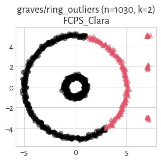

#### FCPS_Softcl (NCA=0.57)

#### CalinskiHarabasz (NCA=0.57)

#### Silhouette (NCA=0.56)

#### FCPS_PAM (NCA=0.56)

#### FCPS_Minimax (NCA=0.56)

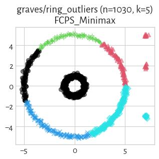

#### fastcluster_complete (NCA=0.56)

#### fastcluster_weighted (NCA=0.56)

#### GDunn_d4_D2 (NCA=0.56)

#### GDunn_d3_D2 (NCA=0.56)

#### GDunn_d3_D1 (NCA=0.55)

#### GDunn_d3_D3 (NCA=0.55)

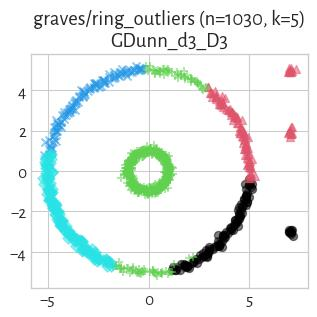

#### fastcluster_centroid (NCA=0.55)

#### FCPS_Diana (NCA=0.54)

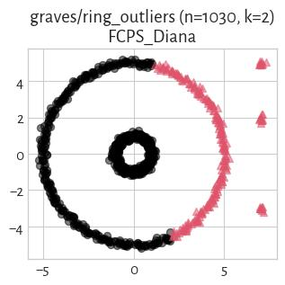

#### GDunn_d4_D1 (NCA=0.54)

#### DaviesBouldin (NCA=0.50)

#### IcA (NCA=0.48)

#### FCPS_Hardcl (NCA=0.42)

#### GDunn_d2_D1 (NCA=0.41)

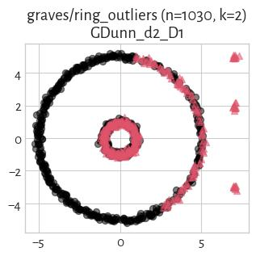

#### GDunn_d5_D2 (NCA=0.41)

#### mst_divisive_GDunn_d2_D2 (NCA=0.40)

#### mst_divisive_GDunn_d5_D2 (NCA=0.40)

#### mst_divisive_GDunn_d3_D2 (NCA=0.37)

#### mst_divisive_GDunn_d5_D3 (NCA=0.36)

#### GDunn_d4_D3 (NCA=0.35)

#### mst_divisive_SilhouetteW (NCA=0.35)

#### GDunn_d2_D2 (NCA=0.34)

#### fastcluster_ward (NCA=0.34)

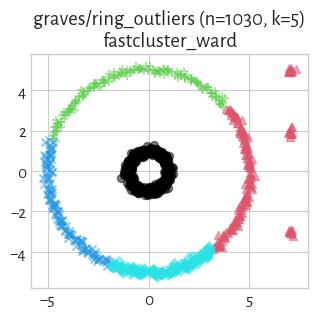

#### mst_divisive_CalinskiHarabasz (NCA=0.33)

#### sklearn_birch_T0.01_BF50 (NCA=0.33)

#### sklearn_gm (NCA=0.31)

#### GDunn_d5_D1 (NCA=0.28)

#### mst_divisive_DaviesBouldin (NCA=0.20)

#### mst_divisive_Silhouette (NCA=0.17)

#### SilhouetteW (NCA=0.15)

#### mst_divisive_GDunn_d4_D2 (NCA=0.14)

#### mst_divisive_GDunn_d3_D3 (NCA=0.14)

#### mst_divisive_GDunn_d4_D3 (NCA=0.13)

#### GDunn_d5_D3 (NCA=0.06)

#### BallHall (NCA=0.02)

## graves/zigzag (n=250, d=2) 

#### Genie_G0.1 (NCA=1.00)

#### WCNN_25 (NCA=1.00)

#### mst_divisive_GDunn_d1_D1 (NCA=1.00)

#### mst_divisive_GDunn_d1_D2 (NCA=1.00)

#### mst_divisive_GDunn_d1_D3 (NCA=1.00)

#### mst_divisive_WCNN_25 (NCA=1.00)

#### mst_divisive_DuNN_25_Min_Max (NCA=1.00)

#### mst_divisive_DuNN_25_Mean_Mean (NCA=1.00)

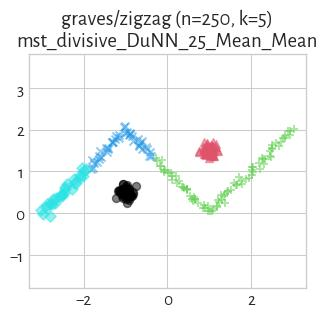

#### Genie_G0.3 (NCA=1.00)

#### mst_divisive_DuNN_25_Max_Min (NCA=1.00)

#### GDunn_d1_D2 (NCA=1.00)

#### GDunn_d1_D3 (NCA=1.00)

#### GDunn_d1_D1 (NCA=1.00)

#### HEMST (NCA=1.00)

#### DuNN_25_Min_Max (NCA=1.00)

#### DuNN_25_Mean_Mean (NCA=1.00)

#### DuNN_25_Max_Min (NCA=1.00)

#### FCPS_HDBSCAN_8 (NCA=1.00)

#### FCPS_HDBSCAN_2 (NCA=1.00)

#### FCPS_HDBSCAN_4 (NCA=1.00)

#### Genie_G0.5 (NCA=1.00)

#### Genie_G0.7 (NCA=1.00)

#### Genie_G1.0 (NCA=1.00)

#### GIc (NCA=1.00)

#### sklearn_gm (NCA=0.98)

#### IcA (NCA=0.96)

#### ITM (NCA=0.87)

#### FCPS_MinEnergy (NCA=0.85)

#### FCPS_Fanny (NCA=0.84)

#### sklearn_spectral_Alaplacian_G5 (NCA=0.81)

#### FCPS_Clara (NCA=0.80)

#### sklearn_birch_T0.01_BF50 (NCA=0.74)

#### GDunn_d3_D3 (NCA=0.73)

#### GDunn_d4_D2 (NCA=0.73)

#### GDunn_d4_D3 (NCA=0.72)

#### FCPS_PAM (NCA=0.72)

#### CTCEHC (NCA=0.71)

#### GDunn_d5_D2 (NCA=0.71)

#### sklearn_kmeans (NCA=0.70)

#### FCPS_Softcl (NCA=0.70)

#### CalinskiHarabasz (NCA=0.69)

#### FCPS_Hardcl (NCA=0.69)

#### fastcluster_average (NCA=0.69)

#### GDunn_d2_D1 (NCA=0.69)

#### Silhouette (NCA=0.69)

#### GDunn_d2_D3 (NCA=0.68)

#### GDunn_d3_D2 (NCA=0.67)

#### GDunn_d2_D2 (NCA=0.66)

#### mst_divisive_CalinskiHarabasz (NCA=0.66)

#### FCPS_AdaptiveDensityPeak (NCA=0.64)

#### fastcluster_ward (NCA=0.64)

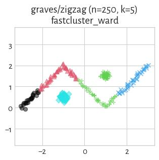

#### fastcluster_centroid (NCA=0.63)

#### GDunn_d4_D1 (NCA=0.62)

#### FCPS_Diana (NCA=0.61)

#### GDunn_d3_D1 (NCA=0.61)

#### fastcluster_median (NCA=0.61)

#### FCPS_Minimax (NCA=0.60)

#### mst_divisive_GDunn_d5_D3 (NCA=0.60)

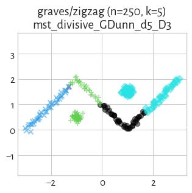

#### mst_divisive_GDunn_d5_D2 (NCA=0.60)

#### fastcluster_weighted (NCA=0.60)

#### BallHall (NCA=0.59)

#### mst_divisive_GDunn_d5_D1 (NCA=0.59)

#### fastcluster_complete (NCA=0.57)

#### mst_divisive_Silhouette (NCA=0.57)

#### mst_divisive_BallHall (NCA=0.56)

#### mst_divisive_GDunn_d2_D3 (NCA=0.53)

#### mst_divisive_GDunn_d2_D2 (NCA=0.53)

#### mst_divisive_GDunn_d2_D1 (NCA=0.53)

#### mst_divisive_GDunn_d3_D2 (NCA=0.50)

#### mst_divisive_GDunn_d3_D1 (NCA=0.50)

#### mst_divisive_GDunn_d3_D3 (NCA=0.50)

#### mst_divisive_GDunn_d4_D1 (NCA=0.50)

#### mst_divisive_GDunn_d4_D2 (NCA=0.50)

#### mst_divisive_GDunn_d4_D3 (NCA=0.50)

#### DaviesBouldin (NCA=0.45)

#### SilhouetteW (NCA=0.30)

#### GDunn_d5_D1 (NCA=0.30)

#### mst_divisive_SilhouetteW (NCA=0.29)

#### GDunn_d5_D3 (NCA=0.08)

#### mst_divisive_DaviesBouldin (NCA=0.04)

## graves/zigzag_noisy (n=300, d=2) 

#### Genie_G0.3 (NCA=1.00)

#### mst_divisive_DuNN_25_Min_Max (NCA=1.00)

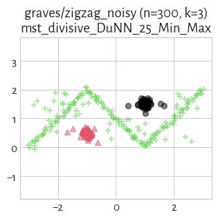

#### mst_divisive_WCNN_25 (NCA=1.00)

#### WCNN_25 (NCA=1.00)

#### DuNN_25_Min_Max (NCA=1.00)

#### Genie_G0.5 (NCA=1.00)

#### Genie_G0.7 (NCA=1.00)

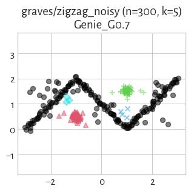

#### sklearn_gm (NCA=0.95)

#### mst_divisive_DuNN_25_Mean_Mean (NCA=0.94)

#### IcA (NCA=0.90)

#### Genie_G0.1 (NCA=0.88)

#### GIc (NCA=0.88)

#### FCPS_MinEnergy (NCA=0.84)

#### FCPS_Fanny (NCA=0.83)

#### FCPS_Clara (NCA=0.83)

#### fastcluster_ward (NCA=0.79)

#### sklearn_spectral_Alaplacian_G5 (NCA=0.78)

#### FCPS_PAM (NCA=0.77)

#### fastcluster_median (NCA=0.77)

#### GDunn_d5_D2 (NCA=0.76)

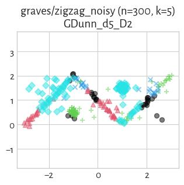

#### ITM (NCA=0.75)

#### sklearn_birch_T0.01_BF50 (NCA=0.74)

#### GDunn_d1_D3 (NCA=0.73)

#### GDunn_d2_D3 (NCA=0.71)

#### GDunn_d2_D2 (NCA=0.71)

#### FCPS_Softcl (NCA=0.69)

#### FCPS_Hardcl (NCA=0.69)

#### GDunn_d3_D3 (NCA=0.69)

#### mst_divisive_CalinskiHarabasz (NCA=0.68)

#### GDunn_d4_D2 (NCA=0.68)

#### mst_divisive_GDunn_d2_D2 (NCA=0.66)

#### mst_divisive_GDunn_d2_D3 (NCA=0.66)

#### GDunn_d4_D3 (NCA=0.66)

#### FCPS_AdaptiveDensityPeak (NCA=0.66)

#### DuNN_25_Mean_Mean (NCA=0.66)

#### fastcluster_average (NCA=0.65)

#### fastcluster_centroid (NCA=0.65)

#### FCPS_Minimax (NCA=0.65)

#### sklearn_kmeans (NCA=0.64)

#### fastcluster_weighted (NCA=0.64)

#### GDunn_d2_D1 (NCA=0.64)

#### GDunn_d3_D2 (NCA=0.64)

#### CalinskiHarabasz (NCA=0.63)

#### FCPS_Diana (NCA=0.61)

#### CTCEHC (NCA=0.61)

#### mst_divisive_GDunn_d5_D2 (NCA=0.60)

#### DuNN_25_Max_Min (NCA=0.60)

#### GDunn_d1_D2 (NCA=0.60)

#### mst_divisive_GDunn_d5_D1 (NCA=0.60)

#### mst_divisive_Silhouette (NCA=0.59)

#### mst_divisive_GDunn_d5_D3 (NCA=0.59)

#### GDunn_d4_D1 (NCA=0.58)

#### fastcluster_complete (NCA=0.58)

#### mst_divisive_DuNN_25_Max_Min (NCA=0.58)

#### mst_divisive_BallHall (NCA=0.57)

#### BallHall (NCA=0.57)

#### HEMST (NCA=0.56)

#### GDunn_d3_D1 (NCA=0.54)

#### mst_divisive_GDunn_d2_D1 (NCA=0.53)

#### GDunn_d1_D1 (NCA=0.51)

#### Silhouette (NCA=0.51)

#### mst_divisive_GDunn_d3_D2 (NCA=0.51)

#### mst_divisive_GDunn_d4_D3 (NCA=0.51)

#### mst_divisive_GDunn_d4_D2 (NCA=0.51)

#### mst_divisive_GDunn_d3_D3 (NCA=0.51)

#### mst_divisive_GDunn_d3_D1 (NCA=0.50)

#### mst_divisive_GDunn_d4_D1 (NCA=0.50)

#### Genie_G1.0 (NCA=0.50)

#### mst_divisive_GDunn_d1_D1 (NCA=0.50)

#### FCPS_HDBSCAN_2 (NCA=0.50)

#### DaviesBouldin (NCA=0.45)

#### GDunn_d5_D1 (NCA=0.36)

#### SilhouetteW (NCA=0.25)

#### mst_divisive_GDunn_d1_D3 (NCA=0.25)

#### mst_divisive_GDunn_d1_D2 (NCA=0.25)

#### GDunn_d5_D3 (NCA=0.09)

#### mst_divisive_SilhouetteW (NCA=0.02)

#### mst_divisive_DaviesBouldin (NCA=0.02)

#### FCPS_HDBSCAN_4 (NCA=0.00)

#### FCPS_HDBSCAN_8 (NCA=0.00)

## graves/zigzag_outliers (n=280, d=2) 

#### Genie_G0.1 (NCA=1.00)

#### mst_divisive_DuNN_25_Min_Max (NCA=1.00)

#### WCNN_25 (NCA=1.00)

#### mst_divisive_WCNN_25 (NCA=1.00)

#### mst_divisive_DuNN_25_Mean_Mean (NCA=1.00)

#### Genie_G0.3 (NCA=1.00)

#### mst_divisive_DuNN_25_Max_Min (NCA=1.00)

#### DuNN_25_Max_Min (NCA=1.00)

#### DuNN_25_Mean_Mean (NCA=1.00)

#### Genie_G0.5 (NCA=1.00)

#### GIc (NCA=1.00)

#### DuNN_25_Min_Max (NCA=1.00)

#### sklearn_gm (NCA=0.99)

#### IcA (NCA=0.95)

#### ITM (NCA=0.91)

#### FCPS_Fanny (NCA=0.82)

#### CTCEHC (NCA=0.71)

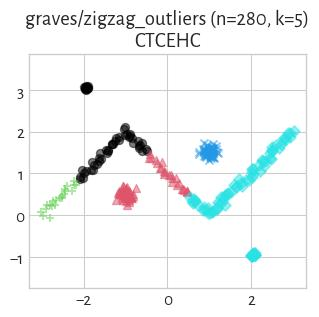

#### FCPS_Softcl (NCA=0.67)

#### GDunn_d2_D3 (NCA=0.66)

#### FCPS_Clara (NCA=0.65)

#### GDunn_d2_D2 (NCA=0.65)

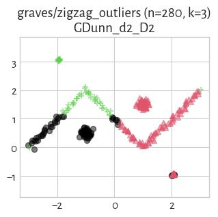

#### FCPS_AdaptiveDensityPeak (NCA=0.64)

#### FCPS_PAM (NCA=0.64)

#### mst_divisive_GDunn_d5_D3 (NCA=0.63)

#### mst_divisive_GDunn_d5_D2 (NCA=0.63)

#### mst_divisive_CalinskiHarabasz (NCA=0.63)

#### CalinskiHarabasz (NCA=0.62)

#### sklearn_kmeans (NCA=0.62)

#### GDunn_d5_D2 (NCA=0.62)

#### FCPS_MinEnergy (NCA=0.62)

#### fastcluster_ward (NCA=0.62)

#### FCPS_Minimax (NCA=0.62)

#### FCPS_Diana (NCA=0.62)

#### mst_divisive_GDunn_d5_D1 (NCA=0.59)

#### fastcluster_complete (NCA=0.57)

#### sklearn_birch_T0.01_BF50 (NCA=0.57)

#### GDunn_d3_D2 (NCA=0.53)

#### FCPS_Hardcl (NCA=0.53)

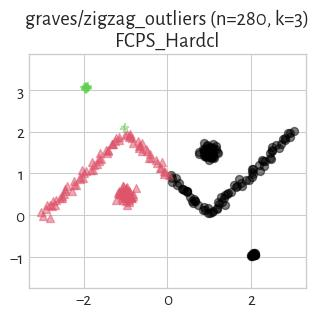

#### Silhouette (NCA=0.51)

#### GDunn_d3_D1 (NCA=0.51)

#### GDunn_d4_D1 (NCA=0.51)

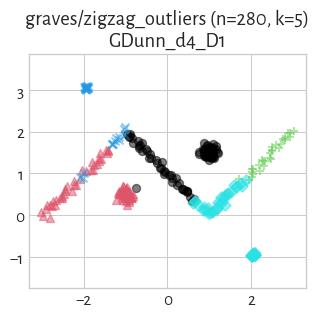

#### GDunn_d3_D3 (NCA=0.50)

#### mst_divisive_BallHall (NCA=0.50)

#### mst_divisive_Silhouette (NCA=0.50)

#### GDunn_d1_D1 (NCA=0.50)

#### mst_divisive_GDunn_d1_D1 (NCA=0.50)

#### BallHall (NCA=0.50)

#### fastcluster_weighted (NCA=0.50)

#### mst_divisive_GDunn_d1_D2 (NCA=0.50)

#### mst_divisive_GDunn_d1_D3 (NCA=0.50)

#### mst_divisive_GDunn_d2_D1 (NCA=0.50)

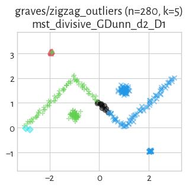

#### mst_divisive_GDunn_d2_D2 (NCA=0.50)

#### mst_divisive_GDunn_d2_D3 (NCA=0.50)

#### mst_divisive_GDunn_d3_D1 (NCA=0.50)

#### mst_divisive_GDunn_d3_D2 (NCA=0.50)

#### mst_divisive_GDunn_d3_D3 (NCA=0.50)

#### mst_divisive_GDunn_d4_D1 (NCA=0.50)

#### mst_divisive_GDunn_d4_D2 (NCA=0.50)

#### mst_divisive_GDunn_d4_D3 (NCA=0.50)

#### HEMST (NCA=0.50)

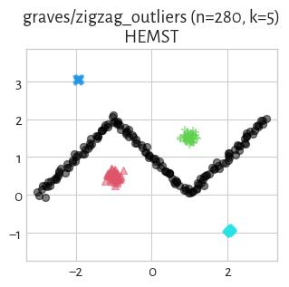

#### fastcluster_average (NCA=0.50)

#### GDunn_d4_D3 (NCA=0.50)

#### FCPS_HDBSCAN_8 (NCA=0.50)

#### GDunn_d4_D2 (NCA=0.50)

#### FCPS_HDBSCAN_4 (NCA=0.50)

#### GDunn_d1_D3 (NCA=0.50)

#### Genie_G1.0 (NCA=0.50)

#### Genie_G0.7 (NCA=0.50)

#### GDunn_d1_D2 (NCA=0.50)

#### fastcluster_centroid (NCA=0.50)

#### FCPS_HDBSCAN_2 (NCA=0.50)

#### fastcluster_median (NCA=0.50)

#### GDunn_d2_D1 (NCA=0.50)

#### DaviesBouldin (NCA=0.45)

#### sklearn_spectral_Alaplacian_G5 (NCA=0.40)

#### GDunn_d5_D1 (NCA=0.30)

#### GDunn_d5_D3 (NCA=0.06)

#### mst_divisive_DaviesBouldin (NCA=0.05)

#### mst_divisive_SilhouetteW (NCA=0.04)

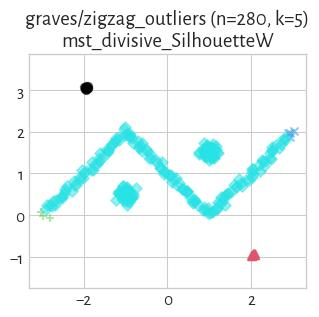

#### SilhouetteW (NCA=0.02)

