The **[Framework for Benchmarking Clustering Algorithms](https://clustering-benchmarks.gagolewski.com)
is authored/edited/maintained by [Marek Gagolewski](https://www.gagolewski.com)**

[Benchmark suite](https://github.com/gagolews/clustering-data-v1) version 1.1.0

--------------------------------------------------------------------------------

**Datasets**

* [other/chameleon_t4_8k](#chameleon_t4_8k)
* [other/chameleon_t5_8k](#chameleon_t5_8k)
* [other/chameleon_t7_10k](#chameleon_t7_10k)
* [other/chameleon_t8_8k](#chameleon_t8_8k)
* [other/hdbscan](#hdbscan)
* [other/iris](#iris)
* [other/iris5](#iris5)
* [other/square](#square)

*(results are sorted wrt the normalised clustering accuracy score – comparison against the reference labels; see the Framework's [homepage](https://clustering-benchmarks.gagolewski.com) for more details)*

--------------------------------------------------------------------------------

## other/chameleon_t4_8k (n=8000, d=2) 

#### WCNN_25 (NCA=1.00)

#### Genie_G0.3 (NCA=1.00)

#### Genie_G0.5 (NCA=0.80)

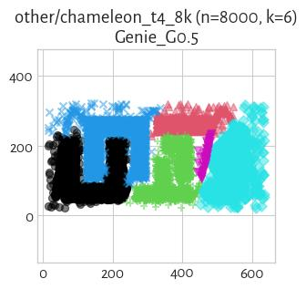

#### ITM (NCA=0.78)

#### mst_divisive_GDunn_d2_D3 (NCA=0.72)

#### mst_divisive_GDunn_d2_D2 (NCA=0.72)

#### Genie_G0.1 (NCA=0.72)

#### GIc (NCA=0.72)

#### fastcluster_centroid (NCA=0.70)

#### FCPS_AdaptiveDensityPeak (NCA=0.67)

#### BallHall (NCA=0.67)

#### fastcluster_average (NCA=0.64)

#### Silhouette (NCA=0.64)

#### FCPS_Softcl (NCA=0.63)

#### sklearn_spectral_Alaplacian_G5 (NCA=0.63)

#### sklearn_birch_T0.01_BF50 (NCA=0.63)

#### GDunn_d3_D1 (NCA=0.62)

#### FCPS_Clara (NCA=0.62)

#### FCPS_Fanny (NCA=0.62)

#### mst_divisive_CalinskiHarabasz (NCA=0.62)

#### FCPS_PAM (NCA=0.61)

#### sklearn_kmeans (NCA=0.61)

#### CalinskiHarabasz (NCA=0.61)

#### CTCEHC (NCA=0.60)

#### mst_divisive_Silhouette (NCA=0.60)

#### mst_divisive_GDunn_d5_D1 (NCA=0.60)

#### FCPS_MinEnergy (NCA=0.60)

#### GDunn_d2_D2 (NCA=0.60)

#### sklearn_gm (NCA=0.59)

#### FCPS_Hardcl (NCA=0.58)

#### mst_divisive_GDunn_d5_D2 (NCA=0.58)

#### mst_divisive_GDunn_d5_D3 (NCA=0.58)

#### GDunn_d2_D3 (NCA=0.58)

#### FCPS_Minimax (NCA=0.58)

#### fastcluster_ward (NCA=0.58)

#### fastcluster_weighted (NCA=0.57)

#### GDunn_d4_D3 (NCA=0.56)

#### GDunn_d3_D3 (NCA=0.54)

#### GDunn_d4_D2 (NCA=0.54)

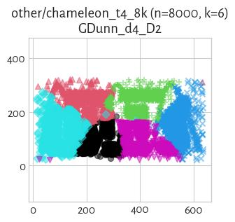

#### GDunn_d3_D2 (NCA=0.54)

#### fastcluster_complete (NCA=0.53)

#### IcA (NCA=0.52)

#### GDunn_d2_D1 (NCA=0.48)

#### GDunn_d4_D1 (NCA=0.47)

#### mst_divisive_GDunn_d2_D1 (NCA=0.43)

#### FCPS_Diana (NCA=0.43)

#### Genie_G0.7 (NCA=0.40)

#### DuNN_25_Mean_Mean (NCA=0.40)

#### DuNN_25_Min_Max (NCA=0.40)

#### GDunn_d5_D3 (NCA=0.39)

#### DuNN_25_Max_Min (NCA=0.35)

#### mst_divisive_BallHall (NCA=0.32)

#### GDunn_d5_D2 (NCA=0.30)

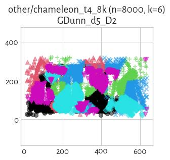

#### mst_divisive_GDunn_d3_D1 (NCA=0.27)

#### fastcluster_median (NCA=0.27)

#### DaviesBouldin (NCA=0.24)

#### mst_divisive_DuNN_25_Max_Min (NCA=0.22)

#### mst_divisive_WCNN_25 (NCA=0.21)

#### mst_divisive_GDunn_d4_D2 (NCA=0.20)

#### mst_divisive_GDunn_d4_D3 (NCA=0.20)

#### mst_divisive_GDunn_d4_D1 (NCA=0.20)

#### mst_divisive_GDunn_d3_D3 (NCA=0.20)

#### mst_divisive_DuNN_25_Mean_Mean (NCA=0.20)

#### mst_divisive_GDunn_d3_D2 (NCA=0.20)

#### mst_divisive_DaviesBouldin (NCA=0.20)

#### mst_divisive_DuNN_25_Min_Max (NCA=0.20)

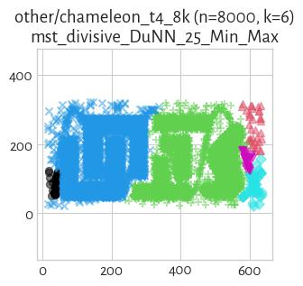

#### GDunn_d5_D1 (NCA=0.17)

#### HEMST (NCA=0.14)

#### mst_divisive_SilhouetteW (NCA=0.00)

#### GDunn_d1_D1 (NCA=0.00)

#### GDunn_d1_D2 (NCA=0.00)

#### GDunn_d1_D3 (NCA=0.00)

#### SilhouetteW (NCA=0.00)

#### FCPS_HDBSCAN_8 (NCA=0.00)

#### mst_divisive_GDunn_d1_D2 (NCA=0.00)

#### Genie_G1.0 (NCA=0.00)

#### mst_divisive_GDunn_d1_D1 (NCA=0.00)

#### mst_divisive_GDunn_d1_D3 (NCA=0.00)

#### FCPS_HDBSCAN_2 (NCA=0.00)

#### FCPS_HDBSCAN_4 (NCA=0.00)

## other/chameleon_t5_8k (n=8000, d=2) 

#### Genie_G0.1 (NCA=1.00)

#### FCPS_Softcl (NCA=1.00)

#### FCPS_Clara (NCA=1.00)

#### FCPS_PAM (NCA=1.00)

#### BallHall (NCA=1.00)

#### CalinskiHarabasz (NCA=1.00)

#### sklearn_kmeans (NCA=1.00)

#### GDunn_d1_D1 (NCA=1.00)

#### GDunn_d1_D2 (NCA=1.00)

#### GDunn_d1_D3 (NCA=1.00)

#### Silhouette (NCA=1.00)

#### Genie_G0.3 (NCA=1.00)

#### mst_divisive_BallHall (NCA=1.00)

#### mst_divisive_Silhouette (NCA=1.00)

#### FCPS_Fanny (NCA=1.00)

#### sklearn_gm (NCA=1.00)

#### GIc (NCA=1.00)

#### fastcluster_ward (NCA=1.00)

#### sklearn_spectral_Alaplacian_G5 (NCA=1.00)

#### FCPS_MinEnergy (NCA=1.00)

#### fastcluster_centroid (NCA=1.00)

#### GDunn_d4_D3 (NCA=1.00)

#### sklearn_birch_T0.01_BF50 (NCA=1.00)

#### fastcluster_average (NCA=1.00)

#### GDunn_d3_D2 (NCA=1.00)

#### GDunn_d4_D2 (NCA=1.00)

#### GDunn_d2_D1 (NCA=1.00)

#### GDunn_d3_D3 (NCA=1.00)

#### GDunn_d2_D2 (NCA=1.00)

#### GDunn_d5_D3 (NCA=1.00)

#### GDunn_d2_D3 (NCA=1.00)

#### mst_divisive_CalinskiHarabasz (NCA=0.99)

#### mst_divisive_GDunn_d4_D1 (NCA=0.99)

#### mst_divisive_GDunn_d3_D1 (NCA=0.99)

#### GDunn_d3_D1 (NCA=0.98)

#### GDunn_d4_D1 (NCA=0.98)

#### FCPS_Minimax (NCA=0.88)

#### FCPS_Diana (NCA=0.86)

#### mst_divisive_GDunn_d2_D1 (NCA=0.84)

#### mst_divisive_GDunn_d2_D3 (NCA=0.84)

#### mst_divisive_GDunn_d2_D2 (NCA=0.84)

#### IcA (NCA=0.83)

#### fastcluster_complete (NCA=0.80)

#### Genie_G0.5 (NCA=0.80)

#### FCPS_Hardcl (NCA=0.70)

#### ITM (NCA=0.69)

#### fastcluster_weighted (NCA=0.69)

#### mst_divisive_GDunn_d5_D2 (NCA=0.68)

#### mst_divisive_GDunn_d5_D3 (NCA=0.68)

#### mst_divisive_GDunn_d5_D1 (NCA=0.66)

#### CTCEHC (NCA=0.63)

#### fastcluster_median (NCA=0.47)

#### GDunn_d5_D2 (NCA=0.43)

#### mst_divisive_DuNN_25_Mean_Mean (NCA=0.40)

#### WCNN_25 (NCA=0.40)

#### DuNN_25_Min_Max (NCA=0.40)

#### DuNN_25_Mean_Mean (NCA=0.40)

#### DaviesBouldin (NCA=0.40)

#### HEMST (NCA=0.40)

#### Genie_G0.7 (NCA=0.40)

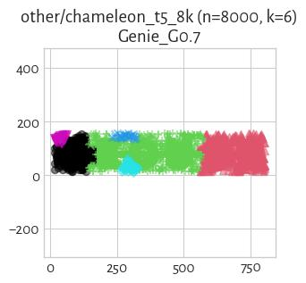

#### DuNN_25_Max_Min (NCA=0.39)

#### mst_divisive_DuNN_25_Max_Min (NCA=0.33)

#### FCPS_AdaptiveDensityPeak (NCA=0.32)

#### GDunn_d5_D1 (NCA=0.28)

#### mst_divisive_SilhouetteW (NCA=0.20)

#### SilhouetteW (NCA=0.20)

#### mst_divisive_GDunn_d4_D3 (NCA=0.20)

#### mst_divisive_GDunn_d3_D2 (NCA=0.20)

#### mst_divisive_DuNN_25_Min_Max (NCA=0.20)

#### mst_divisive_GDunn_d4_D2 (NCA=0.20)

#### mst_divisive_GDunn_d3_D3 (NCA=0.20)

#### mst_divisive_WCNN_25 (NCA=0.03)

#### FCPS_HDBSCAN_4 (NCA=0.00)

#### Genie_G1.0 (NCA=0.00)

#### FCPS_HDBSCAN_8 (NCA=0.00)

#### FCPS_HDBSCAN_2 (NCA=0.00)

#### mst_divisive_GDunn_d1_D1 (NCA=0.00)

#### mst_divisive_GDunn_d1_D3 (NCA=0.00)

#### mst_divisive_GDunn_d1_D2 (NCA=0.00)

#### mst_divisive_DaviesBouldin (NCA=0.00)

## other/chameleon_t7_10k (n=10000, d=2) 

#### Genie_G0.5 (NCA=1.00)

#### Genie_G0.3 (NCA=0.87)

#### ITM (NCA=0.75)

#### Genie_G0.1 (NCA=0.73)

#### GIc (NCA=0.73)

#### fastcluster_weighted (NCA=0.66)

#### mst_divisive_CalinskiHarabasz (NCA=0.66)

#### fastcluster_ward (NCA=0.64)

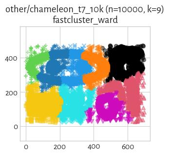

#### FCPS_MinEnergy (NCA=0.63)

#### Genie_G0.7 (NCA=0.62)

#### IcA (NCA=0.61)

#### FCPS_Fanny (NCA=0.60)

#### sklearn_birch_T0.01_BF50 (NCA=0.60)

#### fastcluster_centroid (NCA=0.59)

#### fastcluster_average (NCA=0.59)

#### sklearn_gm (NCA=0.59)

#### sklearn_spectral_Alaplacian_G5 (NCA=0.58)

#### fastcluster_median (NCA=0.57)

#### FCPS_Softcl (NCA=0.56)

#### fastcluster_complete (NCA=0.56)

#### FCPS_Clara (NCA=0.54)

#### sklearn_kmeans (NCA=0.54)

#### FCPS_Minimax (NCA=0.54)

#### FCPS_AdaptiveDensityPeak (NCA=0.52)

#### FCPS_Diana (NCA=0.52)

#### FCPS_PAM (NCA=0.50)

#### mst_divisive_DuNN_25_Min_Max (NCA=0.50)

#### FCPS_Hardcl (NCA=0.46)

#### mst_divisive_DuNN_25_Mean_Mean (NCA=0.38)

#### mst_divisive_BallHall (NCA=0.37)

#### mst_divisive_DuNN_25_Max_Min (NCA=0.30)

#### mst_divisive_GDunn_d4_D3 (NCA=0.25)

#### mst_divisive_WCNN_25 (NCA=0.11)

#### mst_divisive_DaviesBouldin (NCA=0.00)

#### FCPS_HDBSCAN_2 (NCA=0.00)

#### FCPS_HDBSCAN_4 (NCA=0.00)

#### Genie_G1.0 (NCA=0.00)

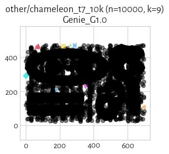

#### FCPS_HDBSCAN_8 (NCA=0.00)

## other/chameleon_t8_8k (n=8000, d=2) 

#### Genie_G0.7 (NCA=0.80)

#### mst_divisive_DuNN_25_Min_Max (NCA=0.80)

#### mst_divisive_GDunn_d5_D1 (NCA=0.79)

#### Genie_G0.5 (NCA=0.73)

#### mst_divisive_DuNN_25_Mean_Mean (NCA=0.72)

#### mst_divisive_GDunn_d5_D3 (NCA=0.70)

#### Genie_G0.1 (NCA=0.67)

#### mst_divisive_GDunn_d5_D2 (NCA=0.66)

#### ITM (NCA=0.62)

#### IcA (NCA=0.61)

#### sklearn_gm (NCA=0.59)

#### FCPS_Minimax (NCA=0.58)

#### FCPS_AdaptiveDensityPeak (NCA=0.58)

#### GIc (NCA=0.55)

#### FCPS_MinEnergy (NCA=0.54)

#### fastcluster_centroid (NCA=0.54)

#### mst_divisive_GDunn_d2_D1 (NCA=0.52)

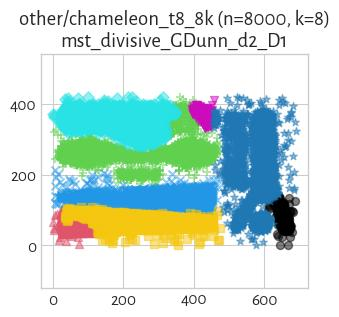

#### FCPS_Softcl (NCA=0.52)

#### sklearn_kmeans (NCA=0.52)

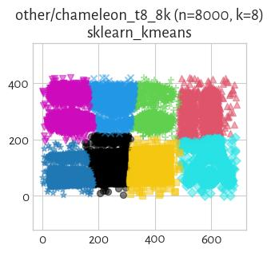

#### sklearn_spectral_Alaplacian_G5 (NCA=0.52)

#### FCPS_Hardcl (NCA=0.52)

#### FCPS_Fanny (NCA=0.52)

#### FCPS_PAM (NCA=0.51)

#### mst_divisive_CalinskiHarabasz (NCA=0.51)

#### FCPS_Clara (NCA=0.50)

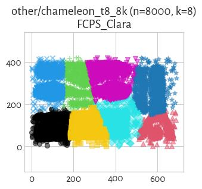

#### mst_divisive_GDunn_d2_D2 (NCA=0.49)

#### Genie_G0.3 (NCA=0.48)

#### fastcluster_ward (NCA=0.48)

#### fastcluster_complete (NCA=0.48)

#### mst_divisive_GDunn_d2_D3 (NCA=0.48)

#### sklearn_birch_T0.01_BF50 (NCA=0.46)

#### fastcluster_median (NCA=0.46)

#### fastcluster_average (NCA=0.45)

#### FCPS_Diana (NCA=0.44)

#### mst_divisive_Silhouette (NCA=0.43)

#### CTCEHC (NCA=0.42)

#### fastcluster_weighted (NCA=0.41)

#### mst_divisive_BallHall (NCA=0.33)

#### mst_divisive_GDunn_d4_D2 (NCA=0.29)

#### mst_divisive_GDunn_d4_D3 (NCA=0.29)

#### mst_divisive_GDunn_d4_D1 (NCA=0.29)

#### mst_divisive_GDunn_d3_D3 (NCA=0.29)

#### mst_divisive_GDunn_d3_D2 (NCA=0.29)

#### mst_divisive_GDunn_d3_D1 (NCA=0.29)

#### HEMST (NCA=0.20)

#### mst_divisive_WCNN_25 (NCA=0.15)

#### mst_divisive_DuNN_25_Max_Min (NCA=0.09)

#### mst_divisive_DaviesBouldin (NCA=0.00)

#### mst_divisive_SilhouetteW (NCA=0.00)

#### mst_divisive_GDunn_d1_D3 (NCA=0.00)

#### mst_divisive_GDunn_d1_D2 (NCA=0.00)

#### mst_divisive_GDunn_d1_D1 (NCA=0.00)

#### Genie_G1.0 (NCA=0.00)

#### FCPS_HDBSCAN_8 (NCA=0.00)

#### FCPS_HDBSCAN_2 (NCA=0.00)

#### FCPS_HDBSCAN_4 (NCA=0.00)

## other/hdbscan (n=2309, d=2) 

#### Genie_G0.1 (NCA=0.98)

#### GIc (NCA=0.98)

#### FCPS_AdaptiveDensityPeak (NCA=0.90)

#### fastcluster_ward (NCA=0.90)

#### ITM (NCA=0.89)

#### CTCEHC (NCA=0.89)

#### FCPS_MinEnergy (NCA=0.84)

#### FCPS_Clara (NCA=0.84)

#### sklearn_gm (NCA=0.83)

#### Genie_G0.5 (NCA=0.79)

#### Genie_G0.3 (NCA=0.78)

#### FCPS_Softcl (NCA=0.78)

#### fastcluster_median (NCA=0.77)

#### CalinskiHarabasz (NCA=0.77)

#### sklearn_kmeans (NCA=0.77)

#### GDunn_d2_D3 (NCA=0.75)

#### GDunn_d2_D2 (NCA=0.75)

#### FCPS_Fanny (NCA=0.73)

#### sklearn_birch_T0.01_BF50 (NCA=0.70)

#### IcA (NCA=0.61)

#### FCPS_Hardcl (NCA=0.60)

#### mst_divisive_GDunn_d5_D1 (NCA=0.60)

#### mst_divisive_GDunn_d5_D2 (NCA=0.60)

#### mst_divisive_GDunn_d5_D3 (NCA=0.59)

#### FCPS_PAM (NCA=0.59)

#### mst_divisive_GDunn_d2_D3 (NCA=0.54)

#### mst_divisive_GDunn_d2_D2 (NCA=0.53)

#### GDunn_d4_D2 (NCA=0.53)

#### GDunn_d4_D3 (NCA=0.52)

#### mst_divisive_CalinskiHarabasz (NCA=0.52)

#### FCPS_Diana (NCA=0.52)

#### fastcluster_complete (NCA=0.52)

#### FCPS_Minimax (NCA=0.50)

#### mst_divisive_GDunn_d2_D1 (NCA=0.48)

#### GDunn_d2_D1 (NCA=0.44)

#### sklearn_spectral_Alaplacian_G5 (NCA=0.44)

#### GDunn_d3_D2 (NCA=0.42)

#### fastcluster_weighted (NCA=0.42)

#### fastcluster_centroid (NCA=0.42)

#### WCNN_25 (NCA=0.40)

#### GDunn_d3_D3 (NCA=0.40)

#### Silhouette (NCA=0.40)

#### BallHall (NCA=0.40)

#### GDunn_d4_D1 (NCA=0.40)

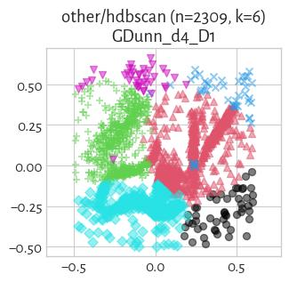

#### DuNN_25_Mean_Mean (NCA=0.40)

#### HEMST (NCA=0.39)

#### DuNN_25_Min_Max (NCA=0.39)

#### Genie_G0.7 (NCA=0.39)

#### fastcluster_average (NCA=0.38)

#### DuNN_25_Max_Min (NCA=0.36)

#### mst_divisive_DuNN_25_Max_Min (NCA=0.36)

#### GDunn_d5_D2 (NCA=0.35)

#### GDunn_d3_D1 (NCA=0.31)

#### GDunn_d5_D1 (NCA=0.30)

#### DaviesBouldin (NCA=0.29)

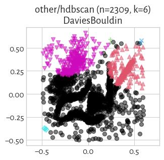

#### mst_divisive_WCNN_25 (NCA=0.27)

#### mst_divisive_GDunn_d3_D3 (NCA=0.20)

#### mst_divisive_GDunn_d3_D2 (NCA=0.20)

#### mst_divisive_GDunn_d3_D1 (NCA=0.20)

#### mst_divisive_GDunn_d4_D2 (NCA=0.20)

#### mst_divisive_GDunn_d4_D3 (NCA=0.20)

#### mst_divisive_BallHall (NCA=0.17)

#### GDunn_d5_D3 (NCA=0.04)

#### SilhouetteW (NCA=0.00)

#### mst_divisive_SilhouetteW (NCA=0.00)

#### mst_divisive_DuNN_25_Min_Max (NCA=0.00)

#### mst_divisive_DuNN_25_Mean_Mean (NCA=0.00)

#### mst_divisive_GDunn_d1_D1 (NCA=0.00)

#### GDunn_d1_D2 (NCA=0.00)

#### GDunn_d1_D1 (NCA=0.00)

#### Genie_G1.0 (NCA=0.00)

#### mst_divisive_DaviesBouldin (NCA=0.00)

#### mst_divisive_Silhouette (NCA=0.00)

#### FCPS_HDBSCAN_4 (NCA=0.00)

#### FCPS_HDBSCAN_2 (NCA=0.00)

#### mst_divisive_GDunn_d1_D2 (NCA=0.00)

#### FCPS_HDBSCAN_8 (NCA=0.00)

#### mst_divisive_GDunn_d1_D3 (NCA=0.00)

#### mst_divisive_GDunn_d4_D1 (NCA=0.00)

#### GDunn_d1_D3 (NCA=0.00)

## other/iris (n=150, d=4) 

> **(preview generation suppressed)**

#### sklearn_gm (NCA=0.95)

#### Genie_G0.1 (NCA=0.94)

#### Genie_G0.3 (NCA=0.94)

#### ITM (NCA=0.94)

#### GIc (NCA=0.94)

#### mst_divisive_DuNN_25_Min_Max (NCA=0.94)

#### CTCEHC (NCA=0.90)

#### FCPS_Fanny (NCA=0.87)

#### fastcluster_centroid (NCA=0.86)

#### fastcluster_average (NCA=0.86)

#### FCPS_MinEnergy (NCA=0.86)

#### FCPS_Hardcl (NCA=0.85)

#### sklearn_spectral_Alaplacian_G5 (NCA=0.85)

#### FCPS_Minimax (NCA=0.85)

#### WCNN_25 (NCA=0.85)

#### sklearn_birch_T0.01_BF50 (NCA=0.84)

#### FCPS_PAM (NCA=0.84)

#### fastcluster_ward (NCA=0.84)

#### FCPS_Softcl (NCA=0.84)

#### FCPS_Clara (NCA=0.84)

#### CalinskiHarabasz (NCA=0.84)

#### sklearn_kmeans (NCA=0.84)

#### GDunn_d4_D1 (NCA=0.83)

#### GDunn_d3_D1 (NCA=0.83)

#### GDunn_d2_D1 (NCA=0.83)

#### mst_divisive_WCNN_25 (NCA=0.82)

#### FCPS_Diana (NCA=0.82)

#### mst_divisive_BallHall (NCA=0.81)

#### GDunn_d2_D3 (NCA=0.81)

#### FCPS_AdaptiveDensityPeak (NCA=0.80)

#### IcA (NCA=0.80)

#### GDunn_d2_D2 (NCA=0.80)

#### mst_divisive_GDunn_d2_D2 (NCA=0.78)

#### mst_divisive_GDunn_d2_D3 (NCA=0.78)

#### mst_divisive_DuNN_25_Mean_Mean (NCA=0.76)

#### fastcluster_complete (NCA=0.76)

#### BallHall (NCA=0.76)

#### mst_divisive_GDunn_d2_D1 (NCA=0.75)

#### DuNN_25_Min_Max (NCA=0.75)

#### mst_divisive_CalinskiHarabasz (NCA=0.75)

#### DuNN_25_Mean_Mean (NCA=0.72)

#### fastcluster_median (NCA=0.72)

#### mst_divisive_DuNN_25_Max_Min (NCA=0.70)

#### fastcluster_weighted (NCA=0.62)

#### mst_divisive_GDunn_d5_D1 (NCA=0.58)

#### Genie_G0.5 (NCA=0.55)

#### GDunn_d4_D2 (NCA=0.54)

#### Genie_G0.7 (NCA=0.54)

#### GDunn_d3_D2 (NCA=0.54)

#### GDunn_d4_D3 (NCA=0.53)

#### mst_divisive_GDunn_d1_D2 (NCA=0.52)

#### GDunn_d3_D3 (NCA=0.52)

#### mst_divisive_GDunn_d1_D1 (NCA=0.52)

#### GDunn_d1_D1 (NCA=0.52)

#### GDunn_d1_D3 (NCA=0.52)

#### GDunn_d1_D2 (NCA=0.52)

#### Genie_G1.0 (NCA=0.52)

#### mst_divisive_SilhouetteW (NCA=0.52)

#### FCPS_HDBSCAN_2 (NCA=0.52)

#### SilhouetteW (NCA=0.52)

#### mst_divisive_DaviesBouldin (NCA=0.52)

#### mst_divisive_GDunn_d1_D3 (NCA=0.52)

#### DaviesBouldin (NCA=0.52)

#### FCPS_HDBSCAN_8 (NCA=0.51)

#### FCPS_HDBSCAN_4 (NCA=0.51)

#### HEMST (NCA=0.51)

#### Silhouette (NCA=0.50)

#### mst_divisive_GDunn_d5_D2 (NCA=0.49)

#### mst_divisive_GDunn_d3_D1 (NCA=0.49)

#### mst_divisive_GDunn_d4_D2 (NCA=0.49)

#### mst_divisive_Silhouette (NCA=0.49)

#### mst_divisive_GDunn_d5_D3 (NCA=0.49)

#### mst_divisive_GDunn_d4_D3 (NCA=0.49)

#### mst_divisive_GDunn_d4_D1 (NCA=0.49)

#### mst_divisive_GDunn_d3_D2 (NCA=0.48)

#### mst_divisive_GDunn_d3_D3 (NCA=0.48)

#### GDunn_d5_D2 (NCA=0.13)

#### GDunn_d5_D1 (NCA=0.12)

#### GDunn_d5_D3 (NCA=0.05)

#### DuNN_25_Max_Min (NCA=0.04)

## other/iris5 (n=105, d=4) 

> **(preview generation suppressed)**

#### sklearn_gm (NCA=0.95)

#### Genie_G0.5 (NCA=0.94)

#### GIc (NCA=0.94)

#### FCPS_MinEnergy (NCA=0.86)

#### fastcluster_average (NCA=0.86)

#### fastcluster_centroid (NCA=0.86)

#### fastcluster_weighted (NCA=0.85)

#### FCPS_AdaptiveDensityPeak (NCA=0.85)

#### FCPS_Minimax (NCA=0.85)

#### sklearn_spectral_Alaplacian_G5 (NCA=0.85)

#### FCPS_Clara (NCA=0.84)

#### sklearn_birch_T0.01_BF50 (NCA=0.84)

#### CalinskiHarabasz (NCA=0.84)

#### sklearn_kmeans (NCA=0.84)

#### fastcluster_ward (NCA=0.84)

#### mst_divisive_CalinskiHarabasz (NCA=0.82)

#### mst_divisive_BallHall (NCA=0.81)

#### mst_divisive_GDunn_d2_D3 (NCA=0.81)

#### mst_divisive_GDunn_d2_D2 (NCA=0.81)

#### FCPS_Hardcl (NCA=0.80)

#### FCPS_Softcl (NCA=0.80)

#### FCPS_Diana (NCA=0.78)

#### GDunn_d2_D3 (NCA=0.78)

#### GDunn_d2_D1 (NCA=0.78)

#### GDunn_d2_D2 (NCA=0.77)

#### BallHall (NCA=0.76)

#### fastcluster_complete (NCA=0.76)

#### mst_divisive_GDunn_d2_D1 (NCA=0.75)

#### mst_divisive_GDunn_d5_D2 (NCA=0.70)

#### fastcluster_median (NCA=0.63)

#### mst_divisive_GDunn_d5_D1 (NCA=0.59)

#### DuNN_25_Min_Max (NCA=0.57)

#### WCNN_25 (NCA=0.57)

#### FCPS_Fanny (NCA=0.57)

#### FCPS_PAM (NCA=0.56)

#### mst_divisive_GDunn_d3_D1 (NCA=0.55)

#### mst_divisive_GDunn_d4_D3 (NCA=0.55)

#### mst_divisive_GDunn_d4_D2 (NCA=0.55)

#### mst_divisive_GDunn_d4_D1 (NCA=0.55)

#### mst_divisive_GDunn_d3_D3 (NCA=0.55)

#### mst_divisive_GDunn_d3_D2 (NCA=0.55)

#### DuNN_25_Max_Min (NCA=0.55)

#### Genie_G0.7 (NCA=0.55)

#### GDunn_d5_D1 (NCA=0.55)

#### HEMST (NCA=0.54)

#### GDunn_d4_D2 (NCA=0.54)

#### GDunn_d4_D3 (NCA=0.54)

#### GDunn_d4_D1 (NCA=0.53)

#### GDunn_d3_D1 (NCA=0.53)

#### GDunn_d3_D2 (NCA=0.52)

#### GDunn_d3_D3 (NCA=0.52)

#### mst_divisive_GDunn_d1_D2 (NCA=0.52)

#### GDunn_d1_D2 (NCA=0.52)

#### GDunn_d1_D1 (NCA=0.52)

#### Genie_G1.0 (NCA=0.52)

#### mst_divisive_GDunn_d1_D1 (NCA=0.52)

#### mst_divisive_GDunn_d1_D3 (NCA=0.52)

#### FCPS_HDBSCAN_2 (NCA=0.52)

#### GDunn_d1_D3 (NCA=0.52)

#### FCPS_HDBSCAN_4 (NCA=0.51)

#### mst_divisive_GDunn_d5_D3 (NCA=0.50)

#### CTCEHC (NCA=0.43)

#### GDunn_d5_D2 (NCA=0.42)

#### Genie_G0.1 (NCA=0.41)

#### Genie_G0.3 (NCA=0.41)

#### DuNN_25_Mean_Mean (NCA=0.39)

#### mst_divisive_Silhouette (NCA=0.30)

#### mst_divisive_DaviesBouldin (NCA=0.30)

#### Silhouette (NCA=0.30)

#### IcA (NCA=0.29)

#### ITM (NCA=0.28)

#### mst_divisive_SilhouetteW (NCA=0.22)

#### SilhouetteW (NCA=0.22)

#### DaviesBouldin (NCA=0.20)

#### GDunn_d5_D3 (NCA=0.15)

#### FCPS_HDBSCAN_8 (NCA=0.10)

## other/square (n=1000, d=2) 

#### Genie_G0.1 (NCA=1.00)

#### mst_divisive_WCNN_25 (NCA=1.00)

#### mst_divisive_GDunn_d1_D3 (NCA=1.00)

#### mst_divisive_GDunn_d1_D2 (NCA=1.00)

#### mst_divisive_GDunn_d1_D1 (NCA=1.00)

#### WCNN_25 (NCA=1.00)

#### GDunn_d1_D3 (NCA=1.00)

#### GDunn_d1_D2 (NCA=1.00)

#### GDunn_d1_D1 (NCA=1.00)

#### DuNN_25_Min_Max (NCA=1.00)

#### DuNN_25_Mean_Mean (NCA=1.00)

#### mst_divisive_DuNN_25_Min_Max (NCA=1.00)

#### Genie_G0.3 (NCA=1.00)

#### mst_divisive_DuNN_25_Mean_Mean (NCA=1.00)

#### ITM (NCA=1.00)

#### FCPS_HDBSCAN_2 (NCA=1.00)

#### FCPS_HDBSCAN_4 (NCA=1.00)

#### GIc (NCA=1.00)

#### Genie_G0.5 (NCA=1.00)

#### Genie_G0.7 (NCA=1.00)

#### Genie_G1.0 (NCA=1.00)

#### FCPS_HDBSCAN_8 (NCA=1.00)

#### CTCEHC (NCA=0.78)

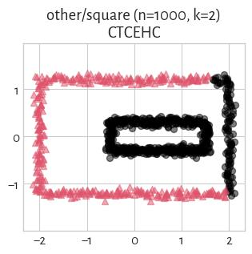

#### mst_divisive_DuNN_25_Max_Min (NCA=0.77)

#### IcA (NCA=0.72)

#### mst_divisive_GDunn_d2_D1 (NCA=0.66)

#### mst_divisive_CalinskiHarabasz (NCA=0.59)

#### mst_divisive_Silhouette (NCA=0.55)

#### fastcluster_ward (NCA=0.50)

#### fastcluster_centroid (NCA=0.50)

#### GDunn_d3_D1 (NCA=0.49)

#### GDunn_d4_D1 (NCA=0.49)

#### fastcluster_weighted (NCA=0.47)

#### fastcluster_complete (NCA=0.41)

#### mst_divisive_GDunn_d2_D2 (NCA=0.41)

#### mst_divisive_GDunn_d5_D2 (NCA=0.41)

#### GDunn_d3_D2 (NCA=0.41)

#### sklearn_birch_T0.01_BF50 (NCA=0.41)

#### sklearn_spectral_Alaplacian_G5 (NCA=0.41)

#### fastcluster_median (NCA=0.40)

#### fastcluster_average (NCA=0.39)

#### mst_divisive_GDunn_d2_D3 (NCA=0.38)

#### mst_divisive_GDunn_d5_D3 (NCA=0.38)

#### GDunn_d3_D3 (NCA=0.38)

#### FCPS_AdaptiveDensityPeak (NCA=0.38)

#### GDunn_d4_D2 (NCA=0.37)

#### Silhouette (NCA=0.37)

#### GDunn_d4_D3 (NCA=0.37)

#### HEMST (NCA=0.26)

#### FCPS_Minimax (NCA=0.25)

#### GDunn_d5_D1 (NCA=0.23)

#### GDunn_d2_D1 (NCA=0.20)

#### sklearn_gm (NCA=0.19)

#### FCPS_Diana (NCA=0.19)

#### CalinskiHarabasz (NCA=0.17)

#### FCPS_Hardcl (NCA=0.17)

#### sklearn_kmeans (NCA=0.17)

#### FCPS_Softcl (NCA=0.17)

#### GDunn_d5_D2 (NCA=0.16)

#### FCPS_Fanny (NCA=0.13)

#### BallHall (NCA=0.12)

#### GDunn_d2_D2 (NCA=0.12)

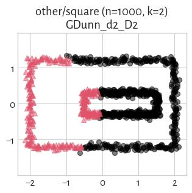

#### FCPS_Clara (NCA=0.09)

#### FCPS_PAM (NCA=0.08)

#### FCPS_MinEnergy (NCA=0.07)

#### mst_divisive_BallHall (NCA=0.06)

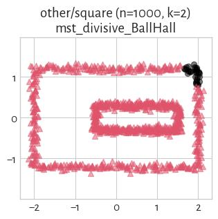

#### GDunn_d5_D3 (NCA=0.03)

#### GDunn_d2_D3 (NCA=0.03)

#### DuNN_25_Max_Min (NCA=0.02)

#### mst_divisive_GDunn_d5_D1 (NCA=0.00)

#### mst_divisive_SilhouetteW (NCA=0.00)

#### SilhouetteW (NCA=0.00)

#### mst_divisive_DaviesBouldin (NCA=0.00)

#### DaviesBouldin (NCA=0.00)

#### mst_divisive_GDunn_d3_D1 (NCA=0.00)

#### mst_divisive_GDunn_d4_D1 (NCA=0.00)

#### mst_divisive_GDunn_d3_D2 (NCA=0.00)

#### mst_divisive_GDunn_d3_D3 (NCA=0.00)

#### mst_divisive_GDunn_d4_D2 (NCA=0.00)

#### mst_divisive_GDunn_d4_D3 (NCA=0.00)

