The **[Framework for Benchmarking Clustering Algorithms](https://clustering-benchmarks.gagolewski.com)
is authored/edited/maintained by [Marek Gagolewski](https://www.gagolewski.com)**

[Benchmark suite](https://github.com/gagolews/clustering-data-v1) version 1.1.0

--------------------------------------------------------------------------------

**Datasets**

* [sipu/a1](#a1)
* [sipu/a2](#a2)
* [sipu/a3](#a3)
* [sipu/aggregation](#aggregation)
* [sipu/birch1](#birch1)
* [sipu/birch2](#birch2)
* [sipu/compound](#compound)
* [sipu/d31](#d31)
* [sipu/flame](#flame)
* [sipu/jain](#jain)
* [sipu/pathbased](#pathbased)
* [sipu/r15](#r15)
* [sipu/s1](#s1)
* [sipu/s2](#s2)
* [sipu/s3](#s3)
* [sipu/s4](#s4)
* [sipu/spiral](#spiral)
* [sipu/unbalance](#unbalance)
* [sipu/worms_2](#worms_2)
* [sipu/worms_64](#worms_64)

*(results are sorted wrt the normalised clustering accuracy score – comparison against the reference labels; see the Framework's [homepage](https://clustering-benchmarks.gagolewski.com) for more details)*

--------------------------------------------------------------------------------

## sipu/a1 (n=3000, d=2) 

#### FCPS_Softcl (NCA=0.98)

#### FCPS_Fanny (NCA=0.98)

#### sklearn_kmeans (NCA=0.98)

#### FCPS_PAM (NCA=0.98)

#### sklearn_spectral_Alaplacian_G5 (NCA=0.98)

#### sklearn_gm (NCA=0.98)

#### FCPS_Clara (NCA=0.97)

#### CTCEHC (NCA=0.97)

#### GIc (NCA=0.97)

#### Genie_G0.1 (NCA=0.97)

#### fastcluster_centroid (NCA=0.97)

#### mst_divisive_BallHall (NCA=0.96)

#### mst_divisive_Silhouette (NCA=0.96)

#### sklearn_birch_T0.01_BF50 (NCA=0.96)

#### fastcluster_average (NCA=0.96)

#### mst_divisive_CalinskiHarabasz (NCA=0.96)

#### FCPS_MinEnergy (NCA=0.96)

#### fastcluster_complete (NCA=0.96)

#### FCPS_AdaptiveDensityPeak (NCA=0.95)

#### fastcluster_ward (NCA=0.95)

#### FCPS_Minimax (NCA=0.94)

#### mst_divisive_WCNN_25 (NCA=0.91)

#### Genie_G0.3 (NCA=0.91)

#### mst_divisive_DuNN_25_Min_Max (NCA=0.91)

#### mst_divisive_DuNN_25_Mean_Mean (NCA=0.91)

#### FCPS_Diana (NCA=0.91)

#### fastcluster_weighted (NCA=0.87)

#### Genie_G0.5 (NCA=0.84)

#### fastcluster_median (NCA=0.83)

#### IcA (NCA=0.83)

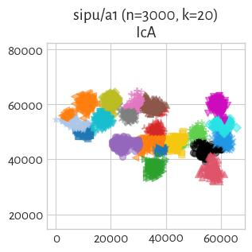

#### ITM (NCA=0.82)

#### mst_divisive_GDunn_d2_D3 (NCA=0.72)

#### mst_divisive_GDunn_d2_D2 (NCA=0.70)

#### HEMST (NCA=0.70)

#### mst_divisive_GDunn_d2_D1 (NCA=0.68)

#### mst_divisive_GDunn_d5_D1 (NCA=0.67)

#### mst_divisive_GDunn_d5_D2 (NCA=0.65)

#### mst_divisive_GDunn_d5_D3 (NCA=0.65)

#### FCPS_Hardcl (NCA=0.62)

#### Genie_G0.7 (NCA=0.58)

#### mst_divisive_DuNN_25_Max_Min (NCA=0.50)

#### Genie_G1.0 (NCA=0.37)

#### mst_divisive_GDunn_d1_D3 (NCA=0.37)

#### mst_divisive_GDunn_d1_D2 (NCA=0.37)

#### mst_divisive_GDunn_d1_D1 (NCA=0.37)

#### FCPS_HDBSCAN_2 (NCA=0.37)

#### mst_divisive_GDunn_d4_D3 (NCA=0.32)

#### mst_divisive_GDunn_d4_D2 (NCA=0.32)

#### mst_divisive_GDunn_d3_D3 (NCA=0.30)

#### mst_divisive_GDunn_d3_D2 (NCA=0.30)

#### mst_divisive_GDunn_d3_D1 (NCA=0.24)

#### mst_divisive_GDunn_d4_D1 (NCA=0.22)

#### FCPS_HDBSCAN_4 (NCA=0.16)

#### mst_divisive_DaviesBouldin (NCA=0.06)

#### mst_divisive_SilhouetteW (NCA=0.01)

#### FCPS_HDBSCAN_8 (NCA=0.00)

## sipu/a2 (n=5250, d=2) 

#### sklearn_kmeans (NCA=0.98)

#### FCPS_PAM (NCA=0.98)

#### sklearn_gm (NCA=0.98)

#### sklearn_spectral_Alaplacian_G5 (NCA=0.98)

#### FCPS_AdaptiveDensityPeak (NCA=0.98)

#### Genie_G0.1 (NCA=0.97)

#### GIc (NCA=0.97)

#### CTCEHC (NCA=0.97)

#### fastcluster_centroid (NCA=0.97)

#### sklearn_birch_T0.01_BF50 (NCA=0.97)

#### fastcluster_average (NCA=0.97)

#### FCPS_MinEnergy (NCA=0.96)

#### fastcluster_ward (NCA=0.96)

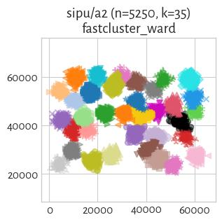

#### FCPS_Minimax (NCA=0.96)

#### fastcluster_complete (NCA=0.95)

#### FCPS_Softcl (NCA=0.95)

#### mst_divisive_CalinskiHarabasz (NCA=0.95)

#### mst_divisive_WCNN_25 (NCA=0.94)

#### mst_divisive_DuNN_25_Mean_Mean (NCA=0.94)

#### Genie_G0.3 (NCA=0.94)

#### mst_divisive_DuNN_25_Min_Max (NCA=0.94)

#### mst_divisive_BallHall (NCA=0.94)

#### FCPS_Clara (NCA=0.93)

#### mst_divisive_Silhouette (NCA=0.93)

#### fastcluster_weighted (NCA=0.90)

#### fastcluster_median (NCA=0.88)

#### Genie_G0.5 (NCA=0.83)

#### ITM (NCA=0.83)

#### FCPS_Diana (NCA=0.82)

#### FCPS_Hardcl (NCA=0.82)

#### IcA (NCA=0.80)

#### mst_divisive_GDunn_d2_D2 (NCA=0.72)

#### mst_divisive_GDunn_d2_D1 (NCA=0.69)

#### mst_divisive_GDunn_d2_D3 (NCA=0.67)

#### mst_divisive_GDunn_d5_D1 (NCA=0.66)

#### mst_divisive_GDunn_d5_D2 (NCA=0.64)

#### mst_divisive_GDunn_d5_D3 (NCA=0.64)

#### HEMST (NCA=0.59)

#### Genie_G0.7 (NCA=0.56)

#### mst_divisive_DuNN_25_Max_Min (NCA=0.45)

#### mst_divisive_GDunn_d3_D2 (NCA=0.38)

#### mst_divisive_GDunn_d1_D1 (NCA=0.35)

#### mst_divisive_GDunn_d1_D2 (NCA=0.33)

#### mst_divisive_GDunn_d1_D3 (NCA=0.33)

#### Genie_G1.0 (NCA=0.30)

#### FCPS_HDBSCAN_2 (NCA=0.30)

#### mst_divisive_GDunn_d3_D1 (NCA=0.29)

#### mst_divisive_GDunn_d4_D2 (NCA=0.25)

#### mst_divisive_GDunn_d3_D3 (NCA=0.25)

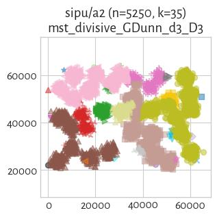

#### mst_divisive_GDunn_d4_D3 (NCA=0.23)

#### mst_divisive_GDunn_d4_D1 (NCA=0.22)

#### mst_divisive_DaviesBouldin (NCA=0.17)

#### FCPS_HDBSCAN_4 (NCA=0.15)

#### mst_divisive_SilhouetteW (NCA=0.01)

#### FCPS_HDBSCAN_8 (NCA=0.00)

## sipu/a3 (n=7500, d=2) 

#### FCPS_AdaptiveDensityPeak (NCA=0.99)

#### FCPS_PAM (NCA=0.98)

#### sklearn_spectral_Alaplacian_G5 (NCA=0.98)

#### Genie_G0.1 (NCA=0.98)

#### GIc (NCA=0.98)

#### CTCEHC (NCA=0.97)

#### sklearn_birch_T0.01_BF50 (NCA=0.97)

#### FCPS_MinEnergy (NCA=0.97)

#### fastcluster_average (NCA=0.97)

#### mst_divisive_Silhouette (NCA=0.97)

#### fastcluster_ward (NCA=0.97)

#### sklearn_gm (NCA=0.96)

#### sklearn_kmeans (NCA=0.96)

#### FCPS_Softcl (NCA=0.96)

#### mst_divisive_WCNN_25 (NCA=0.96)

#### fastcluster_centroid (NCA=0.96)

#### fastcluster_complete (NCA=0.96)

#### mst_divisive_DuNN_25_Mean_Mean (NCA=0.96)

#### Genie_G0.3 (NCA=0.95)

#### FCPS_Minimax (NCA=0.94)

#### FCPS_Clara (NCA=0.94)

#### mst_divisive_CalinskiHarabasz (NCA=0.93)

#### mst_divisive_DuNN_25_Min_Max (NCA=0.93)

#### fastcluster_weighted (NCA=0.90)

#### fastcluster_median (NCA=0.87)

#### Genie_G0.5 (NCA=0.84)

#### ITM (NCA=0.83)

#### FCPS_Diana (NCA=0.82)

#### FCPS_Hardcl (NCA=0.81)

#### IcA (NCA=0.76)

#### mst_divisive_GDunn_d2_D3 (NCA=0.71)

#### mst_divisive_GDunn_d2_D2 (NCA=0.70)

#### mst_divisive_GDunn_d2_D1 (NCA=0.66)

#### mst_divisive_GDunn_d5_D1 (NCA=0.65)

#### mst_divisive_GDunn_d5_D3 (NCA=0.64)

#### mst_divisive_GDunn_d5_D2 (NCA=0.63)

#### HEMST (NCA=0.63)

#### Genie_G0.7 (NCA=0.59)

#### mst_divisive_DuNN_25_Max_Min (NCA=0.51)

#### mst_divisive_BallHall (NCA=0.39)

#### mst_divisive_GDunn_d1_D1 (NCA=0.31)

#### mst_divisive_GDunn_d3_D3 (NCA=0.30)

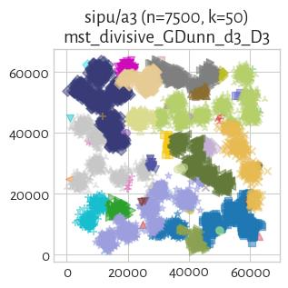

#### mst_divisive_GDunn_d3_D1 (NCA=0.28)

#### mst_divisive_GDunn_d3_D2 (NCA=0.26)

#### Genie_G1.0 (NCA=0.25)

#### mst_divisive_GDunn_d1_D2 (NCA=0.25)

#### FCPS_HDBSCAN_2 (NCA=0.25)

#### mst_divisive_GDunn_d1_D3 (NCA=0.25)

#### mst_divisive_GDunn_d4_D1 (NCA=0.14)

#### FCPS_HDBSCAN_4 (NCA=0.13)

#### mst_divisive_GDunn_d4_D2 (NCA=0.10)

#### mst_divisive_GDunn_d4_D3 (NCA=0.10)

#### mst_divisive_DaviesBouldin (NCA=0.07)

#### FCPS_HDBSCAN_8 (NCA=0.02)

#### mst_divisive_SilhouetteW (NCA=0.01)

## sipu/aggregation (n=788, d=2) 

#### fastcluster_average (NCA=1.00)

#### sklearn_gm (NCA=1.00)

#### WCNN_25 (NCA=1.00)

#### BallHall (NCA=1.00)

#### mst_divisive_DuNN_25_Mean_Mean (NCA=1.00)

#### sklearn_spectral_Alaplacian_G5 (NCA=1.00)

#### mst_divisive_WCNN_25 (NCA=1.00)

#### fastcluster_centroid (NCA=1.00)

#### FCPS_AdaptiveDensityPeak (NCA=0.96)

#### DaviesBouldin (NCA=0.96)

#### mst_divisive_Silhouette (NCA=0.96)

#### mst_divisive_CalinskiHarabasz (NCA=0.94)

#### mst_divisive_BallHall (NCA=0.94)

#### GDunn_d3_D2 (NCA=0.93)

#### GDunn_d4_D3 (NCA=0.92)

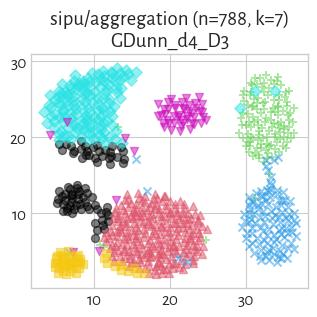

#### GDunn_d4_D1 (NCA=0.92)

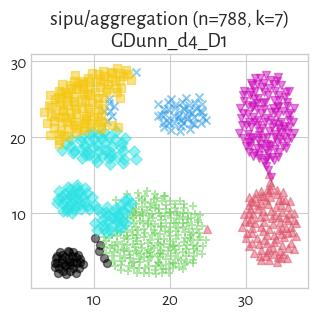

#### GDunn_d4_D2 (NCA=0.92)

#### GDunn_d2_D1 (NCA=0.90)

#### GDunn_d2_D3 (NCA=0.90)

#### GDunn_d3_D3 (NCA=0.90)

#### GDunn_d3_D1 (NCA=0.90)

#### mst_divisive_DuNN_25_Min_Max (NCA=0.89)

#### Genie_G0.5 (NCA=0.88)

#### DuNN_25_Min_Max (NCA=0.87)

#### mst_divisive_GDunn_d3_D2 (NCA=0.85)

#### Silhouette (NCA=0.82)

#### mst_divisive_GDunn_d3_D3 (NCA=0.81)

#### sklearn_birch_T0.01_BF50 (NCA=0.78)

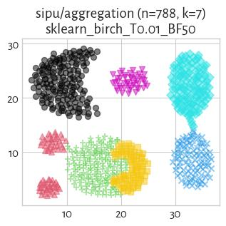

#### mst_divisive_GDunn_d3_D1 (NCA=0.78)

#### fastcluster_ward (NCA=0.78)

#### GDunn_d2_D2 (NCA=0.78)

#### FCPS_Diana (NCA=0.77)

#### FCPS_MinEnergy (NCA=0.76)

#### mst_divisive_GDunn_d4_D2 (NCA=0.75)

#### fastcluster_complete (NCA=0.75)

#### CalinskiHarabasz (NCA=0.75)

#### sklearn_kmeans (NCA=0.75)

#### fastcluster_weighted (NCA=0.75)

#### FCPS_PAM (NCA=0.74)

#### FCPS_Clara (NCA=0.74)

#### fastcluster_median (NCA=0.72)

#### FCPS_Softcl (NCA=0.71)

#### mst_divisive_GDunn_d4_D3 (NCA=0.69)

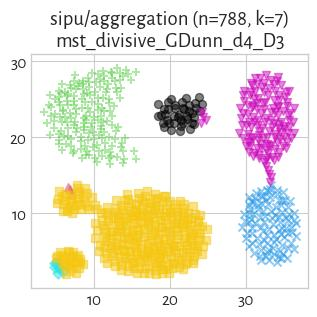

#### IcA (NCA=0.68)

#### FCPS_Minimax (NCA=0.68)

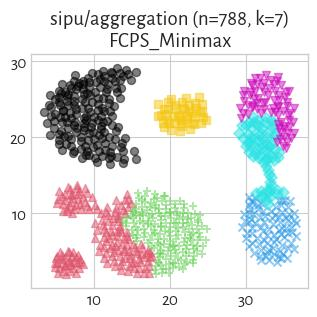

#### HEMST (NCA=0.67)

#### FCPS_HDBSCAN_4 (NCA=0.66)

#### FCPS_HDBSCAN_8 (NCA=0.66)

#### Genie_G1.0 (NCA=0.66)

#### mst_divisive_GDunn_d1_D3 (NCA=0.66)

#### GDunn_d1_D3 (NCA=0.66)

#### mst_divisive_GDunn_d1_D2 (NCA=0.66)

#### GDunn_d1_D1 (NCA=0.66)

#### GDunn_d1_D2 (NCA=0.66)

#### FCPS_HDBSCAN_2 (NCA=0.66)

#### mst_divisive_GDunn_d1_D1 (NCA=0.66)

#### ITM (NCA=0.66)

#### CTCEHC (NCA=0.66)

#### mst_divisive_GDunn_d4_D1 (NCA=0.66)

#### Genie_G0.7 (NCA=0.64)

#### GIc (NCA=0.64)

#### mst_divisive_GDunn_d5_D2 (NCA=0.64)

#### mst_divisive_GDunn_d5_D3 (NCA=0.63)

#### mst_divisive_DuNN_25_Max_Min (NCA=0.62)

#### FCPS_Fanny (NCA=0.62)

#### Genie_G0.1 (NCA=0.58)

#### Genie_G0.3 (NCA=0.58)

#### mst_divisive_GDunn_d2_D1 (NCA=0.57)

#### FCPS_Hardcl (NCA=0.56)

#### mst_divisive_GDunn_d2_D2 (NCA=0.50)

#### mst_divisive_GDunn_d5_D1 (NCA=0.50)

#### mst_divisive_GDunn_d2_D3 (NCA=0.49)

#### GDunn_d5_D2 (NCA=0.37)

#### DuNN_25_Max_Min (NCA=0.37)

#### GDunn_d5_D1 (NCA=0.23)

#### GDunn_d5_D3 (NCA=0.05)

#### DuNN_25_Mean_Mean (NCA=0.04)

#### SilhouetteW (NCA=0.03)

#### mst_divisive_SilhouetteW (NCA=0.01)

#### mst_divisive_DaviesBouldin (NCA=0.01)

## sipu/birch1 (n=100000, d=2) 

#### sklearn_kmeans (NCA=0.96)

#### GIc (NCA=0.95)

#### Genie_G0.1 (NCA=0.94)

#### Genie_G0.3 (NCA=0.94)

#### fastcluster_centroid (NCA=0.92)

#### fastcluster_ward (NCA=0.91)

#### Genie_G0.5 (NCA=0.80)

#### ITM (NCA=0.80)

#### IcA (NCA=0.79)

#### fastcluster_median (NCA=0.60)

#### Genie_G0.7 (NCA=0.45)

#### Genie_G1.0 (NCA=0.00)

## sipu/birch2 (n=100000, d=2) 

#### Genie_G0.1 (NCA=1.00)

#### Genie_G0.3 (NCA=1.00)

#### Genie_G0.5 (NCA=1.00)

#### Genie_G0.7 (NCA=1.00)

#### GIc (NCA=1.00)

#### fastcluster_ward (NCA=1.00)

#### fastcluster_centroid (NCA=1.00)

#### sklearn_kmeans (NCA=0.99)

#### fastcluster_median (NCA=0.98)

#### ITM (NCA=0.77)

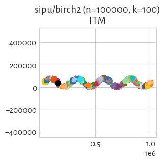

#### IcA (NCA=0.77)

#### Genie_G1.0 (NCA=0.59)

## sipu/compound (n=399, d=2) 

#### fastcluster_ward (NCA=0.87)

#### sklearn_birch_T0.01_BF50 (NCA=0.87)

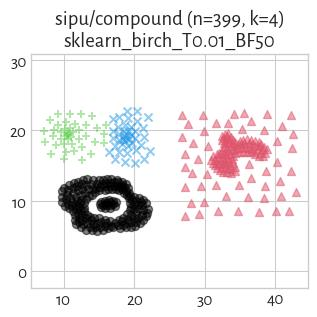

#### FCPS_MinEnergy (NCA=0.87)

#### Genie_G0.3 (NCA=0.87)

#### Genie_G0.1 (NCA=0.84)

#### GIc (NCA=0.84)

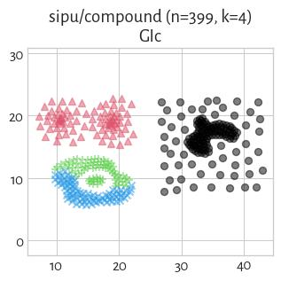

#### sklearn_gm (NCA=0.84)

#### IcA (NCA=0.84)

#### WCNN_25 (NCA=0.82)

#### CalinskiHarabasz (NCA=0.82)

#### sklearn_kmeans (NCA=0.81)

#### mst_divisive_DuNN_25_Min_Max (NCA=0.79)

#### ITM (NCA=0.79)

#### BallHall (NCA=0.79)

#### sklearn_spectral_Alaplacian_G5 (NCA=0.78)

#### DuNN_25_Min_Max (NCA=0.78)

#### GDunn_d2_D3 (NCA=0.78)

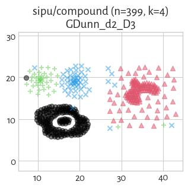

#### FCPS_Clara (NCA=0.77)

#### FCPS_PAM (NCA=0.76)

#### Genie_G0.5 (NCA=0.76)

#### FCPS_AdaptiveDensityPeak (NCA=0.75)

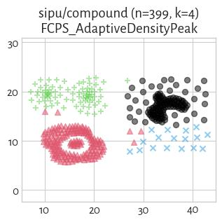

#### DuNN_25_Mean_Mean (NCA=0.75)

#### mst_divisive_CalinskiHarabasz (NCA=0.75)

#### GDunn_d2_D2 (NCA=0.74)

#### fastcluster_median (NCA=0.74)

#### fastcluster_centroid (NCA=0.73)

#### HEMST (NCA=0.73)

#### GDunn_d4_D3 (NCA=0.72)

#### GDunn_d3_D2 (NCA=0.72)

#### FCPS_Fanny (NCA=0.72)

#### mst_divisive_DuNN_25_Mean_Mean (NCA=0.71)

#### GDunn_d3_D3 (NCA=0.71)

#### CTCEHC (NCA=0.70)

#### mst_divisive_Silhouette (NCA=0.69)

#### GDunn_d4_D2 (NCA=0.69)

#### FCPS_Softcl (NCA=0.68)

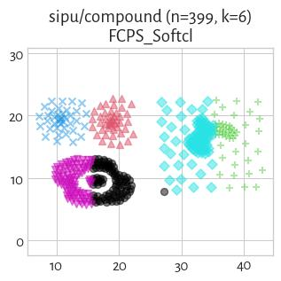

#### mst_divisive_BallHall (NCA=0.68)

#### mst_divisive_WCNN_25 (NCA=0.67)

#### FCPS_Hardcl (NCA=0.67)

#### Genie_G1.0 (NCA=0.67)

#### GDunn_d1_D3 (NCA=0.67)

#### GDunn_d1_D2 (NCA=0.67)

#### FCPS_HDBSCAN_2 (NCA=0.67)

#### GDunn_d1_D1 (NCA=0.67)

#### Genie_G0.7 (NCA=0.67)

#### fastcluster_weighted (NCA=0.67)

#### fastcluster_complete (NCA=0.67)

#### fastcluster_average (NCA=0.67)

#### mst_divisive_GDunn_d1_D1 (NCA=0.67)

#### mst_divisive_GDunn_d1_D2 (NCA=0.67)

#### mst_divisive_GDunn_d1_D3 (NCA=0.67)

#### Silhouette (NCA=0.66)

#### GDunn_d5_D2 (NCA=0.65)

#### mst_divisive_GDunn_d3_D3 (NCA=0.63)

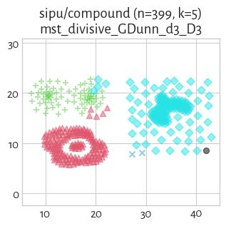

#### GDunn_d4_D1 (NCA=0.62)

#### mst_divisive_GDunn_d4_D3 (NCA=0.61)

#### mst_divisive_GDunn_d4_D2 (NCA=0.61)

#### mst_divisive_GDunn_d5_D3 (NCA=0.61)

#### FCPS_Minimax (NCA=0.61)

#### mst_divisive_GDunn_d5_D2 (NCA=0.61)

#### GDunn_d3_D1 (NCA=0.60)

#### GDunn_d2_D1 (NCA=0.58)

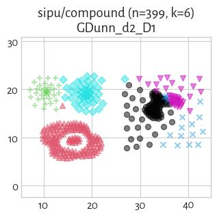

#### DaviesBouldin (NCA=0.58)

#### mst_divisive_GDunn_d5_D1 (NCA=0.57)

#### mst_divisive_GDunn_d2_D1 (NCA=0.57)

#### mst_divisive_GDunn_d3_D2 (NCA=0.55)

#### mst_divisive_GDunn_d2_D2 (NCA=0.55)

#### mst_divisive_GDunn_d2_D3 (NCA=0.55)

#### FCPS_Diana (NCA=0.55)

#### mst_divisive_DuNN_25_Max_Min (NCA=0.51)

#### DuNN_25_Max_Min (NCA=0.45)

#### SilhouetteW (NCA=0.34)

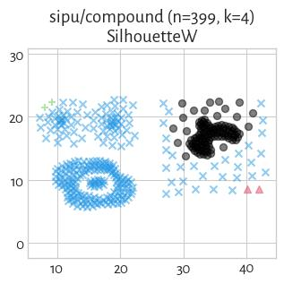

#### mst_divisive_GDunn_d4_D1 (NCA=0.34)

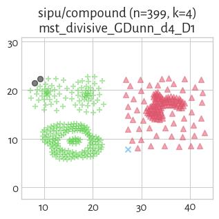

#### mst_divisive_GDunn_d3_D1 (NCA=0.34)

#### mst_divisive_SilhouetteW (NCA=0.33)

#### mst_divisive_DaviesBouldin (NCA=0.33)

#### FCPS_HDBSCAN_4 (NCA=0.33)

#### GDunn_d5_D1 (NCA=0.28)

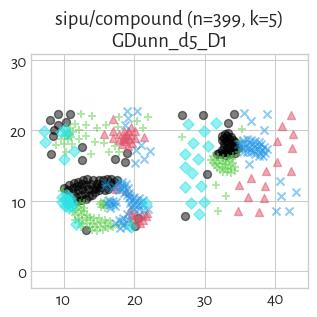

#### FCPS_HDBSCAN_8 (NCA=0.25)

#### GDunn_d5_D3 (NCA=0.11)

## sipu/d31 (n=3100, d=2) 

#### sklearn_kmeans (NCA=0.98)

#### FCPS_PAM (NCA=0.98)

#### FCPS_AdaptiveDensityPeak (NCA=0.98)

#### sklearn_spectral_Alaplacian_G5 (NCA=0.97)

#### sklearn_gm (NCA=0.97)

#### mst_divisive_WCNN_25 (NCA=0.97)

#### Genie_G0.1 (NCA=0.97)

#### CTCEHC (NCA=0.96)

#### GIc (NCA=0.96)

#### fastcluster_complete (NCA=0.96)

#### fastcluster_ward (NCA=0.96)

#### sklearn_birch_T0.01_BF50 (NCA=0.96)

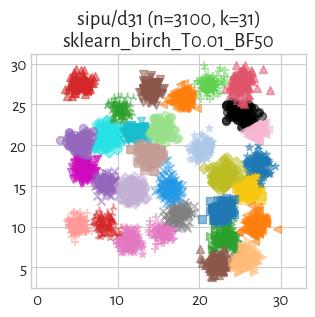

#### FCPS_MinEnergy (NCA=0.96)

#### FCPS_Clara (NCA=0.94)

#### fastcluster_centroid (NCA=0.94)

#### fastcluster_average (NCA=0.94)

#### FCPS_Minimax (NCA=0.93)

#### mst_divisive_DuNN_25_Mean_Mean (NCA=0.93)

#### mst_divisive_CalinskiHarabasz (NCA=0.93)

#### FCPS_Softcl (NCA=0.93)

#### Genie_G0.3 (NCA=0.93)

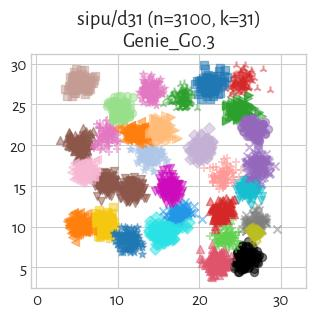

#### mst_divisive_DuNN_25_Min_Max (NCA=0.92)

#### FCPS_Hardcl (NCA=0.88)

#### mst_divisive_Silhouette (NCA=0.86)

#### FCPS_Diana (NCA=0.85)

#### ITM (NCA=0.85)

#### fastcluster_median (NCA=0.83)

#### fastcluster_weighted (NCA=0.82)

#### IcA (NCA=0.80)

#### Genie_G0.5 (NCA=0.76)

#### mst_divisive_GDunn_d5_D2 (NCA=0.74)

#### mst_divisive_GDunn_d2_D3 (NCA=0.73)

#### mst_divisive_BallHall (NCA=0.72)

#### mst_divisive_GDunn_d5_D3 (NCA=0.70)

#### mst_divisive_GDunn_d2_D1 (NCA=0.67)

#### mst_divisive_GDunn_d5_D1 (NCA=0.66)

#### mst_divisive_GDunn_d2_D2 (NCA=0.66)

#### mst_divisive_DuNN_25_Max_Min (NCA=0.58)

#### HEMST (NCA=0.55)

#### Genie_G0.7 (NCA=0.53)

#### mst_divisive_GDunn_d1_D1 (NCA=0.27)

#### mst_divisive_GDunn_d3_D1 (NCA=0.26)

#### mst_divisive_GDunn_d3_D3 (NCA=0.25)

#### mst_divisive_GDunn_d3_D2 (NCA=0.25)

#### mst_divisive_GDunn_d1_D3 (NCA=0.24)

#### mst_divisive_GDunn_d1_D2 (NCA=0.24)

#### Genie_G1.0 (NCA=0.24)

#### FCPS_HDBSCAN_2 (NCA=0.24)

#### mst_divisive_GDunn_d4_D3 (NCA=0.14)

#### FCPS_HDBSCAN_4 (NCA=0.14)

#### mst_divisive_GDunn_d4_D2 (NCA=0.12)

#### FCPS_HDBSCAN_8 (NCA=0.11)

#### mst_divisive_GDunn_d4_D1 (NCA=0.09)

#### mst_divisive_SilhouetteW (NCA=0.01)

#### mst_divisive_DaviesBouldin (NCA=0.01)

## sipu/flame (n=240, d=2) 

#### Genie_G0.1 (NCA=1.00)

#### Genie_G0.3 (NCA=1.00)

#### mst_divisive_DuNN_25_Mean_Mean (NCA=1.00)

#### CTCEHC (NCA=1.00)

#### mst_divisive_DuNN_25_Min_Max (NCA=1.00)

#### DuNN_25_Mean_Mean (NCA=1.00)

#### Genie_G0.5 (NCA=1.00)

#### Genie_G0.7 (NCA=1.00)

#### GIc (NCA=1.00)

#### sklearn_spectral_Alaplacian_G5 (NCA=0.93)

#### FCPS_Minimax (NCA=0.90)

#### FCPS_Diana (NCA=0.79)

#### Silhouette (NCA=0.79)

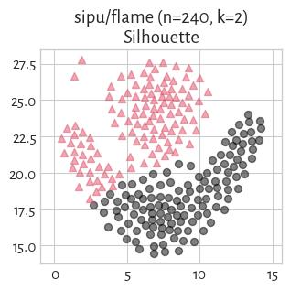

#### GDunn_d2_D3 (NCA=0.78)

#### GDunn_d2_D2 (NCA=0.77)

#### GDunn_d3_D2 (NCA=0.77)

#### FCPS_Softcl (NCA=0.77)

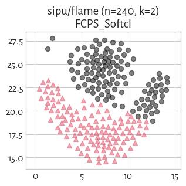

#### FCPS_Clara (NCA=0.77)

#### GDunn_d3_D3 (NCA=0.77)

#### DuNN_25_Max_Min (NCA=0.76)

#### GDunn_d5_D3 (NCA=0.76)

#### FCPS_PAM (NCA=0.76)

#### FCPS_Hardcl (NCA=0.75)

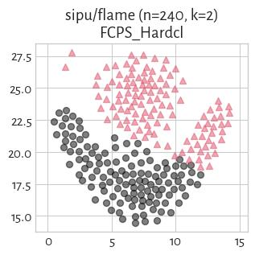

#### DuNN_25_Min_Max (NCA=0.75)

#### FCPS_Fanny (NCA=0.75)

#### fastcluster_average (NCA=0.74)

#### CalinskiHarabasz (NCA=0.74)

#### sklearn_kmeans (NCA=0.74)

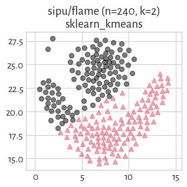

#### fastcluster_weighted (NCA=0.73)

#### FCPS_MinEnergy (NCA=0.72)

#### FCPS_AdaptiveDensityPeak (NCA=0.70)

#### IcA (NCA=0.68)

#### ITM (NCA=0.68)

#### mst_divisive_Silhouette (NCA=0.68)

#### mst_divisive_CalinskiHarabasz (NCA=0.68)

#### mst_divisive_GDunn_d2_D3 (NCA=0.68)

#### mst_divisive_GDunn_d2_D2 (NCA=0.68)

#### sklearn_gm (NCA=0.68)

#### mst_divisive_GDunn_d2_D1 (NCA=0.67)

#### fastcluster_median (NCA=0.61)

#### sklearn_birch_T0.01_BF50 (NCA=0.59)

#### fastcluster_ward (NCA=0.59)

#### GDunn_d5_D2 (NCA=0.35)

#### mst_divisive_DuNN_25_Max_Min (NCA=0.29)

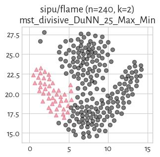

#### fastcluster_complete (NCA=0.21)

#### GDunn_d2_D1 (NCA=0.20)

#### WCNN_25 (NCA=0.19)

#### mst_divisive_WCNN_25 (NCA=0.19)

#### mst_divisive_BallHall (NCA=0.12)

#### BallHall (NCA=0.09)

#### GDunn_d5_D1 (NCA=0.03)

#### FCPS_HDBSCAN_2 (NCA=0.02)

#### fastcluster_centroid (NCA=0.02)

#### Genie_G1.0 (NCA=0.02)

#### mst_divisive_GDunn_d1_D3 (NCA=0.02)

#### GDunn_d3_D1 (NCA=0.02)

#### mst_divisive_GDunn_d5_D1 (NCA=0.02)

#### mst_divisive_GDunn_d3_D1 (NCA=0.02)

#### mst_divisive_SilhouetteW (NCA=0.02)

#### GDunn_d1_D1 (NCA=0.02)

#### GDunn_d1_D2 (NCA=0.02)

#### GDunn_d1_D3 (NCA=0.02)

#### SilhouetteW (NCA=0.02)

#### mst_divisive_DaviesBouldin (NCA=0.02)

#### mst_divisive_GDunn_d1_D1 (NCA=0.02)

#### mst_divisive_GDunn_d1_D2 (NCA=0.02)

#### DaviesBouldin (NCA=0.02)

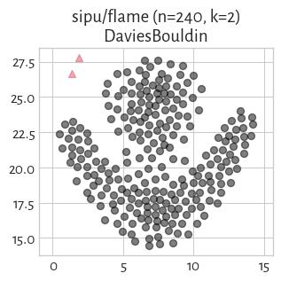

#### HEMST (NCA=0.01)

#### mst_divisive_GDunn_d5_D2 (NCA=0.01)

#### mst_divisive_GDunn_d5_D3 (NCA=0.01)

#### mst_divisive_GDunn_d4_D2 (NCA=0.01)

#### GDunn_d4_D1 (NCA=0.01)

#### GDunn_d4_D2 (NCA=0.01)

#### mst_divisive_GDunn_d4_D1 (NCA=0.01)

#### GDunn_d4_D3 (NCA=0.01)

#### FCPS_HDBSCAN_8 (NCA=0.01)

#### mst_divisive_GDunn_d3_D2 (NCA=0.01)

#### mst_divisive_GDunn_d4_D3 (NCA=0.01)

#### mst_divisive_GDunn_d3_D3 (NCA=0.01)

#### FCPS_HDBSCAN_4 (NCA=0.01)

## sipu/jain (n=373, d=2) 

#### mst_divisive_GDunn_d1_D1 (NCA=1.00)

#### Genie_G0.3 (NCA=1.00)

#### mst_divisive_GDunn_d1_D3 (NCA=1.00)

#### WCNN_25 (NCA=1.00)

#### GDunn_d1_D2 (NCA=1.00)

#### GDunn_d1_D1 (NCA=1.00)

#### mst_divisive_WCNN_25 (NCA=1.00)

#### mst_divisive_GDunn_d1_D2 (NCA=1.00)

#### GIc (NCA=1.00)

#### Genie_G0.5 (NCA=1.00)

#### IcA (NCA=0.99)

#### GDunn_d1_D3 (NCA=0.99)

#### DuNN_25_Min_Max (NCA=0.97)

#### mst_divisive_GDunn_d2_D1 (NCA=0.94)

#### sklearn_birch_T0.01_BF50 (NCA=0.81)

#### fastcluster_ward (NCA=0.81)

#### FCPS_MinEnergy (NCA=0.81)

#### fastcluster_weighted (NCA=0.81)

#### fastcluster_centroid (NCA=0.81)

#### FCPS_AdaptiveDensityPeak (NCA=0.80)

#### mst_divisive_GDunn_d2_D2 (NCA=0.80)

#### mst_divisive_GDunn_d3_D2 (NCA=0.80)

#### mst_divisive_GDunn_d4_D2 (NCA=0.80)

#### mst_divisive_GDunn_d5_D2 (NCA=0.80)

#### fastcluster_average (NCA=0.79)

#### fastcluster_complete (NCA=0.79)

#### GDunn_d2_D2 (NCA=0.76)

#### GDunn_d4_D2 (NCA=0.75)

#### GDunn_d3_D2 (NCA=0.75)

#### mst_divisive_GDunn_d2_D3 (NCA=0.75)

#### mst_divisive_GDunn_d3_D3 (NCA=0.75)

#### mst_divisive_GDunn_d4_D3 (NCA=0.75)

#### GDunn_d3_D3 (NCA=0.74)

#### GDunn_d2_D3 (NCA=0.74)

#### FCPS_Minimax (NCA=0.73)

#### GDunn_d4_D3 (NCA=0.73)

#### sklearn_spectral_Alaplacian_G5 (NCA=0.72)

#### ITM (NCA=0.71)

#### Silhouette (NCA=0.71)

#### FCPS_Diana (NCA=0.71)

#### sklearn_kmeans (NCA=0.70)

#### CalinskiHarabasz (NCA=0.70)

#### FCPS_Softcl (NCA=0.69)

#### mst_divisive_CalinskiHarabasz (NCA=0.69)

#### mst_divisive_Silhouette (NCA=0.69)

#### FCPS_Hardcl (NCA=0.68)

#### mst_divisive_DuNN_25_Max_Min (NCA=0.68)

#### FCPS_Fanny (NCA=0.66)

#### FCPS_PAM (NCA=0.66)

#### fastcluster_median (NCA=0.65)

#### FCPS_Clara (NCA=0.65)

#### mst_divisive_GDunn_d3_D1 (NCA=0.60)

#### mst_divisive_GDunn_d4_D1 (NCA=0.60)

#### mst_divisive_GDunn_d5_D1 (NCA=0.60)

#### GDunn_d3_D1 (NCA=0.56)

#### GDunn_d4_D1 (NCA=0.56)

#### CTCEHC (NCA=0.53)

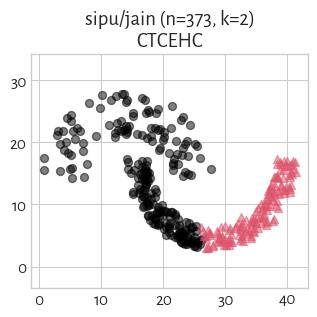

#### GDunn_d2_D1 (NCA=0.52)

#### mst_divisive_BallHall (NCA=0.50)

#### Genie_G0.1 (NCA=0.49)

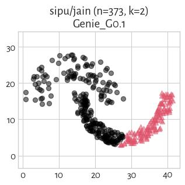

#### HEMST (NCA=0.49)

#### BallHall (NCA=0.47)

#### GDunn_d5_D1 (NCA=0.47)

#### sklearn_gm (NCA=0.43)

#### FCPS_HDBSCAN_2 (NCA=0.27)

#### Genie_G0.7 (NCA=0.27)

#### DuNN_25_Mean_Mean (NCA=0.27)

#### Genie_G1.0 (NCA=0.27)

#### mst_divisive_DuNN_25_Mean_Mean (NCA=0.27)

#### mst_divisive_DuNN_25_Min_Max (NCA=0.27)

#### GDunn_d5_D2 (NCA=0.21)

#### DuNN_25_Max_Min (NCA=0.14)

#### SilhouetteW (NCA=0.02)

#### DaviesBouldin (NCA=0.02)

#### mst_divisive_SilhouetteW (NCA=0.02)

#### mst_divisive_DaviesBouldin (NCA=0.02)

#### FCPS_HDBSCAN_8 (NCA=0.01)

#### FCPS_HDBSCAN_4 (NCA=0.01)

#### GDunn_d5_D3 (NCA=0.00)

#### mst_divisive_GDunn_d5_D3 (NCA=0.00)

## sipu/pathbased (n=300, d=2) 

#### Genie_G0.1 (NCA=0.98)

#### Genie_G0.3 (NCA=0.98)

#### GIc (NCA=0.98)

#### IcA (NCA=0.82)

#### mst_divisive_Silhouette (NCA=0.80)

#### mst_divisive_DuNN_25_Max_Min (NCA=0.76)

#### mst_divisive_DuNN_25_Min_Max (NCA=0.76)

#### Genie_G0.7 (NCA=0.76)

#### Genie_G0.5 (NCA=0.76)

#### DuNN_25_Min_Max (NCA=0.75)

#### mst_divisive_CalinskiHarabasz (NCA=0.72)

#### ITM (NCA=0.68)

#### fastcluster_ward (NCA=0.67)

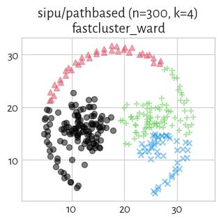

#### sklearn_birch_T0.01_BF50 (NCA=0.67)

#### FCPS_AdaptiveDensityPeak (NCA=0.67)

#### FCPS_Softcl (NCA=0.65)

#### CalinskiHarabasz (NCA=0.65)

#### Silhouette (NCA=0.65)

#### sklearn_kmeans (NCA=0.65)

#### FCPS_Hardcl (NCA=0.65)

#### GDunn_d3_D1 (NCA=0.65)

#### GDunn_d4_D1 (NCA=0.65)

#### FCPS_PAM (NCA=0.65)

#### fastcluster_median (NCA=0.65)

#### FCPS_Clara (NCA=0.65)

#### sklearn_spectral_Alaplacian_G5 (NCA=0.65)

#### DuNN_25_Mean_Mean (NCA=0.64)

#### GDunn_d1_D2 (NCA=0.64)

#### fastcluster_centroid (NCA=0.64)

#### fastcluster_average (NCA=0.63)

#### mst_divisive_GDunn_d5_D1 (NCA=0.62)

#### GDunn_d2_D3 (NCA=0.62)

#### GDunn_d3_D2 (NCA=0.62)

#### GDunn_d2_D2 (NCA=0.62)

#### GDunn_d1_D3 (NCA=0.62)

#### WCNN_25 (NCA=0.62)

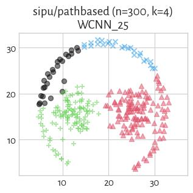

#### mst_divisive_WCNN_25 (NCA=0.62)

#### FCPS_Diana (NCA=0.62)

#### mst_divisive_GDunn_d5_D2 (NCA=0.62)

#### mst_divisive_GDunn_d5_D3 (NCA=0.61)

#### GDunn_d4_D2 (NCA=0.61)

#### sklearn_gm (NCA=0.61)

#### GDunn_d3_D3 (NCA=0.60)

#### GDunn_d4_D3 (NCA=0.60)

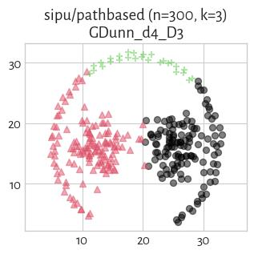

#### FCPS_Minimax (NCA=0.60)

#### GDunn_d1_D1 (NCA=0.60)

#### FCPS_MinEnergy (NCA=0.59)

#### HEMST (NCA=0.56)

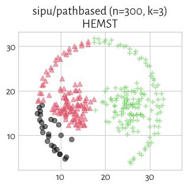
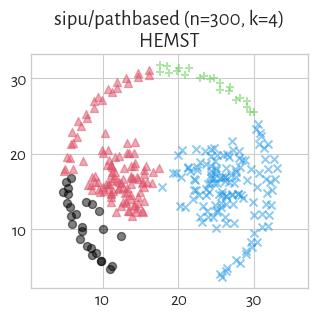

#### DaviesBouldin (NCA=0.56)

#### fastcluster_complete (NCA=0.56)

#### BallHall (NCA=0.55)

#### FCPS_Fanny (NCA=0.53)

#### GDunn_d2_D1 (NCA=0.52)

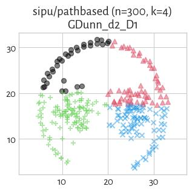

#### mst_divisive_DuNN_25_Mean_Mean (NCA=0.51)

#### fastcluster_weighted (NCA=0.46)

#### GDunn_d5_D2 (NCA=0.39)

#### SilhouetteW (NCA=0.36)

#### mst_divisive_GDunn_d2_D2 (NCA=0.32)

#### mst_divisive_GDunn_d2_D1 (NCA=0.32)

#### mst_divisive_GDunn_d2_D3 (NCA=0.31)

#### DuNN_25_Max_Min (NCA=0.30)

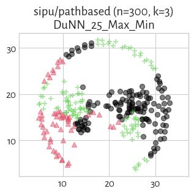

#### mst_divisive_GDunn_d3_D1 (NCA=0.29)

#### mst_divisive_GDunn_d4_D3 (NCA=0.29)

#### mst_divisive_GDunn_d4_D2 (NCA=0.29)

#### GDunn_d5_D1 (NCA=0.28)

#### mst_divisive_GDunn_d3_D3 (NCA=0.27)

#### mst_divisive_GDunn_d3_D2 (NCA=0.27)

#### CTCEHC (NCA=0.24)

#### mst_divisive_BallHall (NCA=0.08)

#### mst_divisive_GDunn_d4_D1 (NCA=0.06)

#### GDunn_d5_D3 (NCA=0.06)

#### mst_divisive_SilhouetteW (NCA=0.02)

#### mst_divisive_DaviesBouldin (NCA=0.01)

#### FCPS_HDBSCAN_8 (NCA=0.01)

#### FCPS_HDBSCAN_4 (NCA=0.01)

#### mst_divisive_GDunn_d1_D3 (NCA=0.01)

#### mst_divisive_GDunn_d1_D2 (NCA=0.01)

#### FCPS_HDBSCAN_2 (NCA=0.01)

#### Genie_G1.0 (NCA=0.01)

#### mst_divisive_GDunn_d1_D1 (NCA=0.01)

## sipu/r15 (n=600, d=2) 

#### mst_divisive_BallHall (NCA=1.00)

#### mst_divisive_DuNN_25_Max_Min (NCA=1.00)

#### mst_divisive_DuNN_25_Mean_Mean (NCA=1.00)

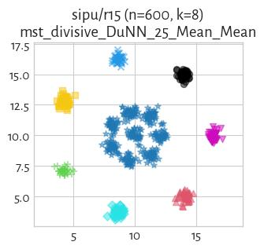

#### mst_divisive_DuNN_25_Min_Max (NCA=1.00)

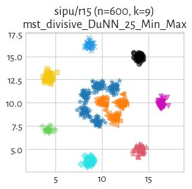

#### mst_divisive_WCNN_25 (NCA=1.00)

#### mst_divisive_GDunn_d1_D3 (NCA=1.00)

#### mst_divisive_GDunn_d1_D2 (NCA=1.00)

#### mst_divisive_GDunn_d1_D1 (NCA=1.00)

#### WCNN_25 (NCA=1.00)

#### SilhouetteW (NCA=1.00)

#### Silhouette (NCA=1.00)

#### GDunn_d1_D3 (NCA=1.00)

#### GDunn_d1_D2 (NCA=1.00)

#### GDunn_d1_D1 (NCA=1.00)

#### sklearn_spectral_Alaplacian_G5 (NCA=1.00)

#### sklearn_kmeans (NCA=1.00)

#### sklearn_gm (NCA=1.00)

#### sklearn_birch_T0.01_BF50 (NCA=1.00)

#### CalinskiHarabasz (NCA=1.00)

#### FCPS_HDBSCAN_8 (NCA=1.00)

#### FCPS_Diana (NCA=1.00)

#### FCPS_PAM (NCA=1.00)

#### HEMST (NCA=1.00)

#### BallHall (NCA=1.00)

#### DaviesBouldin (NCA=1.00)

#### FCPS_HDBSCAN_2 (NCA=1.00)

#### FCPS_HDBSCAN_4 (NCA=1.00)

#### FCPS_MinEnergy (NCA=1.00)

#### FCPS_Minimax (NCA=1.00)

#### FCPS_AdaptiveDensityPeak (NCA=1.00)

#### fastcluster_weighted (NCA=1.00)

#### fastcluster_ward (NCA=1.00)

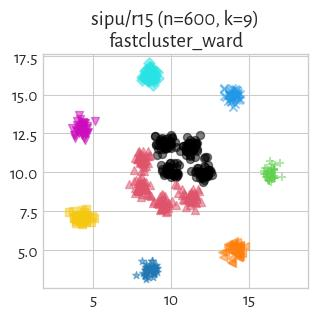

#### fastcluster_median (NCA=1.00)

#### fastcluster_complete (NCA=1.00)

#### fastcluster_centroid (NCA=1.00)

#### fastcluster_average (NCA=1.00)

#### Genie_G1.0 (NCA=1.00)

#### Genie_G0.7 (NCA=1.00)

#### Genie_G0.5 (NCA=1.00)

#### FCPS_Clara (NCA=1.00)

#### DuNN_25_Min_Max (NCA=1.00)

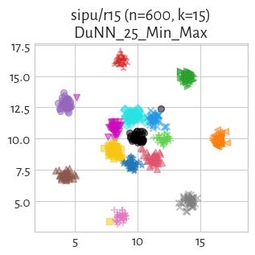

#### DuNN_25_Max_Min (NCA=1.00)

#### DuNN_25_Mean_Mean (NCA=1.00)

#### GDunn_d2_D1 (NCA=1.00)

#### FCPS_Fanny (NCA=1.00)

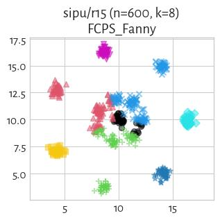

#### GDunn_d4_D1 (NCA=1.00)

#### GDunn_d3_D1 (NCA=0.99)

#### ITM (NCA=0.99)

#### Genie_G0.1 (NCA=0.99)

#### Genie_G0.3 (NCA=0.99)

#### mst_divisive_CalinskiHarabasz (NCA=0.99)

#### GIc (NCA=0.99)

#### GDunn_d4_D3 (NCA=0.99)

#### GDunn_d4_D2 (NCA=0.99)

#### GDunn_d3_D2 (NCA=0.98)

#### CTCEHC (NCA=0.98)

#### mst_divisive_Silhouette (NCA=0.98)

#### GDunn_d3_D3 (NCA=0.97)

#### GDunn_d2_D3 (NCA=0.94)

#### GDunn_d2_D2 (NCA=0.91)

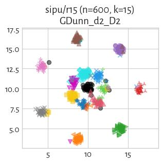

#### mst_divisive_GDunn_d5_D1 (NCA=0.90)

#### FCPS_Hardcl (NCA=0.90)

#### mst_divisive_GDunn_d2_D1 (NCA=0.89)

#### mst_divisive_GDunn_d5_D2 (NCA=0.88)

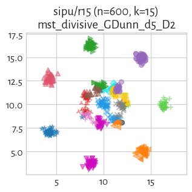

#### IcA (NCA=0.87)

#### mst_divisive_GDunn_d5_D3 (NCA=0.87)

#### mst_divisive_GDunn_d4_D2 (NCA=0.86)

#### mst_divisive_GDunn_d4_D3 (NCA=0.86)

#### mst_divisive_GDunn_d3_D2 (NCA=0.85)

#### mst_divisive_GDunn_d3_D3 (NCA=0.83)

#### mst_divisive_GDunn_d2_D2 (NCA=0.75)

#### mst_divisive_DaviesBouldin (NCA=0.75)

#### GDunn_d5_D2 (NCA=0.72)

#### GDunn_d5_D3 (NCA=0.70)

#### mst_divisive_GDunn_d2_D3 (NCA=0.68)

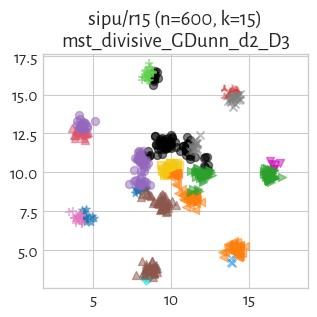

#### GDunn_d5_D1 (NCA=0.67)

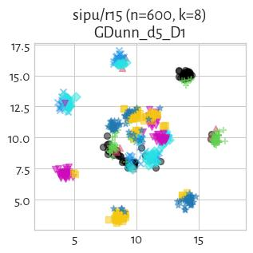

#### FCPS_Softcl (NCA=0.64)

#### mst_divisive_GDunn_d4_D1 (NCA=0.47)

#### mst_divisive_GDunn_d3_D1 (NCA=0.34)

#### mst_divisive_SilhouetteW (NCA=0.05)

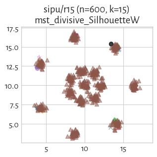

## sipu/s1 (n=5000, d=2) 

#### mst_divisive_WCNN_25 (NCA=1.00)

#### mst_divisive_DuNN_25_Mean_Mean (NCA=0.99)

#### sklearn_gm (NCA=0.99)

#### Genie_G0.3 (NCA=0.99)

#### mst_divisive_DuNN_25_Min_Max (NCA=0.99)

#### Genie_G0.1 (NCA=0.99)

#### GIc (NCA=0.99)

#### Genie_G0.5 (NCA=0.99)

#### FCPS_Clara (NCA=0.99)

#### sklearn_kmeans (NCA=0.99)

#### FCPS_Fanny (NCA=0.99)

#### sklearn_spectral_Alaplacian_G5 (NCA=0.99)

#### FCPS_Softcl (NCA=0.99)

#### FCPS_AdaptiveDensityPeak (NCA=0.99)

#### FCPS_PAM (NCA=0.99)

#### CTCEHC (NCA=0.99)

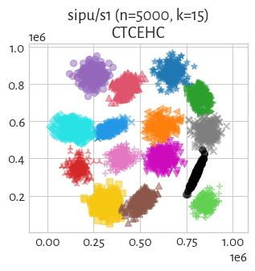

#### mst_divisive_Silhouette (NCA=0.99)

#### fastcluster_ward (NCA=0.99)

#### fastcluster_average (NCA=0.99)

#### sklearn_birch_T0.01_BF50 (NCA=0.99)

#### fastcluster_centroid (NCA=0.99)

#### FCPS_MinEnergy (NCA=0.99)

#### mst_divisive_CalinskiHarabasz (NCA=0.99)

#### fastcluster_complete (NCA=0.98)

#### FCPS_Minimax (NCA=0.98)

#### mst_divisive_BallHall (NCA=0.97)

#### fastcluster_median (NCA=0.88)

#### IcA (NCA=0.85)

#### Genie_G0.7 (NCA=0.85)

#### FCPS_Diana (NCA=0.85)

#### ITM (NCA=0.80)

#### fastcluster_weighted (NCA=0.78)

#### FCPS_Hardcl (NCA=0.71)

#### mst_divisive_GDunn_d2_D2 (NCA=0.69)

#### HEMST (NCA=0.68)

#### mst_divisive_GDunn_d2_D3 (NCA=0.68)

#### mst_divisive_GDunn_d2_D1 (NCA=0.63)

#### mst_divisive_GDunn_d5_D2 (NCA=0.63)

#### mst_divisive_GDunn_d5_D3 (NCA=0.62)

#### mst_divisive_GDunn_d5_D1 (NCA=0.52)

#### mst_divisive_GDunn_d3_D2 (NCA=0.50)

#### mst_divisive_GDunn_d3_D3 (NCA=0.43)

#### mst_divisive_GDunn_d1_D2 (NCA=0.43)

#### Genie_G1.0 (NCA=0.43)

#### FCPS_HDBSCAN_2 (NCA=0.43)

#### mst_divisive_GDunn_d1_D1 (NCA=0.43)

#### mst_divisive_GDunn_d1_D3 (NCA=0.43)

#### mst_divisive_GDunn_d3_D1 (NCA=0.40)

#### mst_divisive_GDunn_d4_D2 (NCA=0.39)

#### mst_divisive_DuNN_25_Max_Min (NCA=0.39)

#### mst_divisive_GDunn_d4_D3 (NCA=0.38)

#### FCPS_HDBSCAN_4 (NCA=0.36)

#### mst_divisive_GDunn_d4_D1 (NCA=0.35)

#### FCPS_HDBSCAN_8 (NCA=0.07)

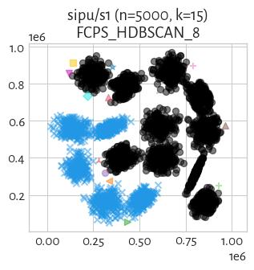

#### mst_divisive_DaviesBouldin (NCA=0.06)

#### mst_divisive_SilhouetteW (NCA=0.00)

## sipu/s2 (n=5000, d=2) 

#### sklearn_gm (NCA=0.97)

#### FCPS_Fanny (NCA=0.97)

#### FCPS_PAM (NCA=0.97)

#### FCPS_Softcl (NCA=0.97)

#### FCPS_AdaptiveDensityPeak (NCA=0.97)

#### sklearn_spectral_Alaplacian_G5 (NCA=0.97)

#### sklearn_kmeans (NCA=0.97)

#### FCPS_Clara (NCA=0.96)

#### Genie_G0.3 (NCA=0.95)

#### Genie_G0.1 (NCA=0.95)

#### fastcluster_average (NCA=0.95)

#### mst_divisive_BallHall (NCA=0.95)

#### fastcluster_ward (NCA=0.95)

#### GIc (NCA=0.95)

#### sklearn_birch_T0.01_BF50 (NCA=0.95)

#### FCPS_MinEnergy (NCA=0.95)

#### CTCEHC (NCA=0.94)

#### mst_divisive_Silhouette (NCA=0.92)

#### mst_divisive_CalinskiHarabasz (NCA=0.91)

#### fastcluster_centroid (NCA=0.90)

#### FCPS_Diana (NCA=0.87)

#### ITM (NCA=0.86)

#### mst_divisive_DuNN_25_Mean_Mean (NCA=0.84)

#### fastcluster_complete (NCA=0.83)

#### Genie_G0.5 (NCA=0.83)

#### mst_divisive_DuNN_25_Min_Max (NCA=0.82)

#### IcA (NCA=0.82)

#### FCPS_Hardcl (NCA=0.80)

#### fastcluster_median (NCA=0.76)

#### fastcluster_weighted (NCA=0.75)

#### FCPS_Minimax (NCA=0.74)

#### mst_divisive_WCNN_25 (NCA=0.69)

#### HEMST (NCA=0.68)

#### Genie_G0.7 (NCA=0.62)

#### mst_divisive_GDunn_d5_D3 (NCA=0.60)

#### mst_divisive_GDunn_d5_D2 (NCA=0.59)

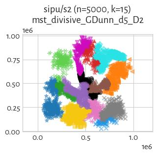

#### mst_divisive_GDunn_d5_D1 (NCA=0.59)

#### mst_divisive_GDunn_d2_D2 (NCA=0.58)

#### mst_divisive_GDunn_d2_D3 (NCA=0.57)

#### mst_divisive_GDunn_d2_D1 (NCA=0.55)

#### mst_divisive_GDunn_d4_D1 (NCA=0.41)

#### mst_divisive_DuNN_25_Max_Min (NCA=0.35)

#### mst_divisive_GDunn_d3_D1 (NCA=0.29)

#### mst_divisive_GDunn_d3_D3 (NCA=0.22)

#### mst_divisive_GDunn_d3_D2 (NCA=0.22)

#### mst_divisive_GDunn_d4_D3 (NCA=0.21)

#### mst_divisive_GDunn_d4_D2 (NCA=0.15)

#### mst_divisive_GDunn_d1_D2 (NCA=0.14)

#### mst_divisive_GDunn_d1_D3 (NCA=0.14)

#### mst_divisive_DaviesBouldin (NCA=0.13)

#### mst_divisive_GDunn_d1_D1 (NCA=0.00)

#### Genie_G1.0 (NCA=0.00)

#### FCPS_HDBSCAN_2 (NCA=0.00)

#### FCPS_HDBSCAN_4 (NCA=0.00)

#### FCPS_HDBSCAN_8 (NCA=0.00)

#### mst_divisive_SilhouetteW (NCA=0.00)

## sipu/s3 (n=5000, d=2) 

#### FCPS_PAM (NCA=0.85)

#### FCPS_AdaptiveDensityPeak (NCA=0.85)

#### sklearn_gm (NCA=0.85)

#### FCPS_Softcl (NCA=0.85)

#### sklearn_kmeans (NCA=0.84)

#### sklearn_spectral_Alaplacian_G5 (NCA=0.84)

#### FCPS_Clara (NCA=0.84)

#### CTCEHC (NCA=0.82)

#### Genie_G0.1 (NCA=0.82)

#### GIc (NCA=0.82)

#### mst_divisive_CalinskiHarabasz (NCA=0.81)

#### mst_divisive_Silhouette (NCA=0.81)

#### fastcluster_ward (NCA=0.81)

#### FCPS_MinEnergy (NCA=0.80)

#### sklearn_birch_T0.01_BF50 (NCA=0.79)

#### Genie_G0.3 (NCA=0.76)

#### IcA (NCA=0.76)

#### ITM (NCA=0.76)

#### FCPS_Diana (NCA=0.71)

#### FCPS_Minimax (NCA=0.70)

#### FCPS_Hardcl (NCA=0.69)

#### fastcluster_average (NCA=0.66)

#### Genie_G0.5 (NCA=0.63)

#### fastcluster_centroid (NCA=0.63)

#### fastcluster_complete (NCA=0.57)

#### mst_divisive_GDunn_d5_D1 (NCA=0.57)

#### mst_divisive_GDunn_d2_D3 (NCA=0.54)

#### mst_divisive_GDunn_d2_D2 (NCA=0.54)

#### fastcluster_median (NCA=0.52)

#### mst_divisive_GDunn_d2_D1 (NCA=0.51)

#### fastcluster_weighted (NCA=0.50)

#### mst_divisive_GDunn_d5_D2 (NCA=0.50)

#### mst_divisive_GDunn_d5_D3 (NCA=0.50)

#### mst_divisive_DuNN_25_Min_Max (NCA=0.47)

#### Genie_G0.7 (NCA=0.42)

#### HEMST (NCA=0.38)

#### mst_divisive_DuNN_25_Max_Min (NCA=0.36)

#### mst_divisive_GDunn_d3_D3 (NCA=0.35)

#### mst_divisive_GDunn_d3_D2 (NCA=0.35)

#### mst_divisive_GDunn_d4_D1 (NCA=0.28)

#### mst_divisive_GDunn_d4_D2 (NCA=0.28)

#### mst_divisive_GDunn_d4_D3 (NCA=0.28)

#### mst_divisive_GDunn_d3_D1 (NCA=0.20)

#### mst_divisive_DuNN_25_Mean_Mean (NCA=0.18)

#### mst_divisive_BallHall (NCA=0.09)

#### mst_divisive_WCNN_25 (NCA=0.03)

#### FCPS_HDBSCAN_2 (NCA=0.00)

#### Genie_G1.0 (NCA=0.00)

#### mst_divisive_GDunn_d1_D1 (NCA=0.00)

#### mst_divisive_GDunn_d1_D2 (NCA=0.00)

#### mst_divisive_GDunn_d1_D3 (NCA=0.00)

#### mst_divisive_SilhouetteW (NCA=0.00)

#### mst_divisive_DaviesBouldin (NCA=0.00)

#### FCPS_HDBSCAN_8 (NCA=0.00)

#### FCPS_HDBSCAN_4 (NCA=0.00)

## sipu/s4 (n=5000, d=2) 

#### sklearn_gm (NCA=0.79)

#### FCPS_AdaptiveDensityPeak (NCA=0.79)

#### FCPS_PAM (NCA=0.78)

#### FCPS_Softcl (NCA=0.78)

#### sklearn_spectral_Alaplacian_G5 (NCA=0.78)

#### sklearn_kmeans (NCA=0.78)

#### FCPS_Clara (NCA=0.77)

#### CTCEHC (NCA=0.77)

#### Genie_G0.1 (NCA=0.77)

#### GIc (NCA=0.77)

#### mst_divisive_CalinskiHarabasz (NCA=0.77)

#### FCPS_MinEnergy (NCA=0.75)

#### Genie_G0.3 (NCA=0.73)

#### sklearn_birch_T0.01_BF50 (NCA=0.73)

#### FCPS_Hardcl (NCA=0.72)

#### fastcluster_ward (NCA=0.68)

#### IcA (NCA=0.67)

#### ITM (NCA=0.67)

#### FCPS_Diana (NCA=0.66)

#### fastcluster_average (NCA=0.59)

#### mst_divisive_GDunn_d5_D2 (NCA=0.57)

#### mst_divisive_GDunn_d5_D3 (NCA=0.57)

#### mst_divisive_GDunn_d2_D1 (NCA=0.57)

#### FCPS_Minimax (NCA=0.56)

#### fastcluster_centroid (NCA=0.54)

#### Genie_G0.5 (NCA=0.54)

#### mst_divisive_GDunn_d2_D3 (NCA=0.53)

#### mst_divisive_GDunn_d2_D2 (NCA=0.53)

#### fastcluster_complete (NCA=0.52)

#### mst_divisive_GDunn_d5_D1 (NCA=0.49)

#### fastcluster_median (NCA=0.43)

#### fastcluster_weighted (NCA=0.42)

#### Genie_G0.7 (NCA=0.38)

#### mst_divisive_GDunn_d4_D3 (NCA=0.38)

#### mst_divisive_GDunn_d3_D1 (NCA=0.37)

#### mst_divisive_GDunn_d4_D2 (NCA=0.36)

#### HEMST (NCA=0.34)

#### mst_divisive_GDunn_d4_D1 (NCA=0.32)

#### mst_divisive_GDunn_d3_D3 (NCA=0.28)

#### mst_divisive_GDunn_d3_D2 (NCA=0.28)

#### mst_divisive_DuNN_25_Max_Min (NCA=0.27)

#### mst_divisive_DuNN_25_Min_Max (NCA=0.27)

#### mst_divisive_Silhouette (NCA=0.21)

#### mst_divisive_BallHall (NCA=0.14)

#### mst_divisive_DuNN_25_Mean_Mean (NCA=0.10)

#### mst_divisive_WCNN_25 (NCA=0.09)

#### mst_divisive_DaviesBouldin (NCA=0.00)

#### mst_divisive_SilhouetteW (NCA=0.00)

#### mst_divisive_GDunn_d1_D1 (NCA=0.00)

#### mst_divisive_GDunn_d1_D2 (NCA=0.00)

#### FCPS_HDBSCAN_2 (NCA=0.00)

#### mst_divisive_GDunn_d1_D3 (NCA=0.00)

#### Genie_G1.0 (NCA=0.00)

#### FCPS_HDBSCAN_8 (NCA=0.00)

#### FCPS_HDBSCAN_4 (NCA=0.00)

## sipu/spiral (n=312, d=2) 

#### Genie_G0.1 (NCA=1.00)

#### GDunn_d1_D3 (NCA=1.00)

#### GDunn_d1_D2 (NCA=1.00)

#### GDunn_d1_D1 (NCA=1.00)

#### DuNN_25_Min_Max (NCA=1.00)

#### Genie_G0.3 (NCA=1.00)

#### mst_divisive_DuNN_25_Mean_Mean (NCA=1.00)

#### mst_divisive_DuNN_25_Min_Max (NCA=1.00)

#### mst_divisive_GDunn_d1_D3 (NCA=1.00)

#### mst_divisive_GDunn_d1_D2 (NCA=1.00)

#### mst_divisive_GDunn_d1_D1 (NCA=1.00)

#### FCPS_HDBSCAN_4 (NCA=1.00)

#### FCPS_HDBSCAN_2 (NCA=1.00)

#### Genie_G0.5 (NCA=1.00)

#### Genie_G0.7 (NCA=1.00)

#### Genie_G1.0 (NCA=1.00)

#### GIc (NCA=1.00)

#### mst_divisive_GDunn_d5_D2 (NCA=0.98)

#### mst_divisive_DuNN_25_Max_Min (NCA=0.98)

#### mst_divisive_GDunn_d5_D1 (NCA=0.92)

#### IcA (NCA=0.84)

#### ITM (NCA=0.83)

#### mst_divisive_GDunn_d5_D3 (NCA=0.71)

#### mst_divisive_GDunn_d2_D1 (NCA=0.68)

#### CTCEHC (NCA=0.51)

#### mst_divisive_GDunn_d2_D2 (NCA=0.47)

#### mst_divisive_GDunn_d2_D3 (NCA=0.38)

#### mst_divisive_Silhouette (NCA=0.36)

#### mst_divisive_CalinskiHarabasz (NCA=0.32)

#### mst_divisive_GDunn_d3_D2 (NCA=0.28)

#### GDunn_d5_D2 (NCA=0.28)

#### mst_divisive_GDunn_d3_D3 (NCA=0.28)

#### mst_divisive_GDunn_d3_D1 (NCA=0.27)

#### GDunn_d5_D1 (NCA=0.27)

#### fastcluster_weighted (NCA=0.14)

#### mst_divisive_WCNN_25 (NCA=0.12)

#### HEMST (NCA=0.12)

#### WCNN_25 (NCA=0.12)

#### GDunn_d2_D1 (NCA=0.10)

#### FCPS_MinEnergy (NCA=0.09)

#### fastcluster_median (NCA=0.08)

#### GDunn_d3_D3 (NCA=0.08)

#### sklearn_birch_T0.01_BF50 (NCA=0.07)

#### fastcluster_centroid (NCA=0.07)

#### GDunn_d3_D2 (NCA=0.07)

#### GDunn_d3_D1 (NCA=0.07)

#### fastcluster_ward (NCA=0.07)

#### DuNN_25_Mean_Mean (NCA=0.06)

#### FCPS_Minimax (NCA=0.06)

#### GDunn_d4_D2 (NCA=0.06)

#### fastcluster_complete (NCA=0.06)

#### GDunn_d5_D3 (NCA=0.06)

#### GDunn_d4_D3 (NCA=0.05)

#### mst_divisive_GDunn_d4_D2 (NCA=0.05)

#### mst_divisive_GDunn_d4_D3 (NCA=0.05)

#### GDunn_d2_D2 (NCA=0.04)

#### GDunn_d4_D1 (NCA=0.04)

#### fastcluster_average (NCA=0.04)

#### FCPS_Diana (NCA=0.04)

#### DuNN_25_Max_Min (NCA=0.03)

#### Silhouette (NCA=0.03)

#### FCPS_Fanny (NCA=0.03)

#### FCPS_Hardcl (NCA=0.03)

#### sklearn_gm (NCA=0.03)

#### FCPS_Softcl (NCA=0.02)

#### GDunn_d2_D3 (NCA=0.02)

#### FCPS_PAM (NCA=0.02)

#### FCPS_Clara (NCA=0.02)

#### mst_divisive_SilhouetteW (NCA=0.02)

#### BallHall (NCA=0.02)

#### mst_divisive_BallHall (NCA=0.02)

#### DaviesBouldin (NCA=0.02)

#### FCPS_AdaptiveDensityPeak (NCA=0.02)

#### sklearn_spectral_Alaplacian_G5 (NCA=0.01)

#### sklearn_kmeans (NCA=0.01)

#### CalinskiHarabasz (NCA=0.01)

#### SilhouetteW (NCA=0.01)

#### mst_divisive_DaviesBouldin (NCA=0.01)

#### FCPS_HDBSCAN_8 (NCA=0.01)

#### mst_divisive_GDunn_d4_D1 (NCA=0.01)

## sipu/unbalance (n=6500, d=2) 

#### sklearn_kmeans (NCA=1.00)

#### FCPS_PAM (NCA=1.00)

#### WCNN_25 (NCA=1.00)

#### sklearn_gm (NCA=1.00)

#### fastcluster_median (NCA=1.00)

#### BallHall (NCA=1.00)

#### CalinskiHarabasz (NCA=1.00)

#### GDunn_d1_D2 (NCA=1.00)

#### sklearn_spectral_Alaplacian_G5 (NCA=1.00)

#### GDunn_d1_D1 (NCA=1.00)

#### mst_divisive_WCNN_25 (NCA=1.00)

#### fastcluster_average (NCA=1.00)

#### DuNN_25_Min_Max (NCA=1.00)

#### mst_divisive_DuNN_25_Min_Max (NCA=1.00)

#### mst_divisive_DuNN_25_Mean_Mean (NCA=1.00)

#### mst_divisive_GDunn_d1_D3 (NCA=1.00)

#### mst_divisive_GDunn_d1_D2 (NCA=1.00)

#### GDunn_d1_D3 (NCA=1.00)

#### FCPS_Clara (NCA=1.00)

#### Genie_G0.7 (NCA=1.00)

#### fastcluster_centroid (NCA=1.00)

#### fastcluster_ward (NCA=1.00)

#### FCPS_Minimax (NCA=1.00)

#### FCPS_MinEnergy (NCA=1.00)

#### sklearn_birch_T0.01_BF50 (NCA=1.00)

#### CTCEHC (NCA=1.00)

#### mst_divisive_BallHall (NCA=1.00)

#### DuNN_25_Mean_Mean (NCA=1.00)

#### mst_divisive_CalinskiHarabasz (NCA=0.93)

#### GDunn_d4_D2 (NCA=0.92)

#### GDunn_d4_D3 (NCA=0.92)

#### GDunn_d5_D3 (NCA=0.86)

#### fastcluster_weighted (NCA=0.86)

#### mst_divisive_GDunn_d1_D1 (NCA=0.86)

#### FCPS_HDBSCAN_2 (NCA=0.86)

#### Genie_G1.0 (NCA=0.86)

#### HEMST (NCA=0.86)

#### GDunn_d3_D1 (NCA=0.85)

#### GDunn_d4_D1 (NCA=0.85)

#### GDunn_d2_D1 (NCA=0.85)

#### GDunn_d3_D2 (NCA=0.85)

#### GDunn_d2_D3 (NCA=0.84)

#### GDunn_d3_D3 (NCA=0.84)

#### fastcluster_complete (NCA=0.80)

#### mst_divisive_GDunn_d3_D1 (NCA=0.79)

#### GDunn_d2_D2 (NCA=0.76)

#### mst_divisive_GDunn_d5_D1 (NCA=0.73)

#### mst_divisive_GDunn_d4_D1 (NCA=0.73)

#### mst_divisive_GDunn_d5_D2 (NCA=0.71)

#### mst_divisive_GDunn_d5_D3 (NCA=0.71)

#### Silhouette (NCA=0.70)

#### FCPS_Diana (NCA=0.69)

#### mst_divisive_DuNN_25_Max_Min (NCA=0.60)

#### mst_divisive_GDunn_d2_D3 (NCA=0.59)

#### FCPS_Softcl (NCA=0.58)

#### FCPS_HDBSCAN_4 (NCA=0.57)

#### mst_divisive_Silhouette (NCA=0.57)

#### mst_divisive_GDunn_d4_D2 (NCA=0.57)

#### mst_divisive_GDunn_d3_D2 (NCA=0.57)

#### mst_divisive_GDunn_d3_D3 (NCA=0.56)

#### DuNN_25_Max_Min (NCA=0.54)

#### mst_divisive_GDunn_d2_D2 (NCA=0.47)

#### FCPS_HDBSCAN_8 (NCA=0.43)

#### mst_divisive_GDunn_d2_D1 (NCA=0.42)

#### FCPS_AdaptiveDensityPeak (NCA=0.41)

#### GDunn_d5_D2 (NCA=0.39)

#### mst_divisive_GDunn_d4_D3 (NCA=0.36)

#### Genie_G0.5 (NCA=0.35)

#### FCPS_Fanny (NCA=0.34)

#### GDunn_d5_D1 (NCA=0.29)

#### Genie_G0.3 (NCA=0.29)

#### DaviesBouldin (NCA=0.27)

#### FCPS_Hardcl (NCA=0.26)

#### IcA (NCA=0.26)

#### GIc (NCA=0.24)

#### Genie_G0.1 (NCA=0.24)

#### ITM (NCA=0.22)

#### SilhouetteW (NCA=0.01)

#### mst_divisive_SilhouetteW (NCA=0.01)

#### mst_divisive_DaviesBouldin (NCA=0.01)

## sipu/worms_2 (n=105600, d=2) 

#### Genie_G0.1 (NCA=0.57)

#### GIc (NCA=0.57)

#### IcA (NCA=0.55)

#### ITM (NCA=0.52)

#### Genie_G0.3 (NCA=0.49)

#### fastcluster_ward (NCA=0.47)

#### sklearn_kmeans (NCA=0.46)

#### Genie_G0.5 (NCA=0.44)

#### Genie_G0.7 (NCA=0.30)

#### fastcluster_median (NCA=0.27)

#### fastcluster_centroid (NCA=0.20)

#### Genie_G1.0 (NCA=0.00)

## sipu/worms_64 (n=105000, d=64) 

> **(preview generation suppressed)**

#### Genie_G0.1 (NCA=0.84)

#### GIc (NCA=0.84)

#### IcA (NCA=0.77)

#### sklearn_kmeans (NCA=0.75)

#### ITM (NCA=0.74)

#### fastcluster_ward (NCA=0.73)

#### Genie_G0.3 (NCA=0.70)

#### Genie_G0.5 (NCA=0.00)

#### Genie_G0.7 (NCA=0.00)

#### Genie_G1.0 (NCA=0.00)

#### fastcluster_centroid (NCA=0.00)

#### fastcluster_median (NCA=0.00)

