The **[Framework for Benchmarking Clustering Algorithms](https://clustering-benchmarks.gagolewski.com)
is authored/edited/maintained by [Marek Gagolewski](https://www.gagolewski.com)**

[Benchmark suite](https://github.com/gagolews/clustering-data-v1) version 1.1.0

--------------------------------------------------------------------------------

**Datasets**

* [wut/circles](#circles)
* [wut/cross](#cross)
* [wut/graph](#graph)
* [wut/isolation](#isolation)
* [wut/labirynth](#labirynth)
* [wut/mk1](#mk1)
* [wut/mk2](#mk2)
* [wut/mk3](#mk3)
* [wut/mk4](#mk4)
* [wut/olympic](#olympic)
* [wut/smile](#smile)
* [wut/stripes](#stripes)
* [wut/trajectories](#trajectories)
* [wut/trapped_lovers](#trapped_lovers)
* [wut/twosplashes](#twosplashes)
* [wut/windows](#windows)
* [wut/x1](#x1)
* [wut/x2](#x2)
* [wut/x3](#x3)
* [wut/z1](#z1)
* [wut/z2](#z2)
* [wut/z3](#z3)

*(results are sorted wrt the normalised clustering accuracy score – comparison against the reference labels; see the Framework's [homepage](https://clustering-benchmarks.gagolewski.com) for more details)*

--------------------------------------------------------------------------------

## wut/circles (n=4000, d=2) 

#### Genie_G0.1 (NCA=1.00)

#### mst_divisive_DuNN_25_Mean_Mean (NCA=1.00)

#### mst_divisive_DuNN_25_Max_Min (NCA=1.00)

#### mst_divisive_DuNN_25_Min_Max (NCA=1.00)

#### Silhouette (NCA=1.00)

#### SilhouetteW (NCA=1.00)

#### WCNN_25 (NCA=1.00)

#### mst_divisive_CalinskiHarabasz (NCA=1.00)

#### mst_divisive_Silhouette (NCA=1.00)

#### mst_divisive_GDunn_d1_D1 (NCA=1.00)

#### mst_divisive_GDunn_d1_D2 (NCA=1.00)

#### mst_divisive_GDunn_d1_D3 (NCA=1.00)

#### mst_divisive_GDunn_d3_D1 (NCA=1.00)

#### mst_divisive_GDunn_d3_D2 (NCA=1.00)

#### mst_divisive_GDunn_d3_D3 (NCA=1.00)

#### Genie_G0.3 (NCA=1.00)

#### mst_divisive_GDunn_d4_D2 (NCA=1.00)

#### mst_divisive_GDunn_d4_D3 (NCA=1.00)

#### mst_divisive_WCNN_25 (NCA=1.00)

#### GDunn_d4_D1 (NCA=1.00)

#### sklearn_gm (NCA=1.00)

#### sklearn_kmeans (NCA=1.00)

#### sklearn_spectral_Alaplacian_G5 (NCA=1.00)

#### sklearn_birch_T0.01_BF50 (NCA=1.00)

#### GDunn_d5_D1 (NCA=1.00)

#### mst_divisive_GDunn_d4_D1 (NCA=1.00)

#### DaviesBouldin (NCA=1.00)

#### FCPS_Softcl (NCA=1.00)

#### DuNN_25_Max_Min (NCA=1.00)

#### fastcluster_average (NCA=1.00)

#### fastcluster_centroid (NCA=1.00)

#### fastcluster_complete (NCA=1.00)

#### fastcluster_ward (NCA=1.00)

#### FCPS_AdaptiveDensityPeak (NCA=1.00)

#### FCPS_MinEnergy (NCA=1.00)

#### FCPS_HDBSCAN_4 (NCA=1.00)

#### FCPS_HDBSCAN_2 (NCA=1.00)

#### FCPS_HDBSCAN_8 (NCA=1.00)

#### FCPS_Diana (NCA=1.00)

#### FCPS_Fanny (NCA=1.00)

#### FCPS_Hardcl (NCA=1.00)

#### CalinskiHarabasz (NCA=1.00)

#### DuNN_25_Mean_Mean (NCA=1.00)

#### Genie_G0.5 (NCA=1.00)

#### Genie_G0.7 (NCA=1.00)

#### Genie_G1.0 (NCA=1.00)

#### GIc (NCA=1.00)

#### GDunn_d3_D1 (NCA=1.00)

#### ITM (NCA=1.00)

#### GDunn_d2_D1 (NCA=1.00)

#### GDunn_d1_D3 (NCA=1.00)

#### GDunn_d1_D2 (NCA=1.00)

#### GDunn_d1_D1 (NCA=1.00)

#### DuNN_25_Min_Max (NCA=1.00)

#### BallHall (NCA=1.00)

#### GDunn_d4_D2 (NCA=1.00)

#### GDunn_d4_D3 (NCA=1.00)

#### GDunn_d3_D3 (NCA=1.00)

#### GDunn_d3_D2 (NCA=1.00)

#### GDunn_d2_D3 (NCA=1.00)

#### GDunn_d2_D2 (NCA=1.00)

#### fastcluster_weighted (NCA=0.91)

#### FCPS_Minimax (NCA=0.87)

#### fastcluster_median (NCA=0.86)

#### mst_divisive_GDunn_d2_D2 (NCA=0.73)

#### mst_divisive_GDunn_d2_D3 (NCA=0.73)

#### FCPS_Clara (NCA=0.71)

#### mst_divisive_GDunn_d5_D2 (NCA=0.67)

#### HEMST (NCA=0.63)

#### FCPS_PAM (NCA=0.62)

#### IcA (NCA=0.59)

#### mst_divisive_GDunn_d2_D1 (NCA=0.59)

#### mst_divisive_GDunn_d5_D1 (NCA=0.56)

#### mst_divisive_GDunn_d5_D3 (NCA=0.56)

#### CTCEHC (NCA=0.40)

#### GDunn_d5_D2 (NCA=0.34)

#### mst_divisive_BallHall (NCA=0.14)

#### mst_divisive_DaviesBouldin (NCA=0.03)

#### GDunn_d5_D3 (NCA=0.01)

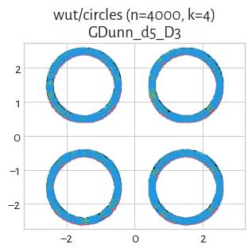

#### mst_divisive_SilhouetteW (NCA=0.01)

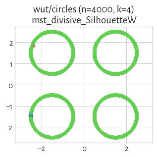

## wut/cross (n=2000, d=2) 

#### Genie_G0.1 (NCA=0.87)

#### Genie_G0.3 (NCA=0.68)

#### WCNN_25 (NCA=0.67)

#### mst_divisive_DuNN_25_Max_Min (NCA=0.59)

#### GIc (NCA=0.57)

#### FCPS_PAM (NCA=0.50)

#### FCPS_Clara (NCA=0.48)

#### IcA (NCA=0.48)

#### sklearn_gm (NCA=0.48)

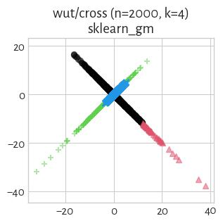

#### mst_divisive_WCNN_25 (NCA=0.46)

#### GDunn_d2_D2 (NCA=0.45)

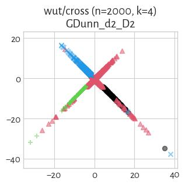

#### FCPS_MinEnergy (NCA=0.44)

#### ITM (NCA=0.44)

#### mst_divisive_GDunn_d2_D1 (NCA=0.43)

#### FCPS_Fanny (NCA=0.43)

#### GDunn_d2_D3 (NCA=0.41)

#### mst_divisive_CalinskiHarabasz (NCA=0.40)

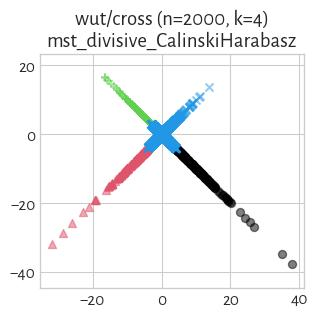

#### FCPS_Hardcl (NCA=0.39)

#### sklearn_kmeans (NCA=0.39)

#### CalinskiHarabasz (NCA=0.39)

#### FCPS_Softcl (NCA=0.39)

#### Genie_G0.5 (NCA=0.38)

#### FCPS_AdaptiveDensityPeak (NCA=0.38)

#### GDunn_d2_D1 (NCA=0.37)

#### mst_divisive_GDunn_d5_D2 (NCA=0.36)

#### mst_divisive_GDunn_d5_D1 (NCA=0.34)

#### fastcluster_complete (NCA=0.32)

#### mst_divisive_GDunn_d2_D3 (NCA=0.32)

#### fastcluster_ward (NCA=0.31)

#### FCPS_Minimax (NCA=0.31)

#### FCPS_Diana (NCA=0.28)

#### DuNN_25_Max_Min (NCA=0.27)

#### sklearn_birch_T0.01_BF50 (NCA=0.26)

#### mst_divisive_GDunn_d2_D2 (NCA=0.23)

#### GDunn_d5_D2 (NCA=0.21)

#### CTCEHC (NCA=0.20)

#### Genie_G0.7 (NCA=0.19)

#### mst_divisive_GDunn_d5_D3 (NCA=0.18)

#### fastcluster_weighted (NCA=0.16)

#### GDunn_d5_D1 (NCA=0.14)

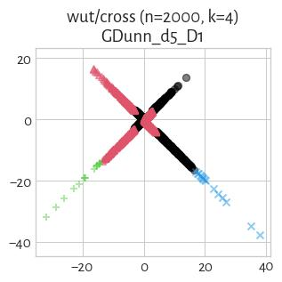

#### DuNN_25_Min_Max (NCA=0.13)

#### DuNN_25_Mean_Mean (NCA=0.09)

#### mst_divisive_DuNN_25_Min_Max (NCA=0.08)

#### fastcluster_median (NCA=0.07)

#### BallHall (NCA=0.06)

#### HEMST (NCA=0.05)

#### GDunn_d4_D1 (NCA=0.05)

#### mst_divisive_DuNN_25_Mean_Mean (NCA=0.04)

#### fastcluster_centroid (NCA=0.03)

#### fastcluster_average (NCA=0.03)

#### GDunn_d3_D2 (NCA=0.02)

#### GDunn_d3_D3 (NCA=0.02)

#### GDunn_d4_D2 (NCA=0.02)

#### GDunn_d4_D3 (NCA=0.02)

#### GDunn_d5_D3 (NCA=0.02)

#### mst_divisive_GDunn_d3_D1 (NCA=0.02)

#### mst_divisive_GDunn_d3_D2 (NCA=0.02)

#### mst_divisive_GDunn_d3_D3 (NCA=0.02)

#### mst_divisive_GDunn_d4_D3 (NCA=0.02)

#### mst_divisive_GDunn_d4_D2 (NCA=0.02)

#### mst_divisive_GDunn_d4_D1 (NCA=0.02)

#### sklearn_spectral_Alaplacian_G5 (NCA=0.01)

#### GDunn_d3_D1 (NCA=0.01)

#### mst_divisive_SilhouetteW (NCA=0.00)

#### mst_divisive_DaviesBouldin (NCA=0.00)

#### Genie_G1.0 (NCA=0.00)

#### DaviesBouldin (NCA=0.00)

#### SilhouetteW (NCA=0.00)

#### mst_divisive_GDunn_d1_D2 (NCA=0.00)

#### mst_divisive_GDunn_d1_D3 (NCA=0.00)

#### GDunn_d1_D3 (NCA=0.00)

#### GDunn_d1_D2 (NCA=0.00)

#### GDunn_d1_D1 (NCA=0.00)

#### FCPS_HDBSCAN_2 (NCA=0.00)

#### mst_divisive_GDunn_d1_D1 (NCA=0.00)

#### mst_divisive_BallHall (NCA=0.00)

#### mst_divisive_Silhouette (NCA=0.00)

#### Silhouette (NCA=0.00)

#### FCPS_HDBSCAN_4 (NCA=0.00)

#### FCPS_HDBSCAN_8 (NCA=0.00)

## wut/graph (n=2500, d=2) 

#### sklearn_gm (NCA=0.93)

#### WCNN_25 (NCA=0.89)

#### IcA (NCA=0.73)

#### Genie_G0.1 (NCA=0.63)

#### FCPS_AdaptiveDensityPeak (NCA=0.63)

#### ITM (NCA=0.63)

#### Silhouette (NCA=0.63)

#### FCPS_MinEnergy (NCA=0.62)

#### fastcluster_ward (NCA=0.62)

#### sklearn_birch_T0.01_BF50 (NCA=0.62)

#### FCPS_PAM (NCA=0.62)

#### FCPS_Clara (NCA=0.61)

#### mst_divisive_CalinskiHarabasz (NCA=0.60)

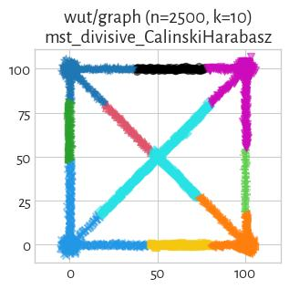

#### FCPS_Hardcl (NCA=0.59)

#### GDunn_d3_D3 (NCA=0.59)

#### sklearn_kmeans (NCA=0.59)

#### CalinskiHarabasz (NCA=0.59)

#### Genie_G0.3 (NCA=0.59)

#### CTCEHC (NCA=0.59)

#### GDunn_d1_D1 (NCA=0.59)

#### fastcluster_centroid (NCA=0.58)

#### GDunn_d4_D1 (NCA=0.58)

#### GDunn_d3_D2 (NCA=0.58)

#### GIc (NCA=0.57)

#### mst_divisive_GDunn_d5_D2 (NCA=0.57)

#### GDunn_d4_D2 (NCA=0.57)

#### GDunn_d3_D1 (NCA=0.56)

#### fastcluster_average (NCA=0.56)

#### GDunn_d2_D3 (NCA=0.56)

#### fastcluster_complete (NCA=0.56)

#### FCPS_Minimax (NCA=0.55)

#### GDunn_d4_D3 (NCA=0.55)

#### GDunn_d2_D2 (NCA=0.55)

#### GDunn_d2_D1 (NCA=0.55)

#### FCPS_Diana (NCA=0.54)

#### fastcluster_median (NCA=0.53)

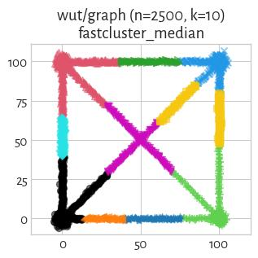

#### FCPS_Softcl (NCA=0.52)

#### fastcluster_weighted (NCA=0.52)

#### mst_divisive_GDunn_d3_D2 (NCA=0.52)

#### mst_divisive_GDunn_d2_D1 (NCA=0.52)

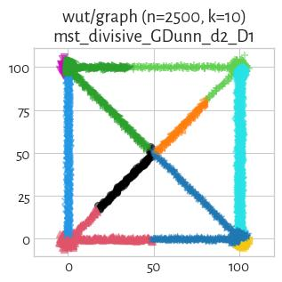

#### mst_divisive_Silhouette (NCA=0.51)

#### mst_divisive_DuNN_25_Max_Min (NCA=0.49)

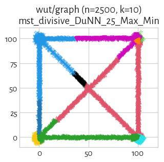

#### DaviesBouldin (NCA=0.48)

#### mst_divisive_GDunn_d3_D3 (NCA=0.48)

#### mst_divisive_GDunn_d3_D1 (NCA=0.48)

#### mst_divisive_GDunn_d5_D1 (NCA=0.48)

#### HEMST (NCA=0.48)

#### mst_divisive_GDunn_d2_D3 (NCA=0.48)

#### BallHall (NCA=0.47)

#### sklearn_spectral_Alaplacian_G5 (NCA=0.47)

#### mst_divisive_GDunn_d5_D3 (NCA=0.47)

#### mst_divisive_GDunn_d4_D2 (NCA=0.47)

#### DuNN_25_Max_Min (NCA=0.46)

#### mst_divisive_GDunn_d2_D2 (NCA=0.46)

#### mst_divisive_BallHall (NCA=0.45)

#### Genie_G0.5 (NCA=0.45)

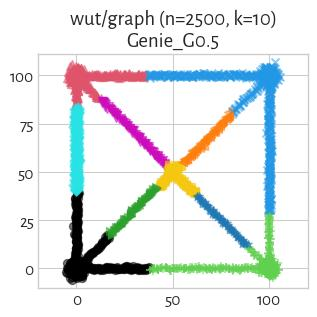

#### GDunn_d1_D2 (NCA=0.45)

#### GDunn_d1_D3 (NCA=0.45)

#### mst_divisive_GDunn_d4_D1 (NCA=0.44)

#### mst_divisive_GDunn_d4_D3 (NCA=0.44)

#### mst_divisive_GDunn_d1_D1 (NCA=0.44)

#### mst_divisive_DaviesBouldin (NCA=0.35)

#### GDunn_d5_D2 (NCA=0.32)

#### mst_divisive_WCNN_25 (NCA=0.30)

#### mst_divisive_GDunn_d1_D2 (NCA=0.24)

#### DuNN_25_Min_Max (NCA=0.23)

#### Genie_G0.7 (NCA=0.23)

#### mst_divisive_GDunn_d1_D3 (NCA=0.19)

#### GDunn_d5_D1 (NCA=0.17)

#### mst_divisive_SilhouetteW (NCA=0.09)

#### mst_divisive_DuNN_25_Min_Max (NCA=0.08)

#### Genie_G1.0 (NCA=0.07)

#### FCPS_HDBSCAN_2 (NCA=0.07)

#### mst_divisive_DuNN_25_Mean_Mean (NCA=0.04)

#### GDunn_d5_D3 (NCA=0.03)

#### DuNN_25_Mean_Mean (NCA=0.02)

#### SilhouetteW (NCA=0.01)

#### FCPS_HDBSCAN_4 (NCA=0.00)

#### FCPS_HDBSCAN_8 (NCA=0.00)

## wut/isolation (n=9000, d=2) 

#### Genie_G0.1 (NCA=1.00)

#### DuNN_25_Min_Max (NCA=1.00)

#### GDunn_d1_D1 (NCA=1.00)

#### GDunn_d1_D2 (NCA=1.00)

#### mst_divisive_DuNN_25_Mean_Mean (NCA=1.00)

#### mst_divisive_DuNN_25_Min_Max (NCA=1.00)

#### mst_divisive_WCNN_25 (NCA=1.00)

#### Genie_G0.3 (NCA=1.00)

#### mst_divisive_GDunn_d1_D3 (NCA=1.00)

#### mst_divisive_GDunn_d1_D2 (NCA=1.00)

#### mst_divisive_GDunn_d1_D1 (NCA=1.00)

#### WCNN_25 (NCA=1.00)

#### GDunn_d1_D3 (NCA=1.00)

#### DuNN_25_Mean_Mean (NCA=1.00)

#### FCPS_HDBSCAN_4 (NCA=1.00)

#### FCPS_HDBSCAN_2 (NCA=1.00)

#### FCPS_HDBSCAN_8 (NCA=1.00)

#### ITM (NCA=1.00)

#### GIc (NCA=1.00)

#### Genie_G1.0 (NCA=1.00)

#### Genie_G0.7 (NCA=1.00)

#### Genie_G0.5 (NCA=1.00)

#### mst_divisive_GDunn_d5_D1 (NCA=0.84)

#### IcA (NCA=0.81)

#### HEMST (NCA=0.65)

#### mst_divisive_DuNN_25_Max_Min (NCA=0.59)

#### mst_divisive_Silhouette (NCA=0.43)

#### mst_divisive_CalinskiHarabasz (NCA=0.42)

#### CTCEHC (NCA=0.41)

#### mst_divisive_GDunn_d2_D2 (NCA=0.26)

#### mst_divisive_GDunn_d5_D2 (NCA=0.26)

#### mst_divisive_GDunn_d2_D1 (NCA=0.26)

#### mst_divisive_GDunn_d5_D3 (NCA=0.25)

#### mst_divisive_GDunn_d2_D3 (NCA=0.25)

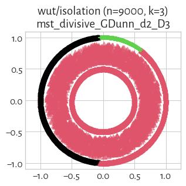

#### DuNN_25_Max_Min (NCA=0.19)

#### mst_divisive_GDunn_d3_D1 (NCA=0.15)

#### mst_divisive_GDunn_d3_D2 (NCA=0.15)

#### mst_divisive_GDunn_d3_D3 (NCA=0.14)

#### mst_divisive_GDunn_d4_D1 (NCA=0.12)

#### mst_divisive_GDunn_d4_D3 (NCA=0.09)

#### mst_divisive_GDunn_d4_D2 (NCA=0.09)

#### sklearn_birch_T0.01_BF50 (NCA=0.06)

#### fastcluster_ward (NCA=0.05)

#### FCPS_Minimax (NCA=0.05)

#### fastcluster_weighted (NCA=0.04)

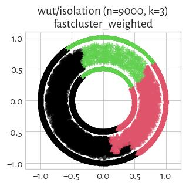

#### fastcluster_median (NCA=0.03)

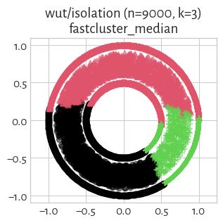

#### fastcluster_average (NCA=0.03)

#### fastcluster_centroid (NCA=0.03)

#### GDunn_d5_D1 (NCA=0.03)

#### FCPS_MinEnergy (NCA=0.02)

#### FCPS_Clara (NCA=0.02)

#### fastcluster_complete (NCA=0.02)

#### GDunn_d5_D2 (NCA=0.02)

#### FCPS_PAM (NCA=0.02)

#### GDunn_d3_D1 (NCA=0.01)

#### FCPS_Hardcl (NCA=0.01)

#### sklearn_spectral_Alaplacian_G5 (NCA=0.01)

#### FCPS_Diana (NCA=0.01)

#### BallHall (NCA=0.01)

#### mst_divisive_BallHall (NCA=0.01)

#### GDunn_d2_D1 (NCA=0.01)

#### Silhouette (NCA=0.01)

#### FCPS_Fanny (NCA=0.01)

#### FCPS_Softcl (NCA=0.01)

#### DaviesBouldin (NCA=0.01)

#### sklearn_gm (NCA=0.01)

#### sklearn_kmeans (NCA=0.01)

#### GDunn_d3_D2 (NCA=0.01)

#### CalinskiHarabasz (NCA=0.01)

#### GDunn_d2_D2 (NCA=0.01)

#### FCPS_AdaptiveDensityPeak (NCA=0.01)

#### GDunn_d4_D1 (NCA=0.01)

#### GDunn_d2_D3 (NCA=0.01)

#### GDunn_d3_D3 (NCA=0.01)

#### GDunn_d4_D2 (NCA=0.01)

#### GDunn_d4_D3 (NCA=0.01)

#### GDunn_d5_D3 (NCA=0.00)

#### SilhouetteW (NCA=0.00)

#### mst_divisive_DaviesBouldin (NCA=0.00)

#### mst_divisive_SilhouetteW (NCA=0.00)

## wut/labirynth (n=3546, d=2) 

#### mst_divisive_WCNN_25 (NCA=1.00)

#### WCNN_25 (NCA=1.00)

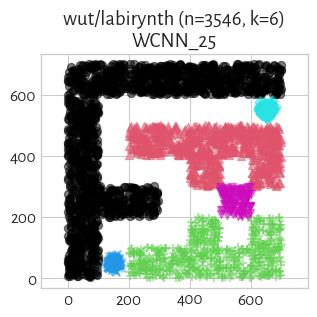

#### mst_divisive_DuNN_25_Mean_Mean (NCA=1.00)

#### Genie_G0.7 (NCA=0.80)

#### mst_divisive_DuNN_25_Min_Max (NCA=0.80)

#### mst_divisive_GDunn_d3_D3 (NCA=0.75)

#### Genie_G0.1 (NCA=0.74)

#### DuNN_25_Min_Max (NCA=0.71)

#### GDunn_d1_D1 (NCA=0.71)

#### GDunn_d1_D2 (NCA=0.71)

#### GDunn_d1_D3 (NCA=0.71)

#### Genie_G0.5 (NCA=0.71)

#### GIc (NCA=0.71)

#### ITM (NCA=0.70)

#### fastcluster_complete (NCA=0.70)

#### mst_divisive_GDunn_d1_D3 (NCA=0.69)

#### IcA (NCA=0.67)

#### fastcluster_median (NCA=0.66)

#### sklearn_gm (NCA=0.66)

#### FCPS_MinEnergy (NCA=0.65)

#### mst_divisive_GDunn_d3_D2 (NCA=0.63)

#### mst_divisive_GDunn_d5_D2 (NCA=0.63)

#### mst_divisive_GDunn_d5_D3 (NCA=0.63)

#### mst_divisive_GDunn_d5_D1 (NCA=0.63)

#### Genie_G0.3 (NCA=0.62)

#### FCPS_HDBSCAN_2 (NCA=0.60)

#### Genie_G1.0 (NCA=0.60)

#### sklearn_birch_T0.01_BF50 (NCA=0.60)

#### GDunn_d2_D2 (NCA=0.59)

#### fastcluster_average (NCA=0.59)

#### GDunn_d2_D1 (NCA=0.58)

#### Silhouette (NCA=0.58)

#### FCPS_Clara (NCA=0.58)

#### mst_divisive_CalinskiHarabasz (NCA=0.58)

#### FCPS_AdaptiveDensityPeak (NCA=0.57)

#### sklearn_spectral_Alaplacian_G5 (NCA=0.57)

#### FCPS_Softcl (NCA=0.56)

#### CalinskiHarabasz (NCA=0.56)

#### sklearn_kmeans (NCA=0.56)

#### FCPS_Fanny (NCA=0.56)

#### fastcluster_ward (NCA=0.55)

#### GDunn_d5_D2 (NCA=0.54)

#### DaviesBouldin (NCA=0.54)

#### FCPS_PAM (NCA=0.54)

#### fastcluster_weighted (NCA=0.54)

#### FCPS_Hardcl (NCA=0.54)

#### mst_divisive_Silhouette (NCA=0.54)

#### GDunn_d4_D3 (NCA=0.52)

#### GDunn_d3_D2 (NCA=0.52)

#### GDunn_d3_D1 (NCA=0.51)

#### mst_divisive_GDunn_d1_D2 (NCA=0.51)

#### GDunn_d2_D3 (NCA=0.51)

#### GDunn_d4_D1 (NCA=0.50)

#### FCPS_Minimax (NCA=0.50)

#### mst_divisive_GDunn_d1_D1 (NCA=0.49)

#### GDunn_d3_D3 (NCA=0.49)

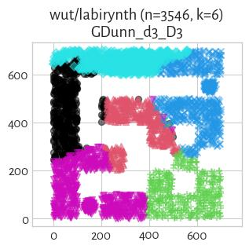

#### FCPS_Diana (NCA=0.49)

#### GDunn_d4_D2 (NCA=0.48)

#### HEMST (NCA=0.48)

#### mst_divisive_GDunn_d2_D1 (NCA=0.48)

#### CTCEHC (NCA=0.47)

#### fastcluster_centroid (NCA=0.46)

#### BallHall (NCA=0.45)

#### DuNN_25_Max_Min (NCA=0.44)

#### mst_divisive_GDunn_d3_D1 (NCA=0.43)

#### mst_divisive_GDunn_d2_D2 (NCA=0.42)

#### mst_divisive_GDunn_d2_D3 (NCA=0.42)

#### FCPS_HDBSCAN_4 (NCA=0.40)

#### mst_divisive_DuNN_25_Max_Min (NCA=0.35)

#### DuNN_25_Mean_Mean (NCA=0.28)

#### mst_divisive_BallHall (NCA=0.23)

#### mst_divisive_GDunn_d4_D3 (NCA=0.20)

#### mst_divisive_GDunn_d4_D2 (NCA=0.20)

#### mst_divisive_GDunn_d4_D1 (NCA=0.20)

#### GDunn_d5_D1 (NCA=0.19)

#### SilhouetteW (NCA=0.17)

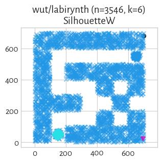

#### GDunn_d5_D3 (NCA=0.03)

#### FCPS_HDBSCAN_8 (NCA=0.00)

#### mst_divisive_DaviesBouldin (NCA=0.00)

#### mst_divisive_SilhouetteW (NCA=0.00)

## wut/mk1 (n=300, d=2) 

#### Genie_G0.1 (NCA=1.00)

#### Genie_G0.3 (NCA=1.00)

#### mst_divisive_DuNN_25_Min_Max (NCA=1.00)

#### mst_divisive_DuNN_25_Mean_Mean (NCA=1.00)

#### mst_divisive_GDunn_d4_D2 (NCA=1.00)

#### mst_divisive_WCNN_25 (NCA=1.00)

#### mst_divisive_GDunn_d3_D1 (NCA=1.00)

#### mst_divisive_GDunn_d3_D2 (NCA=1.00)

#### Silhouette (NCA=1.00)

#### GDunn_d3_D1 (NCA=1.00)

#### GDunn_d3_D2 (NCA=1.00)

#### GDunn_d3_D3 (NCA=1.00)

#### GDunn_d4_D1 (NCA=1.00)

#### GDunn_d4_D2 (NCA=1.00)

#### GDunn_d4_D3 (NCA=1.00)

#### SilhouetteW (NCA=1.00)

#### WCNN_25 (NCA=1.00)

#### mst_divisive_CalinskiHarabasz (NCA=1.00)

#### mst_divisive_Silhouette (NCA=1.00)

#### mst_divisive_GDunn_d1_D2 (NCA=1.00)

#### mst_divisive_GDunn_d1_D3 (NCA=1.00)

#### sklearn_kmeans (NCA=1.00)

#### sklearn_gm (NCA=1.00)

#### sklearn_birch_T0.01_BF50 (NCA=1.00)

#### sklearn_spectral_Alaplacian_G5 (NCA=1.00)

#### GDunn_d1_D2 (NCA=1.00)

#### GDunn_d1_D3 (NCA=1.00)

#### FCPS_MinEnergy (NCA=1.00)

#### BallHall (NCA=1.00)

#### fastcluster_median (NCA=1.00)

#### fastcluster_centroid (NCA=1.00)

#### FCPS_Diana (NCA=1.00)

#### CalinskiHarabasz (NCA=1.00)

#### FCPS_Fanny (NCA=1.00)

#### fastcluster_weighted (NCA=1.00)

#### FCPS_Hardcl (NCA=1.00)

#### FCPS_PAM (NCA=1.00)

#### FCPS_Softcl (NCA=1.00)

#### FCPS_Clara (NCA=1.00)

#### fastcluster_average (NCA=1.00)

#### FCPS_Minimax (NCA=1.00)

#### Genie_G0.7 (NCA=1.00)

#### fastcluster_ward (NCA=1.00)

#### Genie_G0.5 (NCA=1.00)

#### GIc (NCA=1.00)

#### DaviesBouldin (NCA=0.99)

#### mst_divisive_GDunn_d3_D3 (NCA=0.99)

#### mst_divisive_GDunn_d4_D3 (NCA=0.99)

#### FCPS_AdaptiveDensityPeak (NCA=0.99)

#### fastcluster_complete (NCA=0.98)

#### mst_divisive_BallHall (NCA=0.98)

#### DuNN_25_Min_Max (NCA=0.98)

#### mst_divisive_DaviesBouldin (NCA=0.98)

#### mst_divisive_SilhouetteW (NCA=0.98)

#### mst_divisive_GDunn_d4_D1 (NCA=0.98)

#### GDunn_d2_D1 (NCA=0.98)

#### DuNN_25_Mean_Mean (NCA=0.98)

#### GDunn_d2_D2 (NCA=0.98)

#### GDunn_d2_D3 (NCA=0.98)

#### CTCEHC (NCA=0.97)

#### HEMST (NCA=0.93)

#### mst_divisive_GDunn_d2_D2 (NCA=0.92)

#### mst_divisive_GDunn_d2_D3 (NCA=0.92)

#### IcA (NCA=0.88)

#### mst_divisive_DuNN_25_Max_Min (NCA=0.73)

#### mst_divisive_GDunn_d2_D1 (NCA=0.68)

#### ITM (NCA=0.68)

#### GDunn_d1_D1 (NCA=0.49)

#### Genie_G1.0 (NCA=0.49)

#### mst_divisive_GDunn_d1_D1 (NCA=0.49)

#### mst_divisive_GDunn_d5_D1 (NCA=0.49)

#### mst_divisive_GDunn_d5_D2 (NCA=0.49)

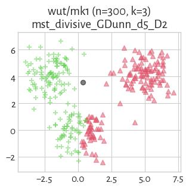

#### mst_divisive_GDunn_d5_D3 (NCA=0.49)

#### FCPS_HDBSCAN_4 (NCA=0.49)

#### FCPS_HDBSCAN_2 (NCA=0.49)

#### GDunn_d5_D2 (NCA=0.24)

#### GDunn_d5_D1 (NCA=0.06)

#### DuNN_25_Max_Min (NCA=0.06)

#### GDunn_d5_D3 (NCA=0.03)

#### FCPS_HDBSCAN_8 (NCA=0.01)

## wut/mk2 (n=1000, d=2) 

#### Genie_G0.1 (NCA=1.00)

#### DuNN_25_Min_Max (NCA=1.00)

#### GDunn_d1_D1 (NCA=1.00)

#### GDunn_d1_D2 (NCA=1.00)

#### Genie_G0.3 (NCA=1.00)

#### mst_divisive_DuNN_25_Mean_Mean (NCA=1.00)

#### mst_divisive_DuNN_25_Min_Max (NCA=1.00)

#### mst_divisive_GDunn_d1_D3 (NCA=1.00)

#### mst_divisive_GDunn_d1_D2 (NCA=1.00)

#### mst_divisive_GDunn_d1_D1 (NCA=1.00)

#### GDunn_d1_D3 (NCA=1.00)

#### FCPS_HDBSCAN_2 (NCA=1.00)

#### ITM (NCA=1.00)

#### GIc (NCA=1.00)

#### FCPS_HDBSCAN_4 (NCA=1.00)

#### Genie_G0.5 (NCA=1.00)

#### Genie_G0.7 (NCA=1.00)

#### Genie_G1.0 (NCA=1.00)

#### IcA (NCA=1.00)

#### DuNN_25_Mean_Mean (NCA=0.99)

#### mst_divisive_DuNN_25_Max_Min (NCA=0.92)

#### mst_divisive_GDunn_d5_D1 (NCA=0.92)

#### CTCEHC (NCA=0.33)

#### mst_divisive_GDunn_d5_D2 (NCA=0.23)

#### mst_divisive_GDunn_d2_D2 (NCA=0.23)

#### mst_divisive_GDunn_d2_D3 (NCA=0.21)

#### mst_divisive_Silhouette (NCA=0.19)

#### mst_divisive_CalinskiHarabasz (NCA=0.19)

#### mst_divisive_GDunn_d5_D3 (NCA=0.16)

#### mst_divisive_GDunn_d3_D2 (NCA=0.13)

#### mst_divisive_GDunn_d3_D3 (NCA=0.13)

#### fastcluster_weighted (NCA=0.13)

#### mst_divisive_GDunn_d3_D1 (NCA=0.11)

#### mst_divisive_GDunn_d2_D1 (NCA=0.10)

#### FCPS_Diana (NCA=0.10)

#### FCPS_PAM (NCA=0.10)

#### GDunn_d2_D3 (NCA=0.09)

#### GDunn_d4_D3 (NCA=0.09)

#### GDunn_d3_D3 (NCA=0.09)

#### fastcluster_complete (NCA=0.09)

#### GDunn_d4_D2 (NCA=0.09)

#### GDunn_d3_D2 (NCA=0.09)

#### GDunn_d2_D2 (NCA=0.09)

#### FCPS_Clara (NCA=0.09)

#### Silhouette (NCA=0.09)

#### sklearn_kmeans (NCA=0.09)

#### CalinskiHarabasz (NCA=0.09)

#### sklearn_gm (NCA=0.09)

#### FCPS_Fanny (NCA=0.09)

#### FCPS_Hardcl (NCA=0.09)

#### GDunn_d5_D1 (NCA=0.09)

#### FCPS_Softcl (NCA=0.08)

#### GDunn_d4_D1 (NCA=0.08)

#### FCPS_MinEnergy (NCA=0.08)

#### FCPS_AdaptiveDensityPeak (NCA=0.08)

#### sklearn_spectral_Alaplacian_G5 (NCA=0.08)

#### FCPS_Minimax (NCA=0.08)

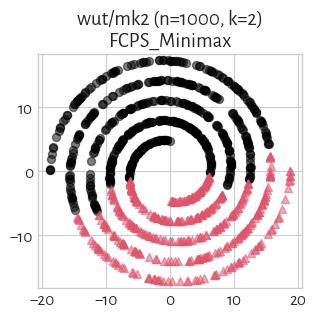

#### fastcluster_centroid (NCA=0.07)

#### fastcluster_average (NCA=0.07)

#### GDunn_d3_D1 (NCA=0.07)

#### mst_divisive_GDunn_d4_D1 (NCA=0.07)

#### GDunn_d5_D3 (NCA=0.07)

#### fastcluster_ward (NCA=0.07)

#### GDunn_d2_D1 (NCA=0.06)

#### fastcluster_median (NCA=0.06)

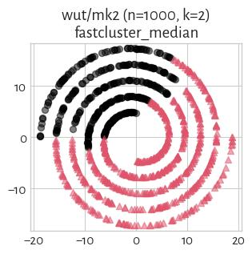

#### sklearn_birch_T0.01_BF50 (NCA=0.06)

#### mst_divisive_WCNN_25 (NCA=0.06)

#### DuNN_25_Max_Min (NCA=0.05)

#### BallHall (NCA=0.03)

#### HEMST (NCA=0.02)

#### GDunn_d5_D2 (NCA=0.02)

#### WCNN_25 (NCA=0.02)

#### mst_divisive_BallHall (NCA=0.01)

#### SilhouetteW (NCA=0.01)

#### mst_divisive_GDunn_d4_D3 (NCA=0.01)

#### mst_divisive_GDunn_d4_D2 (NCA=0.01)

#### mst_divisive_DaviesBouldin (NCA=0.00)

#### mst_divisive_SilhouetteW (NCA=0.00)

#### DaviesBouldin (NCA=0.00)

#### FCPS_HDBSCAN_8 (NCA=0.00)

## wut/mk3 (n=600, d=3) 

#### FCPS_Softcl (NCA=0.94)

#### sklearn_kmeans (NCA=0.94)

#### CalinskiHarabasz (NCA=0.94)

#### sklearn_spectral_Alaplacian_G5 (NCA=0.94)

#### sklearn_gm (NCA=0.94)

#### FCPS_Fanny (NCA=0.94)

#### fastcluster_median (NCA=0.94)

#### FCPS_PAM (NCA=0.94)

#### FCPS_Clara (NCA=0.94)

#### FCPS_AdaptiveDensityPeak (NCA=0.94)

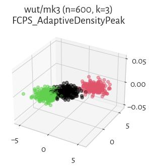

#### BallHall (NCA=0.93)

#### mst_divisive_BallHall (NCA=0.93)

#### GDunn_d2_D2 (NCA=0.93)

#### mst_divisive_GDunn_d3_D1 (NCA=0.93)

#### fastcluster_ward (NCA=0.93)

#### mst_divisive_CalinskiHarabasz (NCA=0.93)

#### FCPS_Hardcl (NCA=0.93)

#### mst_divisive_GDunn_d3_D3 (NCA=0.92)

#### mst_divisive_GDunn_d3_D2 (NCA=0.92)

#### GDunn_d2_D1 (NCA=0.92)

#### sklearn_birch_T0.01_BF50 (NCA=0.92)

#### GDunn_d2_D3 (NCA=0.92)

#### fastcluster_complete (NCA=0.92)

#### CTCEHC (NCA=0.91)

#### fastcluster_weighted (NCA=0.91)

#### FCPS_MinEnergy (NCA=0.91)

#### FCPS_Minimax (NCA=0.90)

#### FCPS_Diana (NCA=0.90)

#### Genie_G0.3 (NCA=0.89)

#### Genie_G0.1 (NCA=0.89)

#### GIc (NCA=0.89)

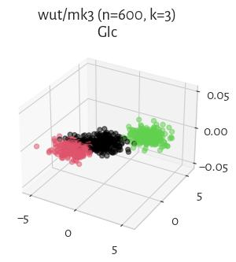

#### GDunn_d3_D2 (NCA=0.88)

#### GDunn_d3_D3 (NCA=0.87)

#### GDunn_d4_D3 (NCA=0.84)

#### mst_divisive_GDunn_d2_D3 (NCA=0.79)

#### mst_divisive_GDunn_d2_D2 (NCA=0.79)

#### GDunn_d4_D1 (NCA=0.78)

#### mst_divisive_GDunn_d2_D1 (NCA=0.77)

#### GDunn_d3_D1 (NCA=0.77)

#### GDunn_d4_D2 (NCA=0.75)

#### ITM (NCA=0.68)

#### mst_divisive_DuNN_25_Max_Min (NCA=0.67)

#### IcA (NCA=0.59)

#### mst_divisive_DuNN_25_Mean_Mean (NCA=0.58)

#### mst_divisive_DuNN_25_Min_Max (NCA=0.58)

#### Genie_G0.5 (NCA=0.58)

#### mst_divisive_WCNN_25 (NCA=0.58)

#### WCNN_25 (NCA=0.56)

#### DuNN_25_Min_Max (NCA=0.56)

#### Genie_G0.7 (NCA=0.53)

#### mst_divisive_DaviesBouldin (NCA=0.50)

#### mst_divisive_GDunn_d5_D3 (NCA=0.50)

#### mst_divisive_GDunn_d5_D2 (NCA=0.50)

#### mst_divisive_SilhouetteW (NCA=0.50)

#### mst_divisive_GDunn_d4_D1 (NCA=0.50)

#### mst_divisive_GDunn_d4_D3 (NCA=0.50)

#### mst_divisive_GDunn_d4_D2 (NCA=0.50)

#### mst_divisive_Silhouette (NCA=0.50)

#### fastcluster_centroid (NCA=0.50)

#### fastcluster_average (NCA=0.50)

#### mst_divisive_GDunn_d5_D1 (NCA=0.50)

#### Silhouette (NCA=0.49)

#### DuNN_25_Mean_Mean (NCA=0.49)

#### DaviesBouldin (NCA=0.45)

#### DuNN_25_Max_Min (NCA=0.22)

#### GDunn_d5_D2 (NCA=0.17)

#### GDunn_d5_D1 (NCA=0.15)

#### GDunn_d5_D3 (NCA=0.04)

#### HEMST (NCA=0.03)

#### SilhouetteW (NCA=0.01)

#### GDunn_d1_D3 (NCA=0.00)

#### GDunn_d1_D2 (NCA=0.00)

#### Genie_G1.0 (NCA=0.00)

#### FCPS_HDBSCAN_4 (NCA=0.00)

#### GDunn_d1_D1 (NCA=0.00)

#### FCPS_HDBSCAN_2 (NCA=0.00)

#### FCPS_HDBSCAN_8 (NCA=0.00)

#### mst_divisive_GDunn_d1_D1 (NCA=0.00)

#### mst_divisive_GDunn_d1_D2 (NCA=0.00)

#### mst_divisive_GDunn_d1_D3 (NCA=0.00)

## wut/mk4 (n=1500, d=3) 

#### Genie_G0.1 (NCA=1.00)

#### DuNN_25_Min_Max (NCA=1.00)

#### mst_divisive_GDunn_d1_D2 (NCA=1.00)

#### mst_divisive_GDunn_d1_D3 (NCA=1.00)

#### mst_divisive_DuNN_25_Min_Max (NCA=1.00)

#### Genie_G0.3 (NCA=1.00)

#### GDunn_d1_D1 (NCA=1.00)

#### GDunn_d1_D3 (NCA=1.00)

#### GDunn_d1_D2 (NCA=1.00)

#### FCPS_HDBSCAN_4 (NCA=1.00)

#### Genie_G0.5 (NCA=1.00)

#### Genie_G0.7 (NCA=1.00)

#### Genie_G1.0 (NCA=1.00)

#### GIc (NCA=1.00)

#### mst_divisive_GDunn_d1_D1 (NCA=1.00)

#### FCPS_HDBSCAN_2 (NCA=1.00)

#### IcA (NCA=0.82)

#### ITM (NCA=0.74)

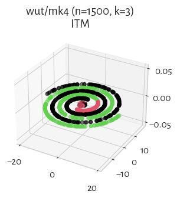

#### CTCEHC (NCA=0.57)

#### FCPS_MinEnergy (NCA=0.55)

#### sklearn_gm (NCA=0.55)

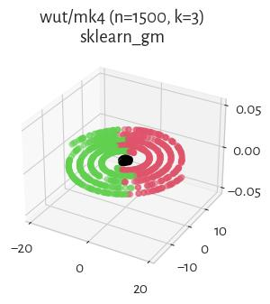

#### sklearn_spectral_Alaplacian_G5 (NCA=0.44)

#### fastcluster_complete (NCA=0.42)

#### HEMST (NCA=0.39)

#### FCPS_Hardcl (NCA=0.38)

#### sklearn_kmeans (NCA=0.37)

#### mst_divisive_DuNN_25_Mean_Mean (NCA=0.37)

#### CalinskiHarabasz (NCA=0.37)

#### mst_divisive_GDunn_d5_D1 (NCA=0.37)

#### FCPS_Softcl (NCA=0.37)

#### fastcluster_ward (NCA=0.36)

#### FCPS_Diana (NCA=0.34)

#### GDunn_d2_D1 (NCA=0.34)

#### DuNN_25_Mean_Mean (NCA=0.34)

#### FCPS_PAM (NCA=0.33)

#### FCPS_Clara (NCA=0.33)

#### sklearn_birch_T0.01_BF50 (NCA=0.31)

#### Silhouette (NCA=0.31)

#### mst_divisive_DuNN_25_Max_Min (NCA=0.30)

#### fastcluster_weighted (NCA=0.28)

#### mst_divisive_Silhouette (NCA=0.27)

#### GDunn_d2_D2 (NCA=0.27)

#### fastcluster_median (NCA=0.26)

#### FCPS_Minimax (NCA=0.26)

#### GDunn_d4_D2 (NCA=0.25)

#### GDunn_d2_D3 (NCA=0.25)

#### GDunn_d3_D2 (NCA=0.25)

#### fastcluster_centroid (NCA=0.21)

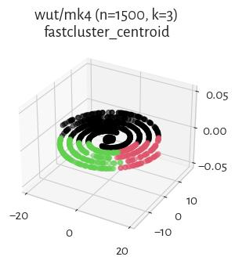

#### FCPS_AdaptiveDensityPeak (NCA=0.20)

#### mst_divisive_GDunn_d2_D1 (NCA=0.18)

#### mst_divisive_CalinskiHarabasz (NCA=0.18)

#### fastcluster_average (NCA=0.18)

#### GDunn_d3_D1 (NCA=0.17)

#### GDunn_d4_D1 (NCA=0.17)

#### GDunn_d3_D3 (NCA=0.16)

#### mst_divisive_GDunn_d3_D1 (NCA=0.15)

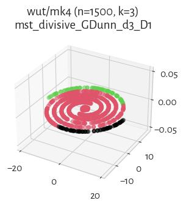

#### mst_divisive_GDunn_d2_D2 (NCA=0.14)

#### GDunn_d4_D3 (NCA=0.13)

#### GDunn_d5_D2 (NCA=0.12)

#### mst_divisive_GDunn_d2_D3 (NCA=0.12)

#### mst_divisive_GDunn_d5_D2 (NCA=0.08)

#### mst_divisive_GDunn_d3_D2 (NCA=0.08)

#### mst_divisive_GDunn_d3_D3 (NCA=0.08)

#### mst_divisive_GDunn_d5_D3 (NCA=0.07)

#### WCNN_25 (NCA=0.05)

#### GDunn_d5_D1 (NCA=0.05)

#### mst_divisive_GDunn_d4_D1 (NCA=0.03)

#### mst_divisive_WCNN_25 (NCA=0.03)

#### GDunn_d5_D3 (NCA=0.03)

#### mst_divisive_GDunn_d4_D3 (NCA=0.03)

#### mst_divisive_GDunn_d4_D2 (NCA=0.03)

#### BallHall (NCA=0.02)

#### DuNN_25_Max_Min (NCA=0.02)

#### mst_divisive_BallHall (NCA=0.01)

#### mst_divisive_SilhouetteW (NCA=0.01)

#### mst_divisive_DaviesBouldin (NCA=0.00)

#### SilhouetteW (NCA=0.00)

#### DaviesBouldin (NCA=0.00)

#### FCPS_HDBSCAN_8 (NCA=0.00)

## wut/olympic (n=5000, d=2) 

#### GDunn_d5_D2 (NCA=0.97)

#### GDunn_d5_D1 (NCA=0.82)

#### mst_divisive_CalinskiHarabasz (NCA=0.40)

#### IcA (NCA=0.38)

#### mst_divisive_GDunn_d5_D1 (NCA=0.37)

#### mst_divisive_GDunn_d3_D2 (NCA=0.36)

#### ITM (NCA=0.36)

#### mst_divisive_GDunn_d3_D1 (NCA=0.35)

#### GDunn_d4_D3 (NCA=0.35)

#### mst_divisive_GDunn_d5_D3 (NCA=0.34)

#### mst_divisive_GDunn_d5_D2 (NCA=0.34)

#### GDunn_d4_D1 (NCA=0.34)

#### GDunn_d3_D1 (NCA=0.34)

#### mst_divisive_GDunn_d3_D3 (NCA=0.33)

#### GDunn_d3_D3 (NCA=0.33)

#### CTCEHC (NCA=0.32)

#### Genie_G0.1 (NCA=0.32)

#### mst_divisive_GDunn_d2_D1 (NCA=0.31)

#### GDunn_d4_D2 (NCA=0.31)

#### fastcluster_centroid (NCA=0.31)

#### mst_divisive_Silhouette (NCA=0.30)

#### FCPS_Minimax (NCA=0.30)

#### GDunn_d3_D2 (NCA=0.30)

#### Genie_G0.3 (NCA=0.29)

#### mst_divisive_GDunn_d2_D2 (NCA=0.27)

#### mst_divisive_GDunn_d2_D3 (NCA=0.27)

#### fastcluster_average (NCA=0.27)

#### FCPS_Clara (NCA=0.27)

#### mst_divisive_DuNN_25_Max_Min (NCA=0.26)

#### FCPS_PAM (NCA=0.26)

#### FCPS_AdaptiveDensityPeak (NCA=0.26)

#### fastcluster_median (NCA=0.26)

#### Silhouette (NCA=0.25)

#### fastcluster_weighted (NCA=0.25)

#### sklearn_spectral_Alaplacian_G5 (NCA=0.25)

#### Genie_G0.5 (NCA=0.25)

#### GDunn_d2_D3 (NCA=0.24)

#### DaviesBouldin (NCA=0.24)

#### FCPS_MinEnergy (NCA=0.24)

#### sklearn_birch_T0.01_BF50 (NCA=0.24)

#### GDunn_d2_D1 (NCA=0.23)

#### GIc (NCA=0.23)

#### Genie_G0.7 (NCA=0.23)

#### DuNN_25_Min_Max (NCA=0.23)

#### FCPS_Hardcl (NCA=0.23)

#### HEMST (NCA=0.22)

#### sklearn_kmeans (NCA=0.22)

#### FCPS_Softcl (NCA=0.22)

#### CalinskiHarabasz (NCA=0.22)

#### fastcluster_complete (NCA=0.21)

#### FCPS_Diana (NCA=0.21)

#### fastcluster_ward (NCA=0.21)

#### GDunn_d2_D2 (NCA=0.21)

#### sklearn_gm (NCA=0.20)

#### FCPS_Fanny (NCA=0.16)

#### mst_divisive_DuNN_25_Min_Max (NCA=0.15)

#### mst_divisive_DuNN_25_Mean_Mean (NCA=0.15)

#### DuNN_25_Max_Min (NCA=0.14)

#### WCNN_25 (NCA=0.09)

#### BallHall (NCA=0.07)

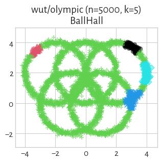

#### mst_divisive_WCNN_25 (NCA=0.06)

#### DuNN_25_Mean_Mean (NCA=0.02)

#### mst_divisive_BallHall (NCA=0.01)

#### GDunn_d5_D3 (NCA=0.01)

#### SilhouetteW (NCA=0.00)

#### mst_divisive_GDunn_d4_D2 (NCA=0.00)

#### mst_divisive_GDunn_d4_D1 (NCA=0.00)

#### mst_divisive_GDunn_d4_D3 (NCA=0.00)

#### FCPS_HDBSCAN_2 (NCA=0.00)

#### FCPS_HDBSCAN_4 (NCA=0.00)

#### FCPS_HDBSCAN_8 (NCA=0.00)

#### mst_divisive_GDunn_d1_D1 (NCA=0.00)

#### GDunn_d1_D1 (NCA=0.00)

#### GDunn_d1_D2 (NCA=0.00)

#### GDunn_d1_D3 (NCA=0.00)

#### Genie_G1.0 (NCA=0.00)

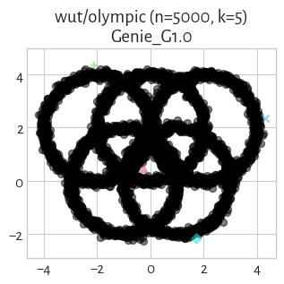

#### mst_divisive_GDunn_d1_D2 (NCA=0.00)

#### mst_divisive_GDunn_d1_D3 (NCA=0.00)

#### mst_divisive_SilhouetteW (NCA=0.00)

#### mst_divisive_DaviesBouldin (NCA=0.00)

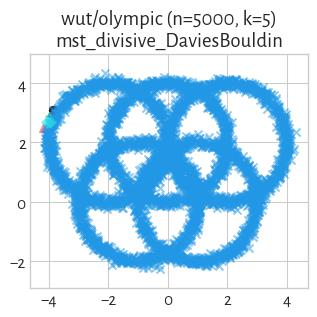

## wut/smile (n=1000, d=2) 

#### mst_divisive_DuNN_25_Min_Max (NCA=1.00)

#### WCNN_25 (NCA=1.00)

#### GDunn_d1_D3 (NCA=1.00)

#### GDunn_d1_D2 (NCA=1.00)

#### GDunn_d1_D1 (NCA=1.00)

#### mst_divisive_GDunn_d1_D2 (NCA=1.00)

#### DuNN_25_Min_Max (NCA=1.00)

#### mst_divisive_GDunn_d1_D1 (NCA=1.00)

#### mst_divisive_GDunn_d1_D3 (NCA=1.00)

#### mst_divisive_WCNN_25 (NCA=1.00)

#### mst_divisive_DuNN_25_Mean_Mean (NCA=1.00)

#### Genie_G0.3 (NCA=1.00)

#### sklearn_spectral_Alaplacian_G5 (NCA=1.00)

#### HEMST (NCA=1.00)

#### FCPS_HDBSCAN_2 (NCA=1.00)

#### FCPS_HDBSCAN_4 (NCA=1.00)

#### BallHall (NCA=1.00)

#### Genie_G1.0 (NCA=1.00)

#### Genie_G0.7 (NCA=1.00)

#### Genie_G0.5 (NCA=1.00)

#### FCPS_HDBSCAN_8 (NCA=1.00)

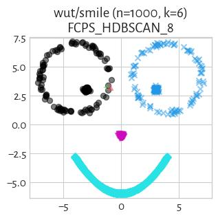

#### fastcluster_average (NCA=0.99)

#### fastcluster_centroid (NCA=0.99)

#### GDunn_d2_D2 (NCA=0.91)

#### CTCEHC (NCA=0.91)

#### fastcluster_ward (NCA=0.88)

#### FCPS_MinEnergy (NCA=0.88)

#### FCPS_Diana (NCA=0.88)

#### sklearn_birch_T0.01_BF50 (NCA=0.88)

#### CalinskiHarabasz (NCA=0.86)

#### FCPS_Softcl (NCA=0.86)

#### sklearn_kmeans (NCA=0.86)

#### FCPS_Clara (NCA=0.85)

#### fastcluster_median (NCA=0.84)

#### mst_divisive_GDunn_d3_D3 (NCA=0.83)

#### FCPS_PAM (NCA=0.82)

#### IcA (NCA=0.82)

#### mst_divisive_GDunn_d2_D3 (NCA=0.75)

#### DuNN_25_Mean_Mean (NCA=0.75)

#### mst_divisive_GDunn_d2_D2 (NCA=0.74)

#### GDunn_d4_D2 (NCA=0.73)

#### GDunn_d3_D1 (NCA=0.73)

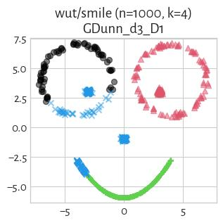

#### GIc (NCA=0.73)

#### GDunn_d4_D1 (NCA=0.73)

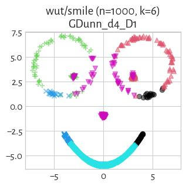

#### GDunn_d3_D2 (NCA=0.73)

#### mst_divisive_DuNN_25_Max_Min (NCA=0.72)

#### GDunn_d3_D3 (NCA=0.70)

#### GDunn_d2_D1 (NCA=0.70)

#### ITM (NCA=0.70)

#### fastcluster_weighted (NCA=0.70)

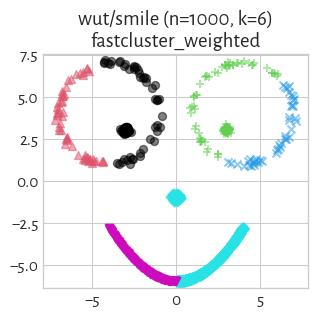

#### mst_divisive_GDunn_d5_D2 (NCA=0.69)

#### mst_divisive_GDunn_d5_D1 (NCA=0.69)

#### mst_divisive_GDunn_d5_D3 (NCA=0.69)

#### GDunn_d2_D3 (NCA=0.67)

#### FCPS_Fanny (NCA=0.67)

#### Silhouette (NCA=0.66)

#### mst_divisive_GDunn_d2_D1 (NCA=0.64)

#### mst_divisive_GDunn_d3_D2 (NCA=0.63)

#### fastcluster_complete (NCA=0.63)

#### mst_divisive_CalinskiHarabasz (NCA=0.62)

#### FCPS_AdaptiveDensityPeak (NCA=0.60)

#### DuNN_25_Max_Min (NCA=0.60)

#### GDunn_d4_D3 (NCA=0.58)

#### mst_divisive_GDunn_d3_D1 (NCA=0.57)

#### DaviesBouldin (NCA=0.55)

#### Genie_G0.1 (NCA=0.55)

#### mst_divisive_BallHall (NCA=0.54)

#### GDunn_d5_D2 (NCA=0.54)

#### FCPS_Minimax (NCA=0.52)

#### mst_divisive_Silhouette (NCA=0.52)

#### FCPS_Hardcl (NCA=0.50)

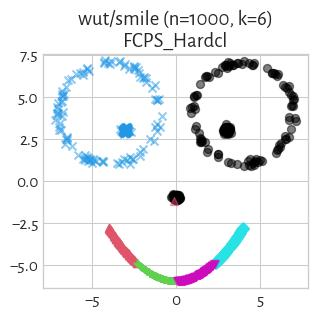

#### sklearn_gm (NCA=0.50)

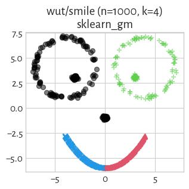

#### mst_divisive_GDunn_d4_D3 (NCA=0.46)

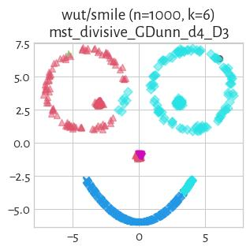

#### mst_divisive_SilhouetteW (NCA=0.41)

#### SilhouetteW (NCA=0.41)

#### mst_divisive_GDunn_d4_D2 (NCA=0.39)

#### mst_divisive_GDunn_d4_D1 (NCA=0.39)

#### GDunn_d5_D1 (NCA=0.34)

#### mst_divisive_DaviesBouldin (NCA=0.06)

#### GDunn_d5_D3 (NCA=0.05)

## wut/stripes (n=5000, d=2) 

#### Genie_G0.1 (NCA=1.00)

#### WCNN_25 (NCA=1.00)

#### mst_divisive_DuNN_25_Max_Min (NCA=1.00)

#### Genie_G0.3 (NCA=1.00)

#### mst_divisive_DuNN_25_Mean_Mean (NCA=1.00)

#### mst_divisive_DuNN_25_Min_Max (NCA=1.00)

#### mst_divisive_WCNN_25 (NCA=1.00)

#### mst_divisive_GDunn_d1_D3 (NCA=1.00)

#### mst_divisive_GDunn_d1_D2 (NCA=1.00)

#### mst_divisive_GDunn_d1_D1 (NCA=1.00)

#### DuNN_25_Mean_Mean (NCA=1.00)

#### GDunn_d1_D3 (NCA=1.00)

#### GDunn_d1_D2 (NCA=1.00)

#### GDunn_d1_D1 (NCA=1.00)

#### DuNN_25_Min_Max (NCA=1.00)

#### FCPS_HDBSCAN_8 (NCA=1.00)

#### FCPS_HDBSCAN_4 (NCA=1.00)

#### FCPS_HDBSCAN_2 (NCA=1.00)

#### ITM (NCA=1.00)

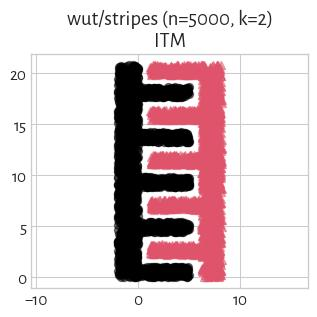

#### GIc (NCA=1.00)

#### DuNN_25_Max_Min (NCA=1.00)

#### Genie_G0.5 (NCA=1.00)

#### Genie_G0.7 (NCA=1.00)

#### Genie_G1.0 (NCA=1.00)

#### IcA (NCA=0.97)

#### mst_divisive_GDunn_d2_D1 (NCA=0.96)

#### mst_divisive_GDunn_d2_D2 (NCA=0.96)

#### mst_divisive_GDunn_d5_D2 (NCA=0.92)

#### FCPS_AdaptiveDensityPeak (NCA=0.66)

#### CTCEHC (NCA=0.61)

#### mst_divisive_CalinskiHarabasz (NCA=0.42)

#### mst_divisive_GDunn_d2_D3 (NCA=0.41)

#### mst_divisive_Silhouette (NCA=0.41)

#### FCPS_MinEnergy (NCA=0.19)

#### fastcluster_centroid (NCA=0.16)

#### HEMST (NCA=0.16)

#### FCPS_Minimax (NCA=0.12)

#### GDunn_d5_D2 (NCA=0.12)

#### fastcluster_ward (NCA=0.12)

#### fastcluster_complete (NCA=0.11)

#### sklearn_spectral_Alaplacian_G5 (NCA=0.11)

#### FCPS_PAM (NCA=0.11)

#### GDunn_d3_D3 (NCA=0.11)

#### GDunn_d2_D3 (NCA=0.11)

#### GDunn_d4_D2 (NCA=0.11)

#### Silhouette (NCA=0.11)

#### sklearn_gm (NCA=0.11)

#### GDunn_d3_D1 (NCA=0.11)

#### GDunn_d2_D2 (NCA=0.11)

#### FCPS_Diana (NCA=0.11)

#### FCPS_Softcl (NCA=0.11)

#### FCPS_Fanny (NCA=0.11)

#### GDunn_d4_D1 (NCA=0.11)

#### BallHall (NCA=0.11)

#### sklearn_kmeans (NCA=0.11)

#### GDunn_d3_D2 (NCA=0.11)

#### FCPS_Hardcl (NCA=0.11)

#### CalinskiHarabasz (NCA=0.11)

#### FCPS_Clara (NCA=0.11)

#### GDunn_d4_D3 (NCA=0.10)

#### mst_divisive_BallHall (NCA=0.10)

#### fastcluster_median (NCA=0.08)

#### GDunn_d5_D1 (NCA=0.08)

#### fastcluster_weighted (NCA=0.06)

#### fastcluster_average (NCA=0.05)

#### sklearn_birch_T0.01_BF50 (NCA=0.04)

#### GDunn_d2_D1 (NCA=0.01)

#### GDunn_d5_D3 (NCA=0.00)

#### mst_divisive_DaviesBouldin (NCA=0.00)

#### mst_divisive_SilhouetteW (NCA=0.00)

#### SilhouetteW (NCA=0.00)

#### DaviesBouldin (NCA=0.00)

#### mst_divisive_GDunn_d3_D1 (NCA=0.00)

#### mst_divisive_GDunn_d3_D2 (NCA=0.00)

#### mst_divisive_GDunn_d3_D3 (NCA=0.00)

#### mst_divisive_GDunn_d4_D3 (NCA=0.00)

#### mst_divisive_GDunn_d5_D1 (NCA=0.00)

#### mst_divisive_GDunn_d4_D2 (NCA=0.00)

#### mst_divisive_GDunn_d4_D1 (NCA=0.00)

#### mst_divisive_GDunn_d5_D3 (NCA=0.00)

## wut/trajectories (n=10000, d=2) 

#### Genie_G0.1 (NCA=1.00)

#### GDunn_d1_D2 (NCA=1.00)

#### mst_divisive_WCNN_25 (NCA=1.00)

#### mst_divisive_GDunn_d1_D3 (NCA=1.00)

#### mst_divisive_GDunn_d1_D2 (NCA=1.00)

#### mst_divisive_GDunn_d1_D1 (NCA=1.00)

#### Genie_G0.3 (NCA=1.00)

#### WCNN_25 (NCA=1.00)

#### Silhouette (NCA=1.00)

#### GDunn_d1_D3 (NCA=1.00)

#### GDunn_d1_D1 (NCA=1.00)

#### DuNN_25_Min_Max (NCA=1.00)

#### DuNN_25_Mean_Mean (NCA=1.00)

#### mst_divisive_DuNN_25_Min_Max (NCA=1.00)

#### mst_divisive_DuNN_25_Mean_Mean (NCA=1.00)

#### sklearn_birch_T0.01_BF50 (NCA=1.00)

#### mst_divisive_DuNN_25_Max_Min (NCA=1.00)

#### DuNN_25_Max_Min (NCA=1.00)

#### FCPS_Diana (NCA=1.00)

#### FCPS_HDBSCAN_8 (NCA=1.00)

#### FCPS_HDBSCAN_2 (NCA=1.00)

#### FCPS_HDBSCAN_4 (NCA=1.00)

#### FCPS_MinEnergy (NCA=1.00)

#### FCPS_Minimax (NCA=1.00)

#### FCPS_AdaptiveDensityPeak (NCA=1.00)

#### fastcluster_ward (NCA=1.00)

#### fastcluster_centroid (NCA=1.00)

#### fastcluster_average (NCA=1.00)

#### FCPS_Clara (NCA=1.00)

#### ITM (NCA=1.00)

#### GIc (NCA=1.00)

#### Genie_G1.0 (NCA=1.00)

#### Genie_G0.7 (NCA=1.00)

#### Genie_G0.5 (NCA=1.00)

#### FCPS_Softcl (NCA=1.00)

#### fastcluster_weighted (NCA=1.00)

#### FCPS_PAM (NCA=1.00)

#### CalinskiHarabasz (NCA=1.00)

#### mst_divisive_BallHall (NCA=1.00)

#### mst_divisive_CalinskiHarabasz (NCA=1.00)

#### BallHall (NCA=1.00)

#### mst_divisive_Silhouette (NCA=1.00)

#### mst_divisive_GDunn_d4_D1 (NCA=1.00)

#### sklearn_kmeans (NCA=1.00)

#### DaviesBouldin (NCA=1.00)

#### sklearn_gm (NCA=1.00)

#### FCPS_Fanny (NCA=1.00)

#### sklearn_spectral_Alaplacian_G5 (NCA=1.00)

#### mst_divisive_GDunn_d3_D3 (NCA=0.96)

#### mst_divisive_GDunn_d3_D2 (NCA=0.96)

#### mst_divisive_GDunn_d4_D2 (NCA=0.96)

#### mst_divisive_GDunn_d4_D3 (NCA=0.96)

#### GDunn_d2_D2 (NCA=0.92)

#### GDunn_d3_D2 (NCA=0.89)

#### GDunn_d2_D3 (NCA=0.89)

#### GDunn_d3_D3 (NCA=0.88)

#### GDunn_d3_D1 (NCA=0.87)

#### GDunn_d4_D1 (NCA=0.87)

#### GDunn_d4_D3 (NCA=0.86)

#### GDunn_d4_D2 (NCA=0.86)

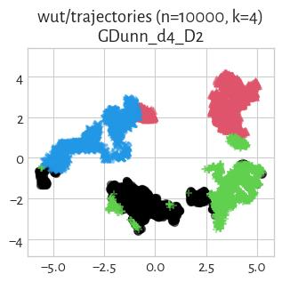

#### IcA (NCA=0.75)

#### fastcluster_complete (NCA=0.74)

#### mst_divisive_GDunn_d5_D1 (NCA=0.71)

#### GDunn_d2_D1 (NCA=0.68)

#### mst_divisive_GDunn_d3_D1 (NCA=0.67)

#### SilhouetteW (NCA=0.65)

#### mst_divisive_GDunn_d5_D3 (NCA=0.61)

#### mst_divisive_GDunn_d5_D2 (NCA=0.61)

#### fastcluster_median (NCA=0.57)

#### mst_divisive_GDunn_d2_D1 (NCA=0.54)

#### FCPS_Hardcl (NCA=0.53)

#### GDunn_d5_D3 (NCA=0.37)

#### mst_divisive_GDunn_d2_D3 (NCA=0.37)

#### mst_divisive_GDunn_d2_D2 (NCA=0.37)

#### GDunn_d5_D2 (NCA=0.33)

#### GDunn_d5_D1 (NCA=0.33)

#### mst_divisive_SilhouetteW (NCA=0.00)

#### mst_divisive_DaviesBouldin (NCA=0.00)

## wut/trapped_lovers (n=5000, d=3) 

#### GDunn_d1_D1 (NCA=1.00)

#### GDunn_d1_D3 (NCA=1.00)

#### GDunn_d1_D2 (NCA=1.00)

#### DuNN_25_Max_Min (NCA=1.00)

#### DuNN_25_Min_Max (NCA=1.00)

#### DuNN_25_Mean_Mean (NCA=1.00)

#### Genie_G0.3 (NCA=1.00)

#### mst_divisive_WCNN_25 (NCA=1.00)

#### mst_divisive_DuNN_25_Mean_Mean (NCA=1.00)

#### mst_divisive_DuNN_25_Max_Min (NCA=1.00)

#### mst_divisive_GDunn_d1_D3 (NCA=1.00)

#### mst_divisive_GDunn_d1_D2 (NCA=1.00)

#### mst_divisive_GDunn_d1_D1 (NCA=1.00)

#### WCNN_25 (NCA=1.00)

#### FCPS_HDBSCAN_2 (NCA=1.00)

#### Genie_G1.0 (NCA=1.00)

#### Genie_G0.7 (NCA=1.00)

#### Genie_G0.5 (NCA=1.00)

#### FCPS_HDBSCAN_4 (NCA=1.00)

#### FCPS_HDBSCAN_8 (NCA=1.00)

#### mst_divisive_DuNN_25_Min_Max (NCA=1.00)

#### sklearn_spectral_Alaplacian_G5 (NCA=0.92)

#### Genie_G0.1 (NCA=0.76)

#### GIc (NCA=0.76)

#### ITM (NCA=0.76)

#### fastcluster_complete (NCA=0.72)

#### mst_divisive_GDunn_d2_D1 (NCA=0.70)

#### FCPS_Fanny (NCA=0.68)

#### IcA (NCA=0.67)

#### CTCEHC (NCA=0.66)

#### GDunn_d3_D1 (NCA=0.66)

#### FCPS_MinEnergy (NCA=0.65)

#### fastcluster_median (NCA=0.65)

#### fastcluster_ward (NCA=0.65)

#### Silhouette (NCA=0.64)

#### sklearn_birch_T0.01_BF50 (NCA=0.64)

#### FCPS_Hardcl (NCA=0.64)

#### CalinskiHarabasz (NCA=0.64)

#### sklearn_kmeans (NCA=0.64)

#### FCPS_Softcl (NCA=0.64)

#### mst_divisive_Silhouette (NCA=0.63)

#### mst_divisive_CalinskiHarabasz (NCA=0.63)

#### fastcluster_weighted (NCA=0.62)

#### FCPS_AdaptiveDensityPeak (NCA=0.61)

#### sklearn_gm (NCA=0.61)

#### FCPS_PAM (NCA=0.61)

#### FCPS_Clara (NCA=0.61)

#### GDunn_d4_D2 (NCA=0.61)

#### GDunn_d2_D2 (NCA=0.61)

#### HEMST (NCA=0.60)

#### GDunn_d3_D2 (NCA=0.60)

#### GDunn_d2_D1 (NCA=0.59)

#### GDunn_d4_D3 (NCA=0.59)

#### GDunn_d2_D3 (NCA=0.59)

#### fastcluster_average (NCA=0.58)

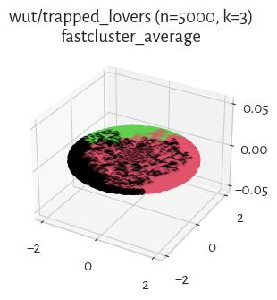

#### GDunn_d3_D3 (NCA=0.58)

#### mst_divisive_GDunn_d4_D3 (NCA=0.58)

#### GDunn_d4_D1 (NCA=0.58)

#### mst_divisive_GDunn_d2_D3 (NCA=0.58)

#### mst_divisive_GDunn_d2_D2 (NCA=0.57)

#### fastcluster_centroid (NCA=0.57)

#### FCPS_Minimax (NCA=0.57)

#### mst_divisive_GDunn_d3_D2 (NCA=0.53)

#### mst_divisive_GDunn_d3_D3 (NCA=0.51)

#### DaviesBouldin (NCA=0.50)

#### mst_divisive_GDunn_d5_D3 (NCA=0.50)

#### GDunn_d5_D2 (NCA=0.44)

#### GDunn_d5_D1 (NCA=0.23)

#### FCPS_Diana (NCA=0.20)

#### mst_divisive_GDunn_d5_D1 (NCA=0.15)

#### mst_divisive_GDunn_d5_D2 (NCA=0.14)

#### mst_divisive_GDunn_d3_D1 (NCA=0.08)

#### GDunn_d5_D3 (NCA=0.01)

#### mst_divisive_GDunn_d4_D2 (NCA=0.00)

#### SilhouetteW (NCA=0.00)

#### mst_divisive_BallHall (NCA=0.00)

#### mst_divisive_DaviesBouldin (NCA=0.00)

#### mst_divisive_SilhouetteW (NCA=0.00)

#### mst_divisive_GDunn_d4_D1 (NCA=0.00)

#### BallHall (NCA=0.00)

## wut/twosplashes (n=400, d=2) 

#### ITM (NCA=0.85)

#### IcA (NCA=0.85)

#### sklearn_gm (NCA=0.82)

#### DuNN_25_Min_Max (NCA=0.78)

#### mst_divisive_DuNN_25_Min_Max (NCA=0.71)

#### Genie_G0.3 (NCA=0.71)

#### mst_divisive_GDunn_d5_D3 (NCA=0.71)

#### Genie_G0.1 (NCA=0.71)

#### Genie_G0.5 (NCA=0.71)

#### GIc (NCA=0.71)

#### mst_divisive_GDunn_d2_D3 (NCA=0.67)

#### mst_divisive_GDunn_d2_D2 (NCA=0.65)

#### HEMST (NCA=0.63)

#### CTCEHC (NCA=0.62)

#### mst_divisive_CalinskiHarabasz (NCA=0.60)

#### mst_divisive_BallHall (NCA=0.55)

#### FCPS_Diana (NCA=0.53)

#### sklearn_spectral_Alaplacian_G5 (NCA=0.53)

#### CalinskiHarabasz (NCA=0.53)

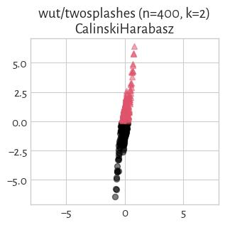

#### BallHall (NCA=0.53)

#### FCPS_Minimax (NCA=0.53)

#### FCPS_PAM (NCA=0.53)

#### FCPS_Clara (NCA=0.53)

#### FCPS_Softcl (NCA=0.53)

#### FCPS_Hardcl (NCA=0.53)

#### FCPS_Fanny (NCA=0.53)

#### GDunn_d2_D3 (NCA=0.53)

#### GDunn_d2_D2 (NCA=0.53)

#### GDunn_d2_D1 (NCA=0.53)

#### sklearn_kmeans (NCA=0.53)

#### sklearn_birch_T0.01_BF50 (NCA=0.53)

#### fastcluster_complete (NCA=0.47)

#### FCPS_MinEnergy (NCA=0.46)

#### DuNN_25_Max_Min (NCA=0.46)

#### fastcluster_ward (NCA=0.44)

#### fastcluster_weighted (NCA=0.44)

#### mst_divisive_GDunn_d2_D1 (NCA=0.40)

#### FCPS_AdaptiveDensityPeak (NCA=0.39)

#### mst_divisive_DuNN_25_Max_Min (NCA=0.30)

#### WCNN_25 (NCA=0.29)

#### mst_divisive_WCNN_25 (NCA=0.29)

#### fastcluster_median (NCA=0.29)

#### GDunn_d5_D1 (NCA=0.27)

#### GDunn_d5_D2 (NCA=0.21)

#### mst_divisive_GDunn_d5_D2 (NCA=0.15)

#### mst_divisive_DuNN_25_Mean_Mean (NCA=0.13)

#### mst_divisive_GDunn_d5_D1 (NCA=0.08)

#### Genie_G0.7 (NCA=0.05)

#### fastcluster_average (NCA=0.05)

#### fastcluster_centroid (NCA=0.05)

#### GDunn_d5_D3 (NCA=0.03)

#### mst_divisive_SilhouetteW (NCA=0.01)

#### GDunn_d1_D1 (NCA=0.01)

#### GDunn_d1_D2 (NCA=0.01)

#### GDunn_d1_D3 (NCA=0.01)

#### GDunn_d3_D1 (NCA=0.01)

#### GDunn_d4_D1 (NCA=0.01)

#### FCPS_HDBSCAN_2 (NCA=0.01)

#### mst_divisive_DaviesBouldin (NCA=0.01)

#### mst_divisive_GDunn_d1_D1 (NCA=0.01)

#### mst_divisive_GDunn_d1_D2 (NCA=0.01)

#### Genie_G1.0 (NCA=0.01)

#### mst_divisive_GDunn_d4_D1 (NCA=0.01)

#### mst_divisive_GDunn_d3_D1 (NCA=0.01)

#### mst_divisive_GDunn_d1_D3 (NCA=0.01)

#### DaviesBouldin (NCA=0.01)

#### SilhouetteW (NCA=0.01)

#### FCPS_HDBSCAN_8 (NCA=0.00)

#### FCPS_HDBSCAN_4 (NCA=0.00)

#### GDunn_d3_D3 (NCA=0.00)

#### GDunn_d3_D2 (NCA=0.00)

#### GDunn_d4_D2 (NCA=0.00)

#### GDunn_d4_D3 (NCA=0.00)

#### mst_divisive_GDunn_d3_D2 (NCA=0.00)

#### mst_divisive_GDunn_d3_D3 (NCA=0.00)

#### mst_divisive_GDunn_d4_D2 (NCA=0.00)

#### mst_divisive_GDunn_d4_D3 (NCA=0.00)

#### mst_divisive_Silhouette (NCA=0.00)

#### DuNN_25_Mean_Mean (NCA=0.00)

#### Silhouette (NCA=0.00)

## wut/windows (n=2977, d=2) 

#### mst_divisive_GDunn_d1_D3 (NCA=1.00)

#### mst_divisive_GDunn_d1_D2 (NCA=1.00)

#### mst_divisive_GDunn_d1_D1 (NCA=1.00)

#### WCNN_25 (NCA=1.00)

#### GDunn_d1_D3 (NCA=1.00)

#### GDunn_d1_D2 (NCA=1.00)

#### GDunn_d1_D1 (NCA=1.00)

#### DuNN_25_Min_Max (NCA=1.00)

#### DuNN_25_Mean_Mean (NCA=1.00)

#### DuNN_25_Max_Min (NCA=1.00)

#### mst_divisive_WCNN_25 (NCA=1.00)

#### mst_divisive_DuNN_25_Max_Min (NCA=1.00)

#### mst_divisive_DuNN_25_Mean_Mean (NCA=1.00)

#### mst_divisive_DuNN_25_Min_Max (NCA=1.00)

#### FCPS_HDBSCAN_2 (NCA=1.00)

#### FCPS_HDBSCAN_4 (NCA=1.00)

#### Genie_G1.0 (NCA=1.00)

#### Genie_G0.7 (NCA=1.00)

#### Genie_G0.5 (NCA=1.00)

#### FCPS_HDBSCAN_8 (NCA=1.00)

#### mst_divisive_CalinskiHarabasz (NCA=0.83)

#### sklearn_gm (NCA=0.82)

#### fastcluster_average (NCA=0.80)

#### FCPS_AdaptiveDensityPeak (NCA=0.79)

#### FCPS_MinEnergy (NCA=0.79)

#### FCPS_PAM (NCA=0.79)

#### sklearn_birch_T0.01_BF50 (NCA=0.79)

#### fastcluster_ward (NCA=0.79)

#### fastcluster_median (NCA=0.79)

#### FCPS_Diana (NCA=0.79)

#### FCPS_Minimax (NCA=0.79)

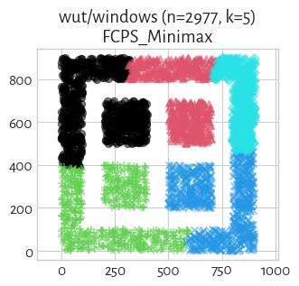

#### fastcluster_weighted (NCA=0.78)

#### fastcluster_centroid (NCA=0.78)

#### BallHall (NCA=0.76)

#### Silhouette (NCA=0.75)

#### DaviesBouldin (NCA=0.75)

#### FCPS_Clara (NCA=0.75)

#### GDunn_d2_D1 (NCA=0.70)

#### CalinskiHarabasz (NCA=0.69)

#### sklearn_kmeans (NCA=0.69)

#### GDunn_d2_D3 (NCA=0.69)

#### FCPS_Hardcl (NCA=0.68)

#### GDunn_d2_D2 (NCA=0.67)

#### FCPS_Softcl (NCA=0.66)

#### GDunn_d3_D3 (NCA=0.66)

#### FCPS_Fanny (NCA=0.64)

#### GDunn_d4_D2 (NCA=0.61)

#### IcA (NCA=0.59)

#### Genie_G0.1 (NCA=0.57)

#### GIc (NCA=0.57)

#### Genie_G0.3 (NCA=0.57)

#### GDunn_d4_D3 (NCA=0.56)

#### mst_divisive_GDunn_d2_D3 (NCA=0.56)

#### mst_divisive_GDunn_d2_D2 (NCA=0.56)

#### mst_divisive_GDunn_d2_D1 (NCA=0.56)

#### GDunn_d4_D1 (NCA=0.55)

#### mst_divisive_Silhouette (NCA=0.55)

#### GDunn_d3_D2 (NCA=0.50)

#### GDunn_d5_D2 (NCA=0.50)

#### ITM (NCA=0.36)

#### CTCEHC (NCA=0.34)

#### mst_divisive_GDunn_d5_D1 (NCA=0.32)

#### fastcluster_complete (NCA=0.32)

#### mst_divisive_GDunn_d5_D2 (NCA=0.32)

#### mst_divisive_GDunn_d5_D3 (NCA=0.31)

#### HEMST (NCA=0.30)

#### mst_divisive_GDunn_d3_D3 (NCA=0.30)

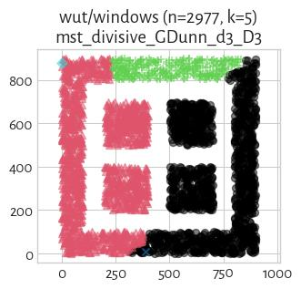

#### mst_divisive_GDunn_d3_D2 (NCA=0.30)

#### GDunn_d5_D1 (NCA=0.29)

#### sklearn_spectral_Alaplacian_G5 (NCA=0.17)

#### GDunn_d3_D1 (NCA=0.11)

#### GDunn_d5_D3 (NCA=0.02)

#### mst_divisive_BallHall (NCA=0.01)

#### mst_divisive_GDunn_d3_D1 (NCA=0.00)

#### mst_divisive_GDunn_d4_D1 (NCA=0.00)

#### mst_divisive_GDunn_d4_D2 (NCA=0.00)

#### mst_divisive_GDunn_d4_D3 (NCA=0.00)

#### mst_divisive_DaviesBouldin (NCA=0.00)

#### mst_divisive_SilhouetteW (NCA=0.00)

#### SilhouetteW (NCA=0.00)

## wut/x1 (n=120, d=2) 

#### Genie_G0.1 (NCA=1.00)

#### mst_divisive_SilhouetteW (NCA=1.00)

#### mst_divisive_GDunn_d1_D2 (NCA=1.00)

#### mst_divisive_GDunn_d1_D3 (NCA=1.00)

#### mst_divisive_WCNN_25 (NCA=1.00)

#### mst_divisive_DuNN_25_Min_Max (NCA=1.00)

#### mst_divisive_DuNN_25_Mean_Mean (NCA=1.00)

#### Genie_G0.3 (NCA=1.00)

#### sklearn_gm (NCA=1.00)

#### sklearn_kmeans (NCA=1.00)

#### sklearn_spectral_Alaplacian_G5 (NCA=1.00)

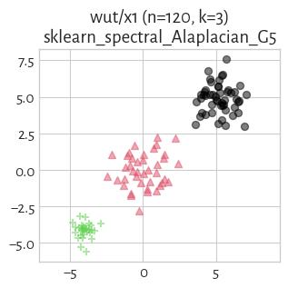

#### sklearn_birch_T0.01_BF50 (NCA=1.00)

#### mst_divisive_GDunn_d1_D1 (NCA=1.00)

#### Genie_G1.0 (NCA=1.00)

#### CTCEHC (NCA=1.00)

#### BallHall (NCA=1.00)

#### CalinskiHarabasz (NCA=1.00)

#### GDunn_d1_D3 (NCA=1.00)

#### GDunn_d1_D2 (NCA=1.00)

#### GDunn_d1_D1 (NCA=1.00)

#### FCPS_PAM (NCA=1.00)

#### DuNN_25_Min_Max (NCA=1.00)

#### DuNN_25_Mean_Mean (NCA=1.00)

#### Genie_G0.7 (NCA=1.00)

#### HEMST (NCA=1.00)

#### FCPS_Clara (NCA=1.00)

#### WCNN_25 (NCA=1.00)

#### GIc (NCA=1.00)

#### ITM (NCA=1.00)

#### fastcluster_average (NCA=1.00)

#### fastcluster_centroid (NCA=1.00)

#### fastcluster_complete (NCA=1.00)

#### FCPS_Softcl (NCA=1.00)

#### fastcluster_median (NCA=1.00)

#### SilhouetteW (NCA=1.00)

#### Silhouette (NCA=1.00)

#### fastcluster_ward (NCA=1.00)

#### fastcluster_weighted (NCA=1.00)

#### FCPS_AdaptiveDensityPeak (NCA=1.00)

#### FCPS_Minimax (NCA=1.00)

#### FCPS_MinEnergy (NCA=1.00)

#### FCPS_HDBSCAN_4 (NCA=1.00)

#### FCPS_HDBSCAN_2 (NCA=1.00)

#### FCPS_Fanny (NCA=1.00)

#### Genie_G0.5 (NCA=1.00)

#### DaviesBouldin (NCA=0.99)

#### mst_divisive_DaviesBouldin (NCA=0.99)

#### mst_divisive_Silhouette (NCA=0.99)

#### GDunn_d4_D1 (NCA=0.99)

#### GDunn_d3_D1 (NCA=0.99)

#### GDunn_d2_D1 (NCA=0.99)

#### mst_divisive_BallHall (NCA=0.99)

#### mst_divisive_GDunn_d4_D1 (NCA=0.98)

#### FCPS_Diana (NCA=0.98)

#### mst_divisive_CalinskiHarabasz (NCA=0.98)

#### mst_divisive_GDunn_d3_D1 (NCA=0.96)

#### GDunn_d3_D3 (NCA=0.95)

#### mst_divisive_GDunn_d3_D3 (NCA=0.95)

#### mst_divisive_GDunn_d4_D3 (NCA=0.95)

#### mst_divisive_GDunn_d4_D2 (NCA=0.95)

#### mst_divisive_GDunn_d2_D1 (NCA=0.94)

#### GDunn_d3_D2 (NCA=0.93)

#### GDunn_d4_D2 (NCA=0.91)

#### GDunn_d4_D3 (NCA=0.91)

#### GDunn_d2_D3 (NCA=0.91)

#### GDunn_d2_D2 (NCA=0.90)

#### mst_divisive_GDunn_d3_D2 (NCA=0.85)

#### mst_divisive_DuNN_25_Max_Min (NCA=0.82)

#### IcA (NCA=0.80)

#### DuNN_25_Max_Min (NCA=0.57)

#### mst_divisive_GDunn_d5_D3 (NCA=0.51)

#### FCPS_HDBSCAN_8 (NCA=0.51)

#### mst_divisive_GDunn_d5_D1 (NCA=0.49)

#### mst_divisive_GDunn_d5_D2 (NCA=0.49)

#### mst_divisive_GDunn_d2_D2 (NCA=0.48)

#### GDunn_d5_D2 (NCA=0.43)

#### mst_divisive_GDunn_d2_D3 (NCA=0.42)

#### FCPS_Hardcl (NCA=0.28)

#### GDunn_d5_D1 (NCA=0.22)

#### GDunn_d5_D3 (NCA=0.12)

## wut/x2 (n=120, d=2) 

#### mst_divisive_CalinskiHarabasz (NCA=1.00)

#### FCPS_Clara (NCA=1.00)

#### fastcluster_complete (NCA=1.00)

#### FCPS_Diana (NCA=0.99)

#### fastcluster_ward (NCA=0.98)

#### sklearn_kmeans (NCA=0.98)

#### FCPS_PAM (NCA=0.98)

#### FCPS_Softcl (NCA=0.98)

#### FCPS_Hardcl (NCA=0.98)

#### FCPS_MinEnergy (NCA=0.98)

#### sklearn_birch_T0.01_BF50 (NCA=0.98)

#### FCPS_Fanny (NCA=0.94)

#### GIc (NCA=0.92)

#### mst_divisive_WCNN_25 (NCA=0.87)

#### mst_divisive_DuNN_25_Min_Max (NCA=0.87)

#### Genie_G0.3 (NCA=0.87)

#### Genie_G0.1 (NCA=0.87)

#### sklearn_gm (NCA=0.87)

#### WCNN_25 (NCA=0.87)

#### mst_divisive_DuNN_25_Mean_Mean (NCA=0.87)

#### ITM (NCA=0.87)

#### DuNN_25_Min_Max (NCA=0.84)

#### IcA (NCA=0.83)

#### CTCEHC (NCA=0.81)

#### GDunn_d2_D2 (NCA=0.75)

#### DuNN_25_Mean_Mean (NCA=0.73)

#### GDunn_d2_D3 (NCA=0.73)

#### mst_divisive_GDunn_d2_D3 (NCA=0.70)

#### mst_divisive_DuNN_25_Max_Min (NCA=0.69)

#### mst_divisive_GDunn_d2_D2 (NCA=0.69)

#### Genie_G0.7 (NCA=0.67)

#### mst_divisive_Silhouette (NCA=0.67)

#### fastcluster_weighted (NCA=0.67)

#### fastcluster_average (NCA=0.65)

#### fastcluster_centroid (NCA=0.65)

#### mst_divisive_GDunn_d2_D1 (NCA=0.62)

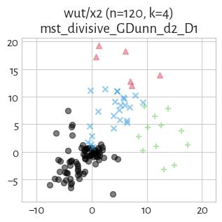

#### Genie_G0.5 (NCA=0.59)

#### mst_divisive_GDunn_d3_D1 (NCA=0.59)

#### fastcluster_median (NCA=0.58)

#### FCPS_Minimax (NCA=0.56)

#### FCPS_AdaptiveDensityPeak (NCA=0.55)

#### mst_divisive_BallHall (NCA=0.52)

#### mst_divisive_GDunn_d5_D2 (NCA=0.48)

#### GDunn_d5_D2 (NCA=0.44)

#### mst_divisive_GDunn_d3_D2 (NCA=0.44)

#### mst_divisive_GDunn_d4_D3 (NCA=0.44)

#### mst_divisive_GDunn_d4_D2 (NCA=0.44)

#### mst_divisive_GDunn_d3_D3 (NCA=0.44)

#### mst_divisive_GDunn_d5_D1 (NCA=0.39)

#### mst_divisive_GDunn_d5_D3 (NCA=0.38)

#### mst_divisive_GDunn_d4_D1 (NCA=0.34)

#### sklearn_spectral_Alaplacian_G5 (NCA=0.34)

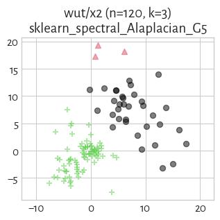

#### HEMST (NCA=0.33)

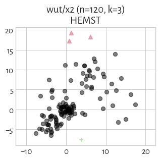

#### GDunn_d2_D1 (NCA=0.27)

#### CalinskiHarabasz (NCA=0.26)

#### Silhouette (NCA=0.26)

#### BallHall (NCA=0.25)

#### GDunn_d3_D1 (NCA=0.24)

#### GDunn_d4_D1 (NCA=0.24)

#### GDunn_d5_D1 (NCA=0.23)

#### GDunn_d4_D2 (NCA=0.22)

#### GDunn_d3_D3 (NCA=0.22)

#### GDunn_d4_D3 (NCA=0.21)

#### GDunn_d3_D2 (NCA=0.21)

#### mst_divisive_SilhouetteW (NCA=0.09)

#### GDunn_d5_D3 (NCA=0.07)

#### DuNN_25_Max_Min (NCA=0.07)

#### mst_divisive_DaviesBouldin (NCA=0.06)

#### FCPS_HDBSCAN_8 (NCA=0.03)

#### mst_divisive_GDunn_d1_D3 (NCA=0.03)

#### mst_divisive_GDunn_d1_D2 (NCA=0.03)

#### SilhouetteW (NCA=0.02)

#### DaviesBouldin (NCA=0.02)

#### GDunn_d1_D1 (NCA=0.01)

#### GDunn_d1_D2 (NCA=0.01)

#### GDunn_d1_D3 (NCA=0.01)

#### Genie_G1.0 (NCA=0.01)

#### FCPS_HDBSCAN_4 (NCA=0.01)

#### FCPS_HDBSCAN_2 (NCA=0.01)

#### mst_divisive_GDunn_d1_D1 (NCA=0.01)

## wut/x3 (n=185, d=2) 

#### mst_divisive_CalinskiHarabasz (NCA=1.00)

#### sklearn_kmeans (NCA=1.00)

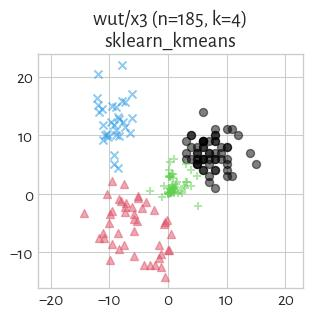

#### FCPS_Softcl (NCA=1.00)

#### sklearn_birch_T0.01_BF50 (NCA=0.99)

#### fastcluster_ward (NCA=0.99)

#### WCNN_25 (NCA=0.97)

#### sklearn_gm (NCA=0.96)

#### FCPS_Fanny (NCA=0.96)

#### mst_divisive_WCNN_25 (NCA=0.96)

#### FCPS_PAM (NCA=0.95)

#### FCPS_Diana (NCA=0.95)

#### mst_divisive_Silhouette (NCA=0.95)

#### fastcluster_weighted (NCA=0.95)

#### FCPS_Hardcl (NCA=0.94)

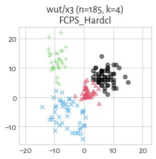

#### CalinskiHarabasz (NCA=0.94)

#### FCPS_Minimax (NCA=0.94)

#### Genie_G0.5 (NCA=0.94)

#### Genie_G0.3 (NCA=0.94)

#### fastcluster_average (NCA=0.94)

#### fastcluster_centroid (NCA=0.94)

#### mst_divisive_DuNN_25_Min_Max (NCA=0.94)

#### FCPS_Clara (NCA=0.93)

#### Genie_G0.1 (NCA=0.93)

#### GIc (NCA=0.93)

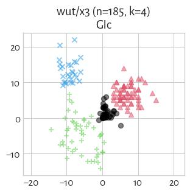

#### FCPS_MinEnergy (NCA=0.93)

#### FCPS_AdaptiveDensityPeak (NCA=0.90)

#### sklearn_spectral_Alaplacian_G5 (NCA=0.89)

#### mst_divisive_GDunn_d2_D3 (NCA=0.84)

#### mst_divisive_GDunn_d2_D2 (NCA=0.84)

#### mst_divisive_DuNN_25_Mean_Mean (NCA=0.83)

#### GDunn_d2_D2 (NCA=0.81)

#### GDunn_d2_D3 (NCA=0.79)

#### mst_divisive_DuNN_25_Max_Min (NCA=0.77)

#### GDunn_d3_D3 (NCA=0.77)

#### DuNN_25_Min_Max (NCA=0.76)

#### GDunn_d4_D2 (NCA=0.76)

#### GDunn_d3_D2 (NCA=0.75)

#### CTCEHC (NCA=0.75)

#### GDunn_d4_D3 (NCA=0.75)

#### fastcluster_complete (NCA=0.74)

#### HEMST (NCA=0.74)

#### mst_divisive_BallHall (NCA=0.74)

#### mst_divisive_GDunn_d2_D1 (NCA=0.69)

#### fastcluster_median (NCA=0.68)

#### BallHall (NCA=0.67)

#### Silhouette (NCA=0.62)

#### ITM (NCA=0.60)

#### DuNN_25_Max_Min (NCA=0.59)

#### Genie_G0.7 (NCA=0.57)

#### GDunn_d1_D3 (NCA=0.55)

#### mst_divisive_GDunn_d5_D3 (NCA=0.54)

#### GDunn_d1_D1 (NCA=0.53)

#### mst_divisive_GDunn_d5_D2 (NCA=0.51)

#### GDunn_d1_D2 (NCA=0.50)

#### IcA (NCA=0.47)

#### mst_divisive_GDunn_d5_D1 (NCA=0.47)

#### mst_divisive_GDunn_d3_D2 (NCA=0.46)

#### mst_divisive_GDunn_d3_D3 (NCA=0.46)

#### GDunn_d2_D1 (NCA=0.43)

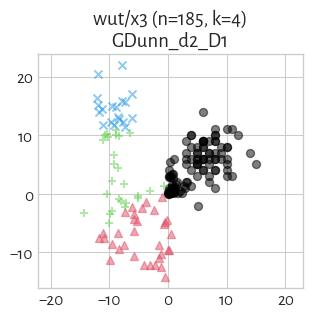

#### GDunn_d3_D1 (NCA=0.41)

#### DaviesBouldin (NCA=0.39)

#### GDunn_d4_D1 (NCA=0.36)

#### GDunn_d5_D2 (NCA=0.29)

#### DuNN_25_Mean_Mean (NCA=0.27)

#### GDunn_d5_D1 (NCA=0.20)

#### mst_divisive_SilhouetteW (NCA=0.05)

#### GDunn_d5_D3 (NCA=0.05)

#### mst_divisive_GDunn_d4_D3 (NCA=0.04)

#### mst_divisive_GDunn_d4_D2 (NCA=0.04)

#### mst_divisive_GDunn_d4_D1 (NCA=0.04)

#### mst_divisive_GDunn_d3_D1 (NCA=0.04)

#### mst_divisive_DaviesBouldin (NCA=0.04)

#### SilhouetteW (NCA=0.03)

#### mst_divisive_GDunn_d1_D3 (NCA=0.03)

#### Genie_G1.0 (NCA=0.03)

#### FCPS_HDBSCAN_2 (NCA=0.03)

#### mst_divisive_GDunn_d1_D2 (NCA=0.03)

#### mst_divisive_GDunn_d1_D1 (NCA=0.02)

#### FCPS_HDBSCAN_8 (NCA=0.02)

#### FCPS_HDBSCAN_4 (NCA=0.02)

## wut/z1 (n=192, d=2) 

#### GDunn_d5_D1 (NCA=1.00)

#### GDunn_d5_D3 (NCA=1.00)

#### GDunn_d2_D1 (NCA=1.00)

#### GDunn_d3_D1 (NCA=0.67)

#### GDunn_d4_D1 (NCA=0.67)

#### mst_divisive_GDunn_d2_D1 (NCA=0.55)

#### mst_divisive_GDunn_d2_D2 (NCA=0.55)

#### mst_divisive_GDunn_d2_D3 (NCA=0.55)

#### mst_divisive_GDunn_d1_D1 (NCA=0.52)

#### mst_divisive_GDunn_d4_D1 (NCA=0.51)

#### mst_divisive_GDunn_d4_D2 (NCA=0.51)

#### mst_divisive_GDunn_d4_D3 (NCA=0.51)

#### mst_divisive_GDunn_d5_D1 (NCA=0.51)

#### GIc (NCA=0.50)

#### ITM (NCA=0.50)

#### Genie_G0.3 (NCA=0.50)

#### Genie_G0.1 (NCA=0.50)

#### mst_divisive_GDunn_d5_D3 (NCA=0.49)

#### mst_divisive_GDunn_d5_D2 (NCA=0.49)

#### mst_divisive_GDunn_d3_D1 (NCA=0.48)

#### IcA (NCA=0.47)

#### mst_divisive_GDunn_d3_D2 (NCA=0.45)

#### mst_divisive_GDunn_d3_D3 (NCA=0.45)

#### mst_divisive_GDunn_d1_D3 (NCA=0.45)

#### mst_divisive_GDunn_d1_D2 (NCA=0.45)

#### mst_divisive_DuNN_25_Max_Min (NCA=0.41)

#### mst_divisive_CalinskiHarabasz (NCA=0.41)

#### mst_divisive_DuNN_25_Mean_Mean (NCA=0.41)

#### GDunn_d1_D1 (NCA=0.41)

#### mst_divisive_DuNN_25_Min_Max (NCA=0.40)

#### mst_divisive_Silhouette (NCA=0.39)

#### fastcluster_median (NCA=0.37)

#### fastcluster_centroid (NCA=0.37)

#### fastcluster_complete (NCA=0.36)

#### mst_divisive_WCNN_25 (NCA=0.34)

#### fastcluster_weighted (NCA=0.34)

#### FCPS_Fanny (NCA=0.34)

#### FCPS_Clara (NCA=0.34)

#### FCPS_Diana (NCA=0.33)

#### FCPS_PAM (NCA=0.33)

#### Silhouette (NCA=0.32)

#### fastcluster_average (NCA=0.32)

#### FCPS_Hardcl (NCA=0.32)

#### WCNN_25 (NCA=0.31)

#### CalinskiHarabasz (NCA=0.31)

#### sklearn_kmeans (NCA=0.31)

#### GDunn_d4_D2 (NCA=0.31)

#### FCPS_Softcl (NCA=0.31)

#### Genie_G0.5 (NCA=0.30)

#### sklearn_spectral_Alaplacian_G5 (NCA=0.30)

#### GDunn_d3_D3 (NCA=0.30)

#### FCPS_MinEnergy (NCA=0.30)

#### FCPS_Minimax (NCA=0.30)

#### GDunn_d3_D2 (NCA=0.30)

#### GDunn_d4_D3 (NCA=0.29)

#### GDunn_d1_D2 (NCA=0.29)

#### GDunn_d2_D2 (NCA=0.28)

#### FCPS_AdaptiveDensityPeak (NCA=0.28)

#### GDunn_d1_D3 (NCA=0.28)

#### GDunn_d2_D3 (NCA=0.27)

#### DuNN_25_Min_Max (NCA=0.27)

#### fastcluster_ward (NCA=0.27)

#### sklearn_birch_T0.01_BF50 (NCA=0.27)

#### GDunn_d5_D2 (NCA=0.24)

#### CTCEHC (NCA=0.21)

#### DuNN_25_Mean_Mean (NCA=0.13)

#### sklearn_gm (NCA=0.11)

#### Genie_G0.7 (NCA=0.11)

#### HEMST (NCA=0.10)

#### mst_divisive_BallHall (NCA=0.08)

#### BallHall (NCA=0.08)

#### FCPS_HDBSCAN_2 (NCA=0.06)

#### Genie_G1.0 (NCA=0.06)

#### DuNN_25_Max_Min (NCA=0.04)

#### mst_divisive_SilhouetteW (NCA=0.03)

#### mst_divisive_DaviesBouldin (NCA=0.02)

#### DaviesBouldin (NCA=0.02)

#### SilhouetteW (NCA=0.02)

#### FCPS_HDBSCAN_4 (NCA=0.02)

#### FCPS_HDBSCAN_8 (NCA=0.02)

## wut/z2 (n=900, d=2) 

#### sklearn_gm (NCA=1.00)

#### mst_divisive_WCNN_25 (NCA=1.00)

#### mst_divisive_DuNN_25_Min_Max (NCA=1.00)

#### mst_divisive_DuNN_25_Mean_Mean (NCA=1.00)

#### WCNN_25 (NCA=1.00)

#### Genie_G0.7 (NCA=1.00)

#### DuNN_25_Mean_Mean (NCA=1.00)

#### DuNN_25_Min_Max (NCA=1.00)

#### sklearn_spectral_Alaplacian_G5 (NCA=0.99)

#### CTCEHC (NCA=0.96)

#### FCPS_AdaptiveDensityPeak (NCA=0.89)

#### Genie_G0.1 (NCA=0.88)

#### GIc (NCA=0.88)

#### ITM (NCA=0.88)

#### Silhouette (NCA=0.87)

#### GDunn_d3_D2 (NCA=0.86)

#### FCPS_Hardcl (NCA=0.86)

#### sklearn_kmeans (NCA=0.86)

#### FCPS_Softcl (NCA=0.86)

#### FCPS_MinEnergy (NCA=0.86)

#### CalinskiHarabasz (NCA=0.86)

#### mst_divisive_Silhouette (NCA=0.86)

#### fastcluster_ward (NCA=0.84)

#### mst_divisive_CalinskiHarabasz (NCA=0.84)

#### sklearn_birch_T0.01_BF50 (NCA=0.84)

#### FCPS_Clara (NCA=0.84)

#### FCPS_Diana (NCA=0.84)

#### GDunn_d4_D2 (NCA=0.83)

#### FCPS_PAM (NCA=0.83)

#### GDunn_d3_D3 (NCA=0.83)

#### FCPS_Fanny (NCA=0.82)

#### IcA (NCA=0.80)

#### GDunn_d2_D3 (NCA=0.80)

#### GDunn_d4_D3 (NCA=0.76)

#### mst_divisive_GDunn_d1_D3 (NCA=0.75)

#### mst_divisive_GDunn_d1_D2 (NCA=0.75)

#### fastcluster_average (NCA=0.75)

#### fastcluster_centroid (NCA=0.75)

#### mst_divisive_GDunn_d5_D2 (NCA=0.74)

#### mst_divisive_GDunn_d5_D3 (NCA=0.74)

#### fastcluster_complete (NCA=0.73)

#### mst_divisive_GDunn_d2_D3 (NCA=0.73)

#### GDunn_d4_D1 (NCA=0.72)

#### GDunn_d2_D2 (NCA=0.71)

#### mst_divisive_GDunn_d5_D1 (NCA=0.70)

#### mst_divisive_BallHall (NCA=0.67)

#### BallHall (NCA=0.67)

#### mst_divisive_GDunn_d2_D2 (NCA=0.65)

#### Genie_G0.5 (NCA=0.64)

#### Genie_G0.3 (NCA=0.64)

#### GDunn_d3_D1 (NCA=0.64)

#### GDunn_d2_D1 (NCA=0.63)

#### fastcluster_median (NCA=0.63)

#### FCPS_Minimax (NCA=0.62)

#### mst_divisive_DuNN_25_Max_Min (NCA=0.57)

#### fastcluster_weighted (NCA=0.56)

#### GDunn_d1_D3 (NCA=0.50)

#### GDunn_d1_D2 (NCA=0.50)

#### GDunn_d1_D1 (NCA=0.50)

#### FCPS_HDBSCAN_2 (NCA=0.50)

#### mst_divisive_GDunn_d1_D1 (NCA=0.50)

#### Genie_G1.0 (NCA=0.50)

#### HEMST (NCA=0.45)

#### GDunn_d5_D1 (NCA=0.42)

#### mst_divisive_GDunn_d2_D1 (NCA=0.42)

#### GDunn_d5_D2 (NCA=0.41)

#### DuNN_25_Max_Min (NCA=0.39)

#### mst_divisive_GDunn_d4_D2 (NCA=0.26)

#### mst_divisive_GDunn_d4_D3 (NCA=0.26)

#### mst_divisive_DaviesBouldin (NCA=0.26)

#### mst_divisive_GDunn_d3_D2 (NCA=0.26)

#### mst_divisive_GDunn_d3_D3 (NCA=0.26)

#### FCPS_HDBSCAN_8 (NCA=0.25)

#### FCPS_HDBSCAN_4 (NCA=0.25)

#### DaviesBouldin (NCA=0.25)

#### SilhouetteW (NCA=0.23)

#### GDunn_d5_D3 (NCA=0.04)

#### mst_divisive_GDunn_d3_D1 (NCA=0.01)

#### mst_divisive_GDunn_d4_D1 (NCA=0.01)

#### mst_divisive_SilhouetteW (NCA=0.00)

## wut/z3 (n=1000, d=2) 

#### CalinskiHarabasz (NCA=1.00)

#### FCPS_Softcl (NCA=1.00)

#### FCPS_Hardcl (NCA=1.00)

#### FCPS_Minimax (NCA=1.00)

#### FCPS_AdaptiveDensityPeak (NCA=1.00)

#### fastcluster_ward (NCA=1.00)

#### sklearn_kmeans (NCA=1.00)

#### Silhouette (NCA=1.00)

#### mst_divisive_WCNN_25 (NCA=1.00)

#### mst_divisive_Silhouette (NCA=1.00)

#### WCNN_25 (NCA=1.00)

#### GDunn_d4_D1 (NCA=1.00)

#### FCPS_PAM (NCA=1.00)

#### FCPS_Clara (NCA=1.00)

#### fastcluster_centroid (NCA=1.00)

#### fastcluster_average (NCA=1.00)

#### mst_divisive_CalinskiHarabasz (NCA=1.00)

#### GDunn_d2_D1 (NCA=1.00)

#### GDunn_d3_D1 (NCA=1.00)

#### sklearn_birch_T0.01_BF50 (NCA=0.99)

#### sklearn_gm (NCA=0.99)

#### FCPS_MinEnergy (NCA=0.99)

#### sklearn_spectral_Alaplacian_G5 (NCA=0.99)

#### GDunn_d3_D2 (NCA=0.99)

#### GDunn_d4_D2 (NCA=0.99)

#### GDunn_d4_D3 (NCA=0.99)

#### GDunn_d3_D3 (NCA=0.99)

#### FCPS_Diana (NCA=0.99)

#### GDunn_d2_D2 (NCA=0.99)

#### GDunn_d2_D3 (NCA=0.99)

#### BallHall (NCA=0.98)

#### DaviesBouldin (NCA=0.98)

#### mst_divisive_GDunn_d3_D3 (NCA=0.98)

#### mst_divisive_GDunn_d4_D3 (NCA=0.98)

#### mst_divisive_GDunn_d4_D2 (NCA=0.98)

#### fastcluster_complete (NCA=0.95)

#### fastcluster_weighted (NCA=0.95)

#### mst_divisive_BallHall (NCA=0.94)

#### mst_divisive_GDunn_d2_D3 (NCA=0.94)

#### GIc (NCA=0.94)

#### Genie_G0.5 (NCA=0.94)

#### DuNN_25_Min_Max (NCA=0.93)

#### mst_divisive_GDunn_d2_D2 (NCA=0.92)

#### DuNN_25_Mean_Mean (NCA=0.91)

#### fastcluster_median (NCA=0.90)

#### mst_divisive_GDunn_d2_D1 (NCA=0.83)

#### ITM (NCA=0.83)

#### FCPS_Fanny (NCA=0.78)

#### HEMST (NCA=0.71)

#### Genie_G0.1 (NCA=0.70)

#### IcA (NCA=0.69)

#### CTCEHC (NCA=0.66)

#### mst_divisive_GDunn_d1_D3 (NCA=0.66)

#### FCPS_HDBSCAN_2 (NCA=0.66)

#### Genie_G1.0 (NCA=0.66)

#### GDunn_d1_D1 (NCA=0.66)

#### GDunn_d1_D2 (NCA=0.66)

#### GDunn_d1_D3 (NCA=0.66)

#### mst_divisive_GDunn_d1_D1 (NCA=0.66)

#### mst_divisive_GDunn_d1_D2 (NCA=0.66)

#### mst_divisive_GDunn_d3_D1 (NCA=0.65)

#### mst_divisive_GDunn_d3_D2 (NCA=0.65)

#### mst_divisive_GDunn_d5_D3 (NCA=0.63)

#### mst_divisive_GDunn_d5_D2 (NCA=0.63)

#### mst_divisive_GDunn_d5_D1 (NCA=0.62)

#### Genie_G0.7 (NCA=0.58)

#### mst_divisive_DuNN_25_Mean_Mean (NCA=0.56)

#### mst_divisive_DuNN_25_Min_Max (NCA=0.50)

#### Genie_G0.3 (NCA=0.49)

#### DuNN_25_Max_Min (NCA=0.47)

#### mst_divisive_DuNN_25_Max_Min (NCA=0.41)

#### GDunn_d5_D2 (NCA=0.39)

#### mst_divisive_GDunn_d4_D1 (NCA=0.34)

#### FCPS_HDBSCAN_4 (NCA=0.34)

#### SilhouetteW (NCA=0.21)

#### GDunn_d5_D1 (NCA=0.17)

#### GDunn_d5_D3 (NCA=0.02)

#### mst_divisive_DaviesBouldin (NCA=0.01)

#### mst_divisive_SilhouetteW (NCA=0.00)

#### FCPS_HDBSCAN_8 (NCA=0.00)

