# [Benchmark Suite for Clustering Algorithms - Version 1](https://github.com/gagolews/clustering_benchmarks_v1/) by [Marek Gagolewski](https://www.gagolewski.com) and others

## Results

**Datasets**

* [sipu/a1](#sipu_a1)
* [sipu/a2](#sipu_a2)
* [sipu/a3](#sipu_a3)
* [sipu/aggregation](#sipu_aggregation)
* [sipu/birch1](#sipu_birch1)
* [sipu/birch2](#sipu_birch2)
* [sipu/compound](#sipu_compound)
* [sipu/d31](#sipu_d31)
* [sipu/flame](#sipu_flame)
* [sipu/jain](#sipu_jain)
* [sipu/pathbased](#sipu_pathbased)
* [sipu/r15](#sipu_r15)
* [sipu/s1](#sipu_s1)
* [sipu/s2](#sipu_s2)
* [sipu/s3](#sipu_s3)
* [sipu/s4](#sipu_s4)
* [sipu/spiral](#sipu_spiral)
* [sipu/unbalance](#sipu_unbalance)
* [sipu/worms_2](#sipu_worms_2)
* [sipu/worms_64](#sipu_worms_64)

--------------------------------------------------------------------------------

# sipu/a1 (n=3000, d=2) 

# sipu/a2 (n=5250, d=2) 

# sipu/a3 (n=7500, d=2) 

# sipu/aggregation (n=788, d=2) 

# sipu/birch1 (n=100000, d=2) 

# sipu/birch2 (n=100000, d=2) 

# sipu/compound (n=399, d=2) 

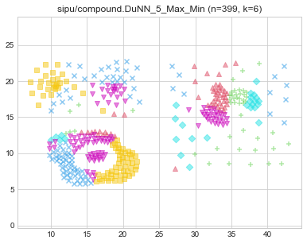

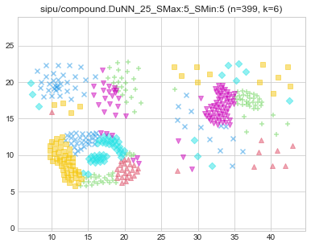

# sipu/d31 (n=3100, d=2) 

# sipu/flame (n=240, d=2) 

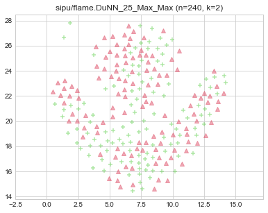

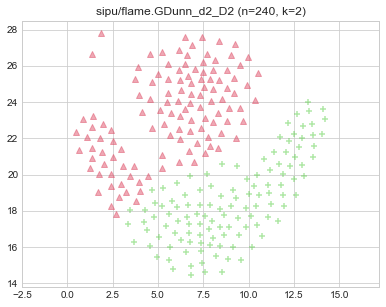

# sipu/jain (n=373, d=2) 

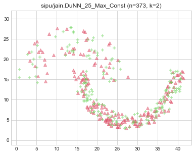

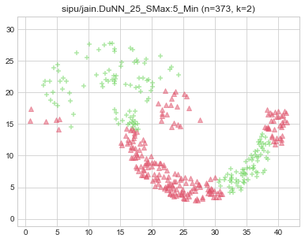

# sipu/pathbased (n=300, d=2) 

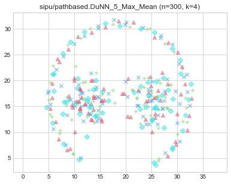

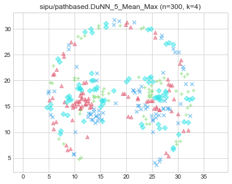

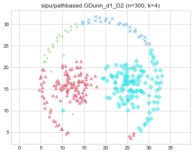

# sipu/r15 (n=600, d=2) 

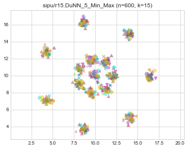

# sipu/s1 (n=5000, d=2) 

# sipu/s2 (n=5000, d=2) 

# sipu/s3 (n=5000, d=2) 

# sipu/s4 (n=5000, d=2) 

# sipu/spiral (n=312, d=2) 

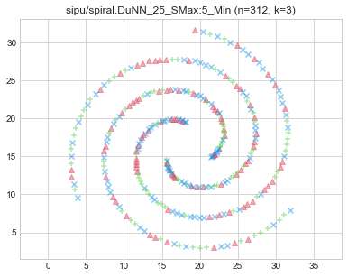

# sipu/unbalance (n=6500, d=2) 

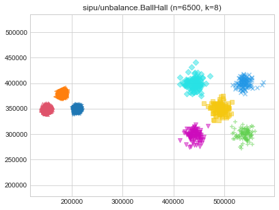

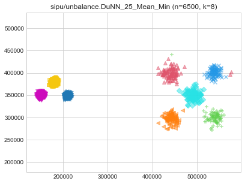

# sipu/worms_2 (n=105600, d=2) 

# sipu/worms_64 (n=105000, d=64) 

