# [Benchmark Suite for Clustering Algorithms - Version 1](https://github.com/gagolews/clustering_benchmarks_v1/) by [Marek Gagolewski](https://www.gagolewski.com) and others

## Results

**Datasets**

* [fcps/atom](#fcps_atom)
* [fcps/chainlink](#fcps_chainlink)
* [fcps/engytime](#fcps_engytime)
* [fcps/hepta](#fcps_hepta)
* [fcps/lsun](#fcps_lsun)
* [fcps/target](#fcps_target)
* [fcps/tetra](#fcps_tetra)
* [fcps/twodiamonds](#fcps_twodiamonds)
* [fcps/wingnut](#fcps_wingnut)

--------------------------------------------------------------------------------

# fcps/atom (n=800, d=3) 

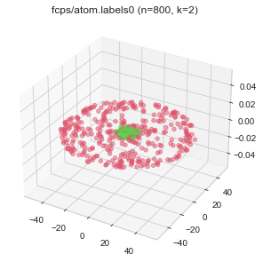
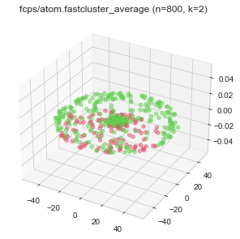
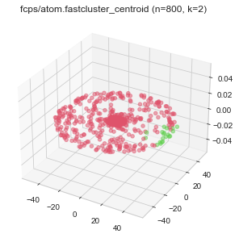
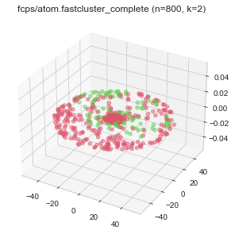
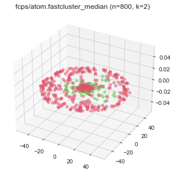
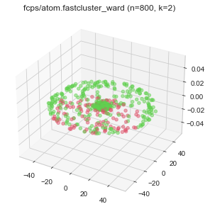
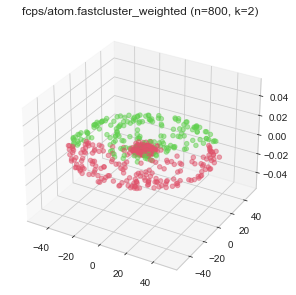
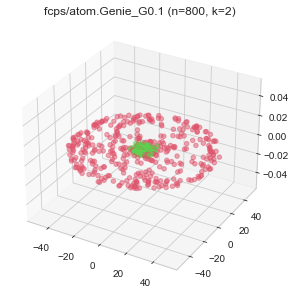

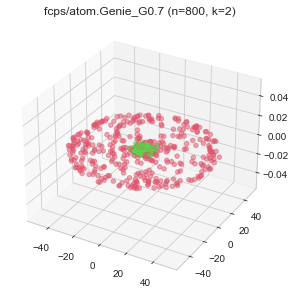

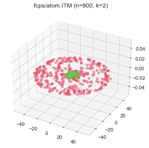
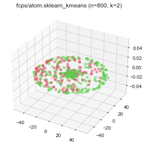
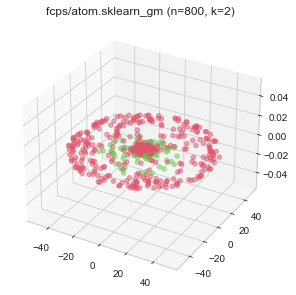

# fcps/chainlink (n=1000, d=3) 

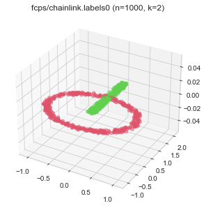

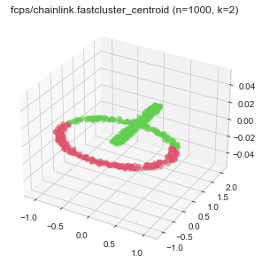
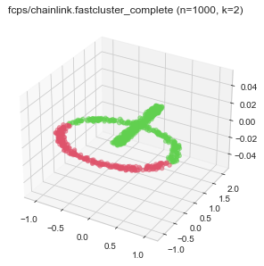
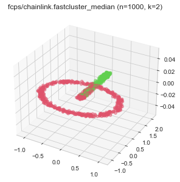
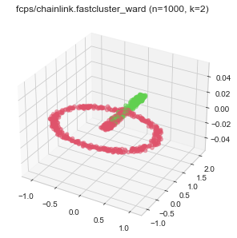
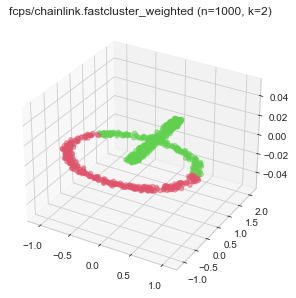
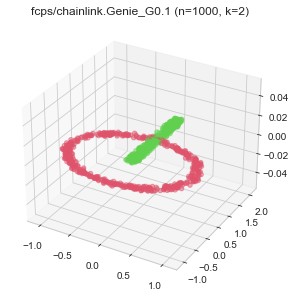
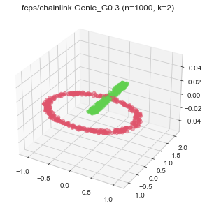
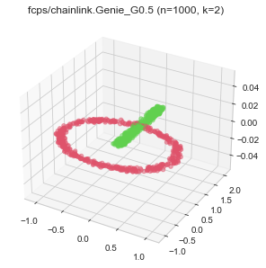
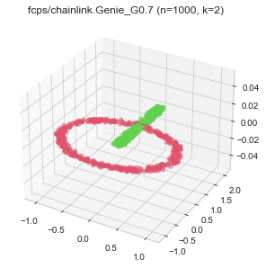

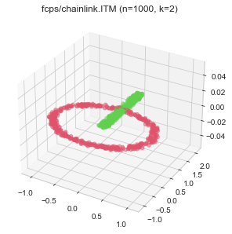
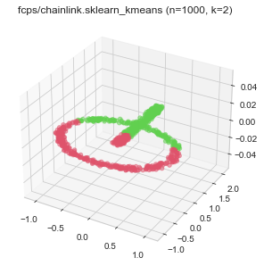
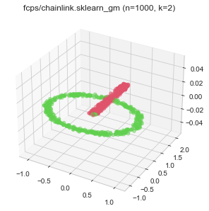

# fcps/engytime (n=4096, d=2) 

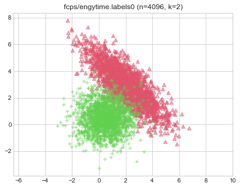

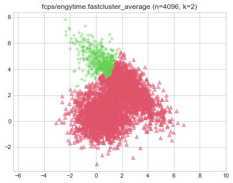
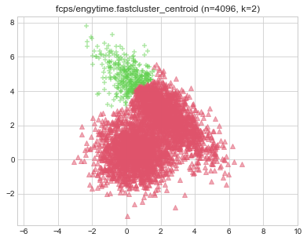
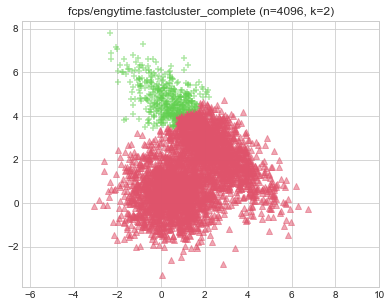
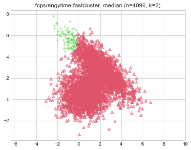
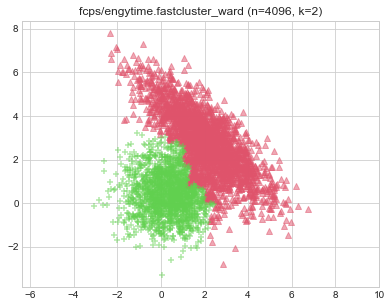
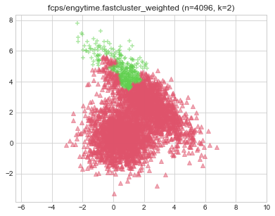

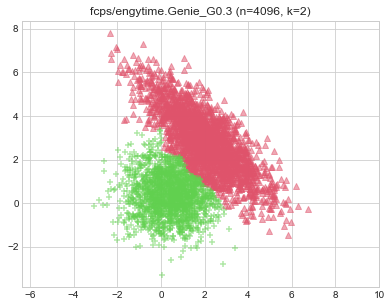

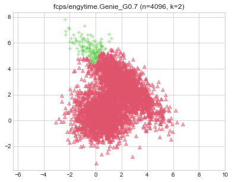
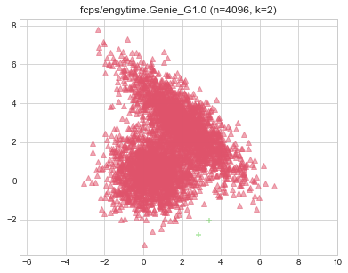

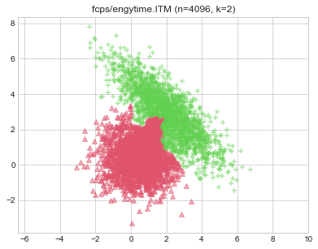
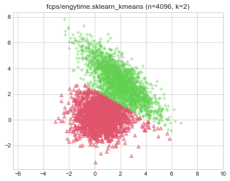
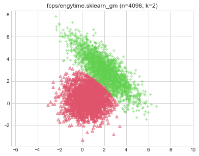

# fcps/hepta (n=212, d=3) 

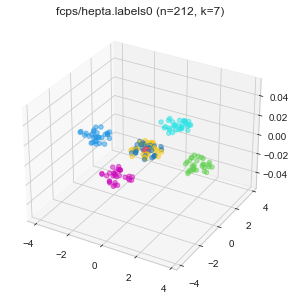

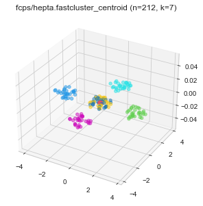

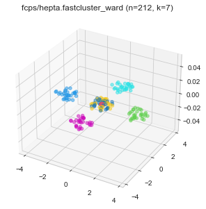
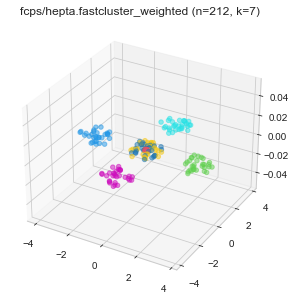

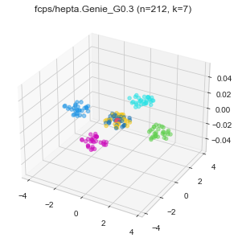

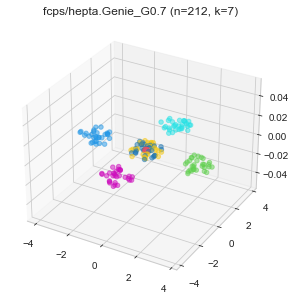
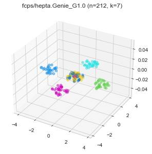
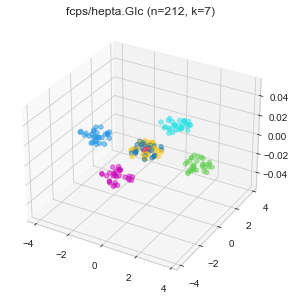
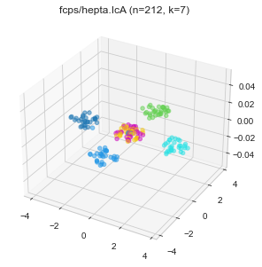
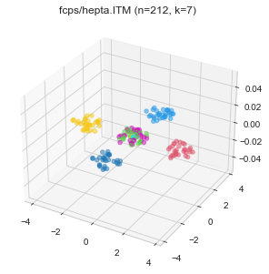
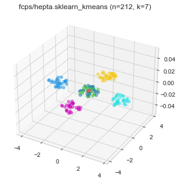
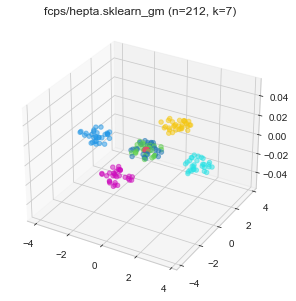

# fcps/lsun (n=400, d=2) 

# fcps/target (n=770, d=2) 

# fcps/tetra (n=400, d=3) 

# fcps/twodiamonds (n=800, d=2) 

# fcps/wingnut (n=1016, d=2) 

