# [Benchmark Suite for Clustering Algorithms - Version 1](https://github.com/gagolews/clustering_benchmarks_v1/) by [Marek Gagolewski](https://www.gagolewski.com) and others

## Results

**Datasets**

* [graves/dense](#graves_dense)
* [graves/fuzzyx](#graves_fuzzyx)
* [graves/line](#graves_line)
* [graves/parabolic](#graves_parabolic)
* [graves/ring](#graves_ring)
* [graves/ring_noisy](#graves_ring_noisy)
* [graves/ring_outliers](#graves_ring_outliers)
* [graves/zigzag](#graves_zigzag)
* [graves/zigzag_noisy](#graves_zigzag_noisy)
* [graves/zigzag_outliers](#graves_zigzag_outliers)

--------------------------------------------------------------------------------

# graves/dense (n=200, d=2) 

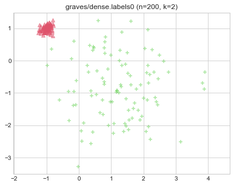
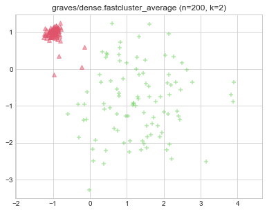
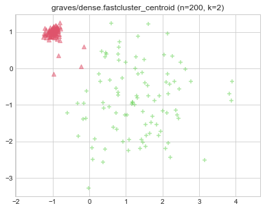
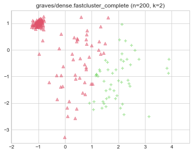
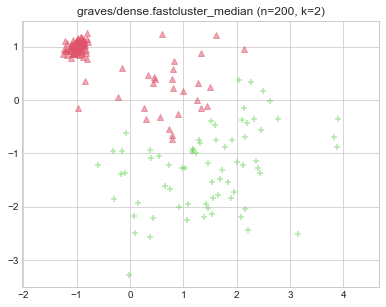

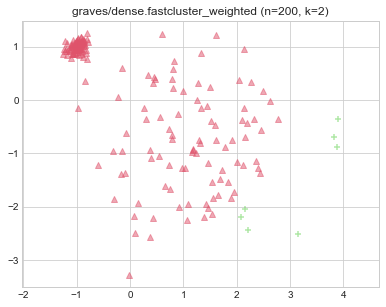
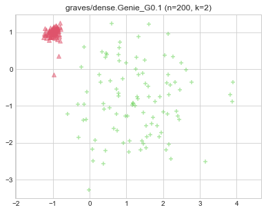

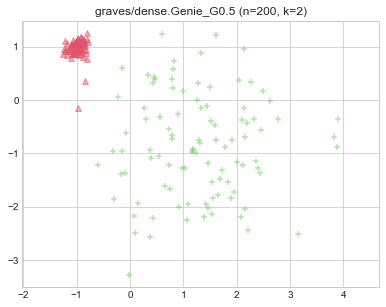

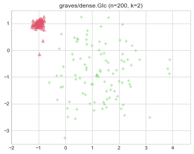

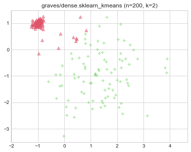

# graves/fuzzyx (n=1000, d=2) 

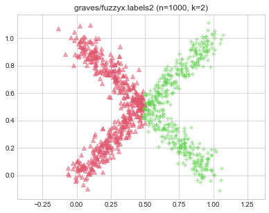
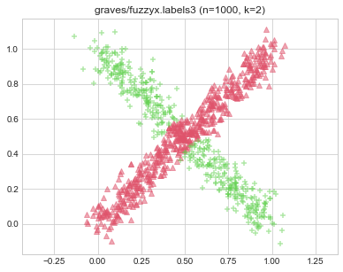
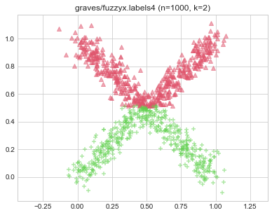
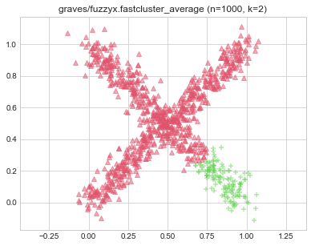

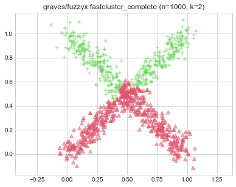
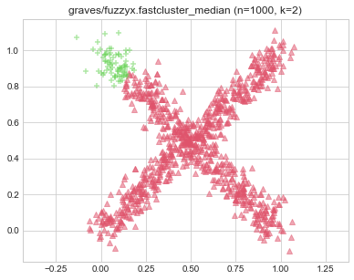
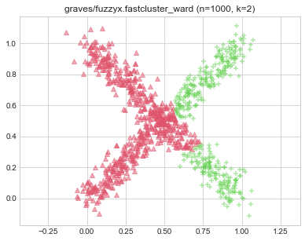
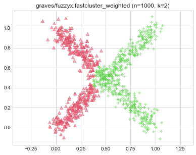
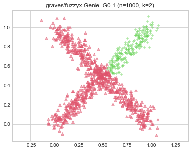
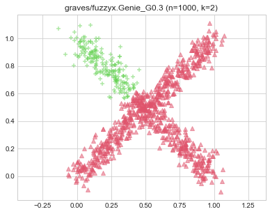

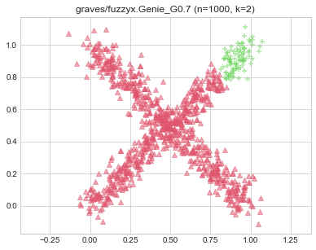
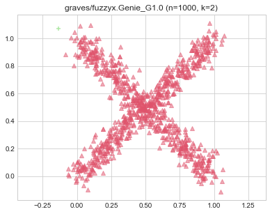
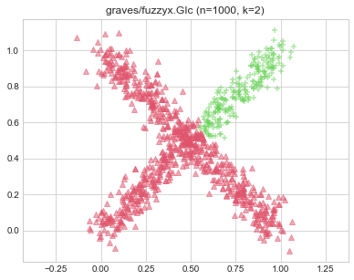
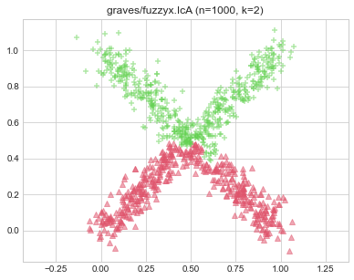
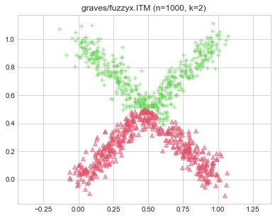
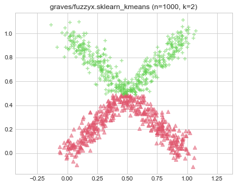
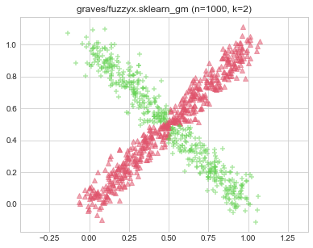
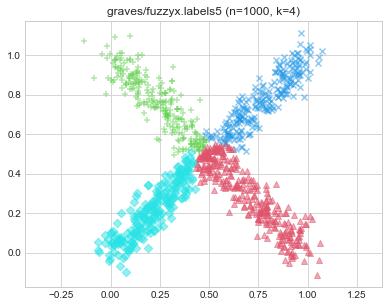
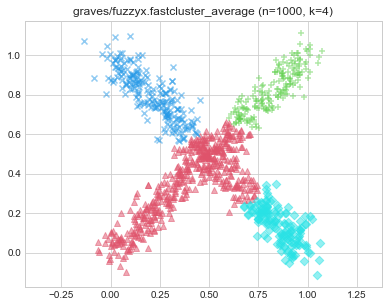
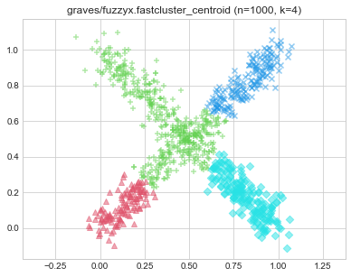
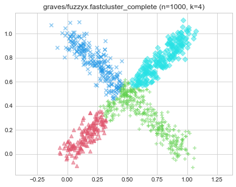
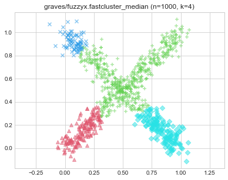
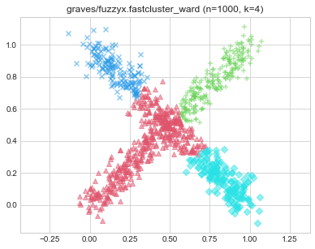
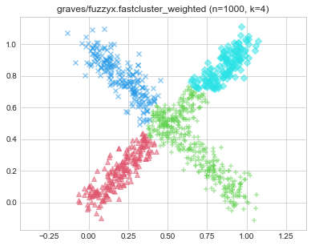
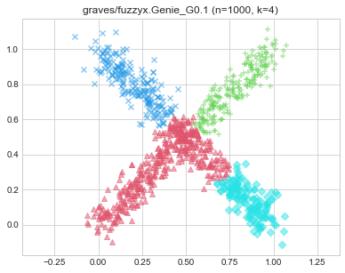
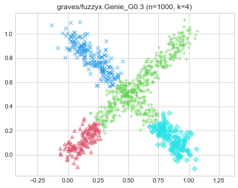
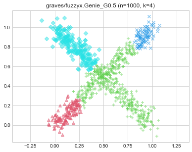

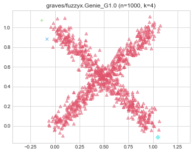
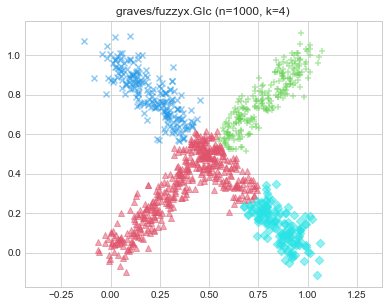
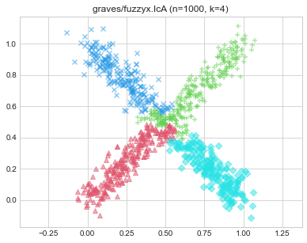
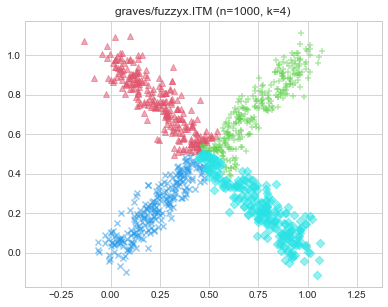
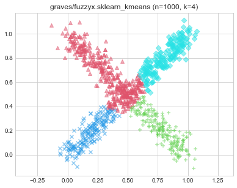
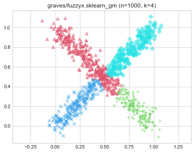
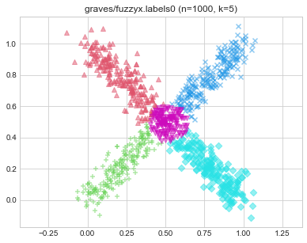
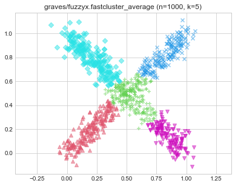
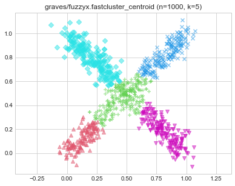
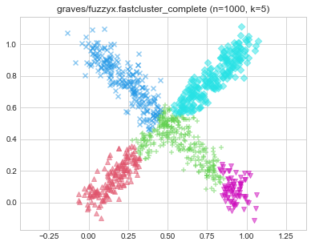
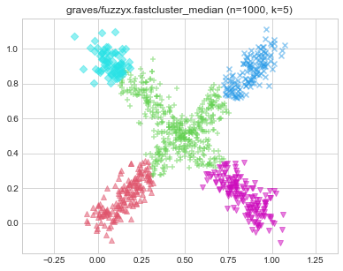
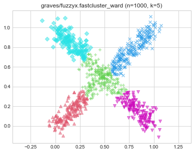
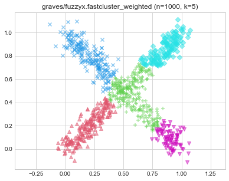

# graves/line (n=250, d=2) 

# graves/parabolic (n=1000, d=2) 

# graves/ring (n=1000, d=2) 

# graves/ring_noisy (n=1050, d=2) 

# graves/ring_outliers (n=1030, d=2) 

# graves/zigzag (n=250, d=2) 

# graves/zigzag_noisy (n=300, d=2) 

# graves/zigzag_outliers (n=280, d=2) 

