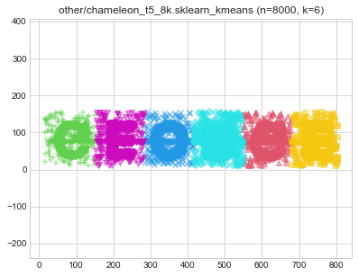
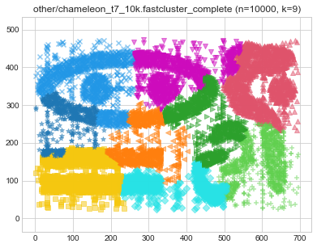
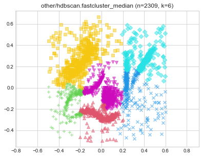

# [Benchmark Suite for Clustering Algorithms - Version 1](https://github.com/gagolews/clustering_benchmarks_v1/) by [Marek Gagolewski](https://www.gagolewski.com) and others

## Results

**Datasets**

* [other/chameleon_t4_8k](#other_chameleon_t4_8k)
* [other/chameleon_t5_8k](#other_chameleon_t5_8k)
* [other/chameleon_t7_10k](#other_chameleon_t7_10k)
* [other/chameleon_t8_8k](#other_chameleon_t8_8k)
* [other/hdbscan](#other_hdbscan)
* [other/iris](#other_iris)
* [other/iris5](#other_iris5)
* [other/square](#other_square)

--------------------------------------------------------------------------------

# other/chameleon_t4_8k (n=8000, d=2) 

# other/chameleon_t5_8k (n=8000, d=2) 

# other/chameleon_t7_10k (n=10000, d=2) 

# other/chameleon_t8_8k (n=8000, d=2) 

# other/hdbscan (n=2309, d=2) 

# other/iris (n=150, d=4) 

> **(preview generation suppressed)**

> **(preview generation suppressed)**

> **(preview generation suppressed)**

> **(preview generation suppressed)**

> **(preview generation suppressed)**

> **(preview generation suppressed)**

> **(preview generation suppressed)**

> **(preview generation suppressed)**

> **(preview generation suppressed)**

> **(preview generation suppressed)**

> **(preview generation suppressed)**

> **(preview generation suppressed)**

> **(preview generation suppressed)**

> **(preview generation suppressed)**

> **(preview generation suppressed)**

> **(preview generation suppressed)**

> **(preview generation suppressed)**

# other/iris5 (n=105, d=4) 

> **(preview generation suppressed)**

> **(preview generation suppressed)**

> **(preview generation suppressed)**

> **(preview generation suppressed)**

> **(preview generation suppressed)**

> **(preview generation suppressed)**

> **(preview generation suppressed)**

> **(preview generation suppressed)**

> **(preview generation suppressed)**

> **(preview generation suppressed)**

> **(preview generation suppressed)**

> **(preview generation suppressed)**

> **(preview generation suppressed)**

> **(preview generation suppressed)**

> **(preview generation suppressed)**

> **(preview generation suppressed)**

> **(preview generation suppressed)**

# other/square (n=1000, d=2) 

