# [Benchmark Suite for Clustering Algorithms - Version 1](https://github.com/gagolews/clustering_benchmarks_v1/) by [Marek Gagolewski](https://www.gagolewski.com) and others

## Results

**Datasets**

* [wut/circles](#wut_circles)
* [wut/cross](#wut_cross)
* [wut/graph](#wut_graph)
* [wut/isolation](#wut_isolation)
* [wut/labirynth](#wut_labirynth)
* [wut/mk1](#wut_mk1)
* [wut/mk2](#wut_mk2)
* [wut/mk3](#wut_mk3)
* [wut/mk4](#wut_mk4)
* [wut/olympic](#wut_olympic)
* [wut/smile](#wut_smile)
* [wut/stripes](#wut_stripes)
* [wut/trajectories](#wut_trajectories)
* [wut/trapped_lovers](#wut_trapped_lovers)
* [wut/twosplashes](#wut_twosplashes)
* [wut/windows](#wut_windows)
* [wut/x1](#wut_x1)
* [wut/x2](#wut_x2)
* [wut/x3](#wut_x3)
* [wut/z1](#wut_z1)
* [wut/z2](#wut_z2)
* [wut/z3](#wut_z3)

--------------------------------------------------------------------------------

# wut/circles (n=4000, d=2) 

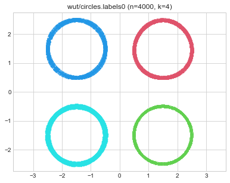
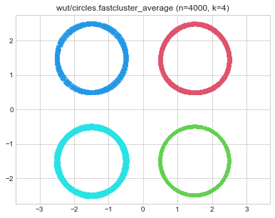

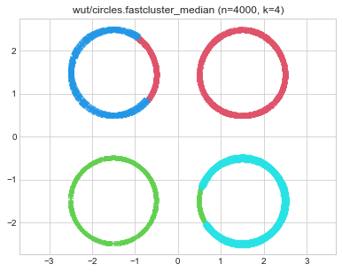
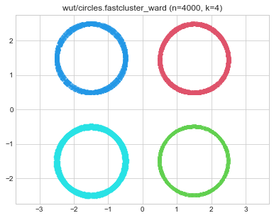
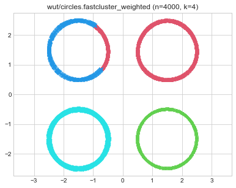
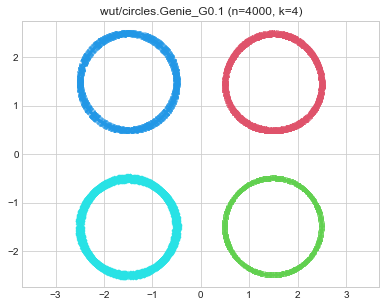
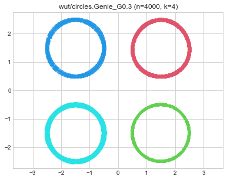

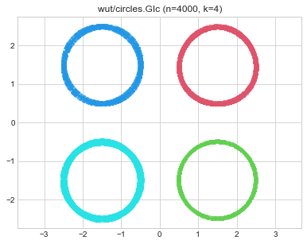
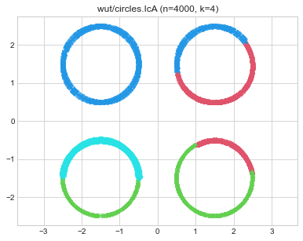

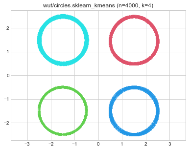
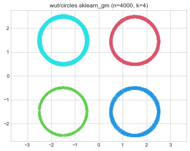

# wut/cross (n=2000, d=2) 

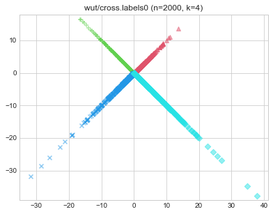

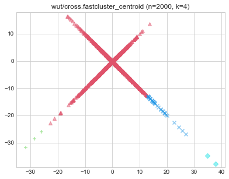
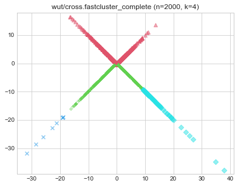
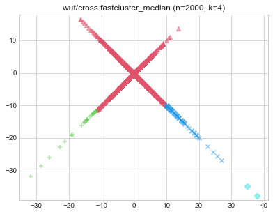
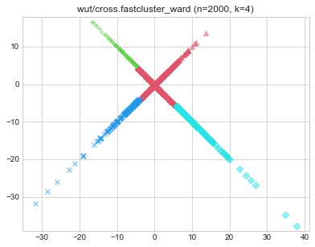
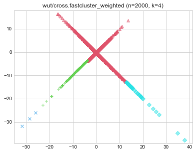
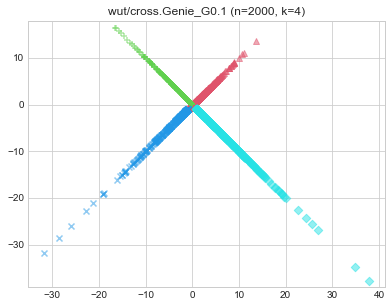
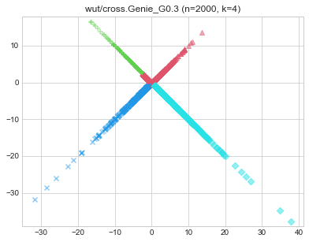
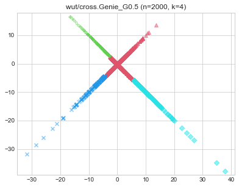
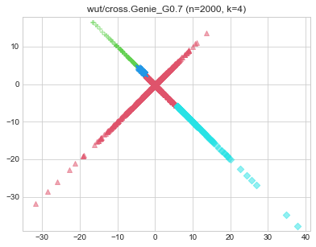
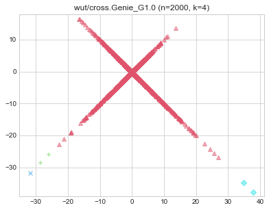
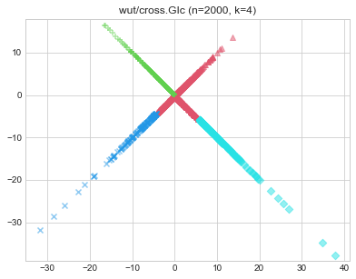
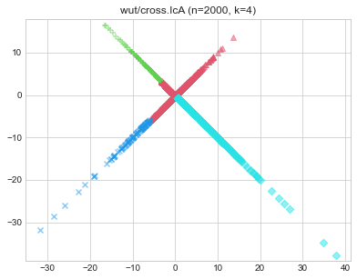
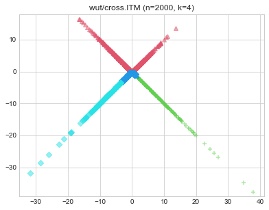
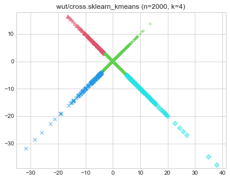
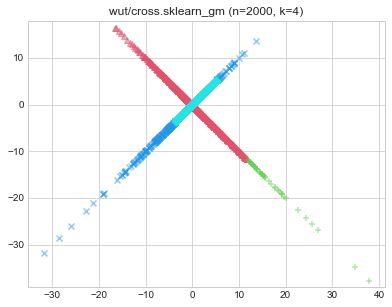

# wut/graph (n=2500, d=2) 

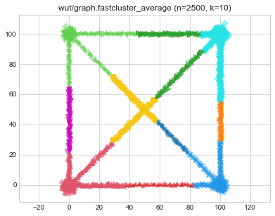
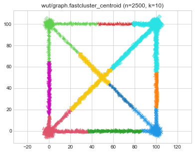
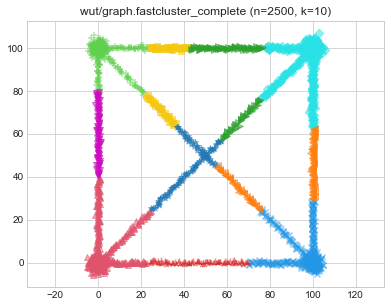
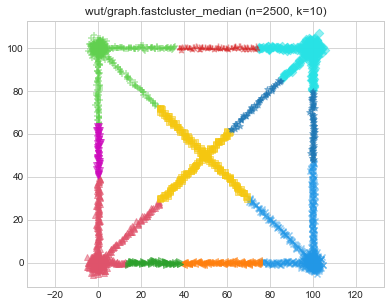
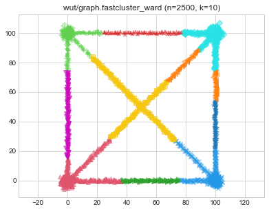
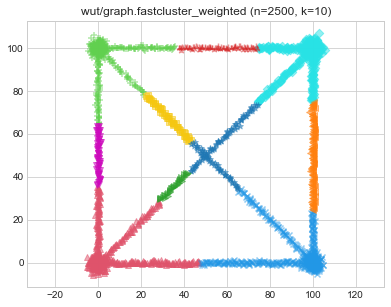
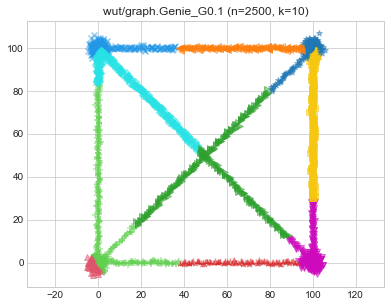
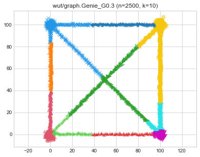
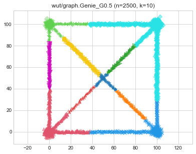
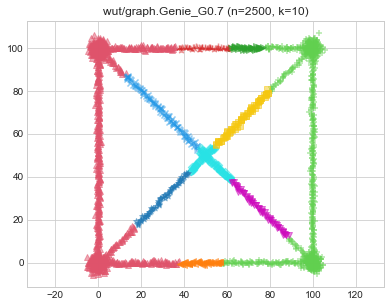

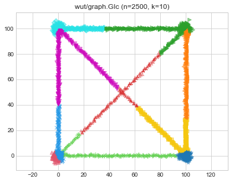
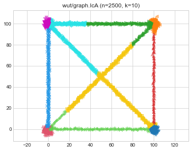
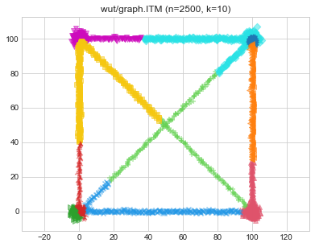
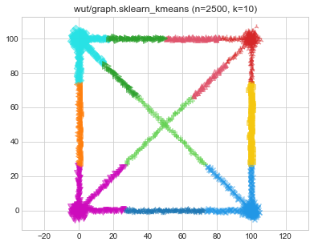
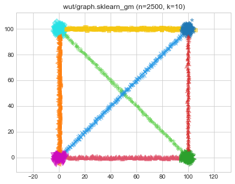

# wut/isolation (n=9000, d=2) 

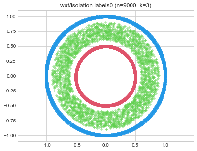
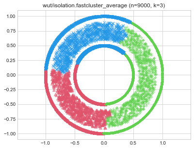
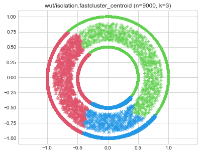
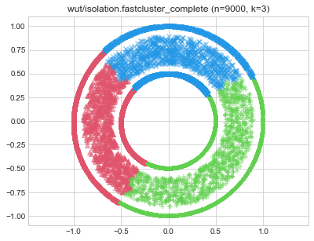
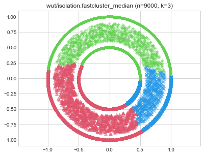
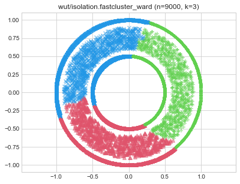
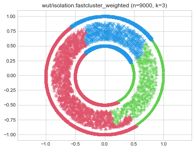
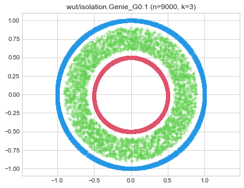

# wut/labirynth (n=3546, d=2) 

# wut/mk1 (n=300, d=2) 

# wut/mk2 (n=1000, d=2) 

# wut/mk3 (n=600, d=3) 

# wut/mk4 (n=1500, d=3) 

# wut/olympic (n=5000, d=2) 

# wut/smile (n=1000, d=2) 

# wut/stripes (n=5000, d=2) 

# wut/trajectories (n=10000, d=2) 

# wut/trapped_lovers (n=5000, d=3) 

# wut/twosplashes (n=400, d=2) 

# wut/windows (n=2977, d=2) 

# wut/x1 (n=120, d=2) 

# wut/x2 (n=120, d=2) 

# wut/x3 (n=185, d=2) 

# wut/z1 (n=192, d=2) 

# wut/z2 (n=900, d=2) 

# wut/z3 (n=1000, d=2) 

